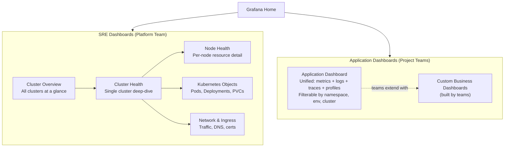
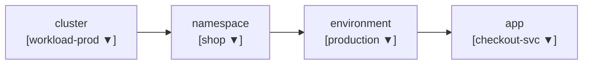
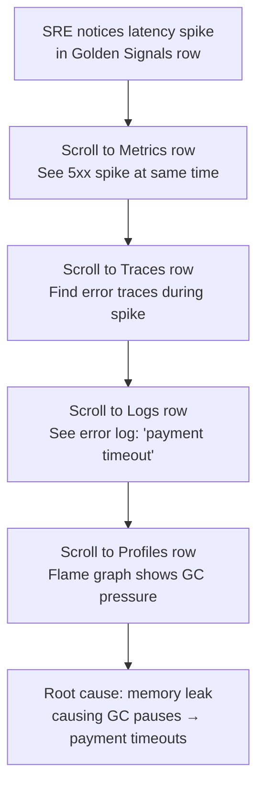
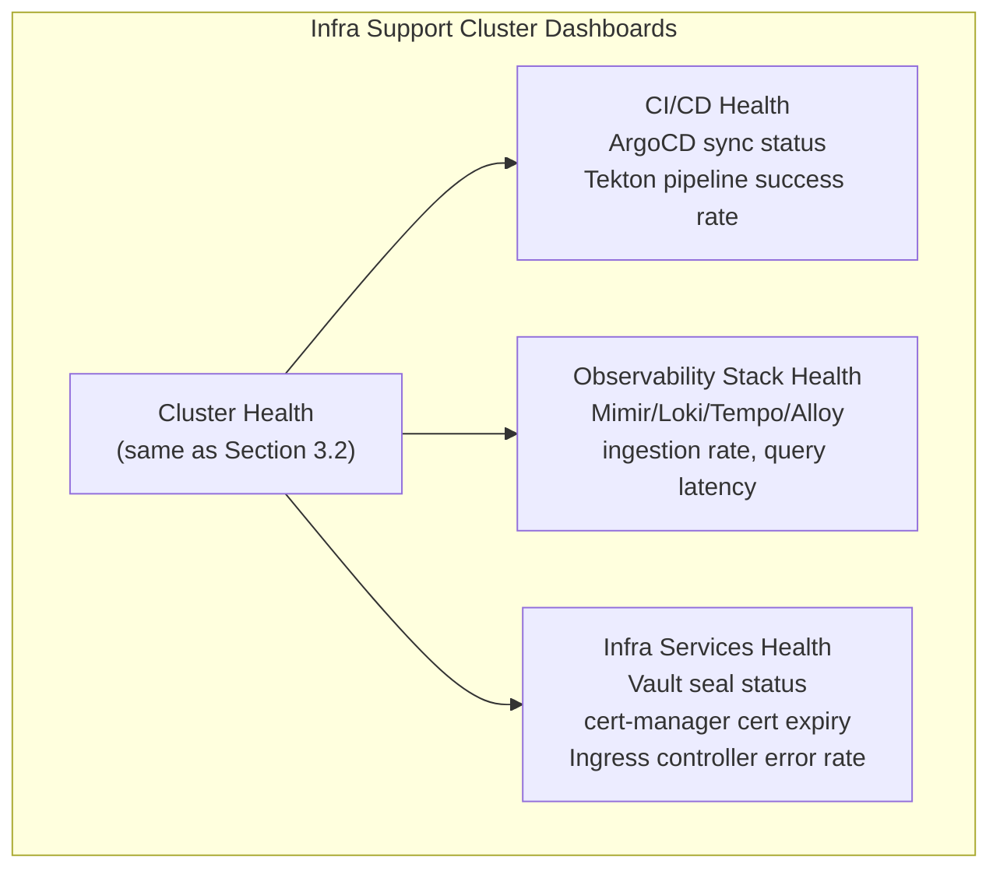
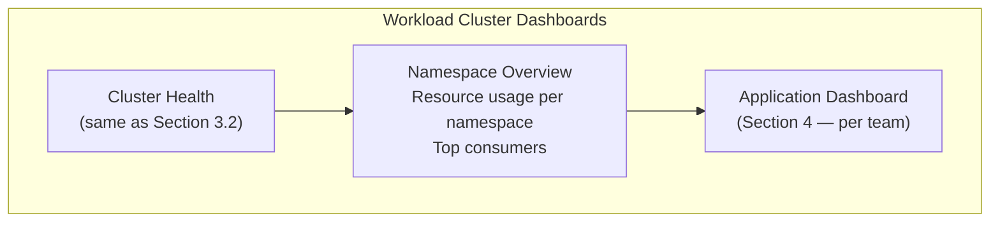
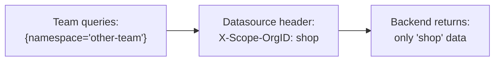
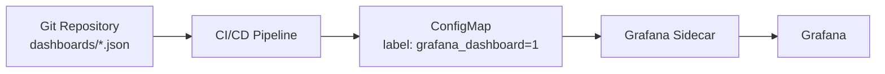

# Dashboard Design

## 1. Overview

This document defines the dashboard strategy for the observability platform. There are two primary dashboard categories aligned to two audiences:

| Audience | Dashboard | Focus |
|----------|-----------|-------|
| **SRE / Platform Team** | Cluster Dashboards | Cluster health, node resources, Kubernetes object state, golden signals at the infrastructure level |
| **Application / Project Teams** | Application Dashboard | Application golden signals, logs, traces, profiles — filterable by namespace (project) and environment |

### Cluster Types

| Cluster Type | Purpose | Examples |
|-------------|---------|---------|
| **Infra Support Clusters** | Shared platform services | CI/CD (ArgoCD, Tekton), observability stack, cert-manager, vault, ingress controllers, databases |
| **Workload Clusters** | Application workloads | Production services, staging/UAT environments, batch jobs |

### Design Principles

- **SRE dashboards**: One dashboard per concern (cluster, nodes, Kubernetes objects). Cluster selector at the top.
- **Application dashboard**: One unified dashboard per app. All four signals (metrics, logs, traces, profiles) in a single view. Filterable by namespace, environment, and cluster.
- **Business metrics**: Not part of the generic dashboard. Teams build their own using the same datasources.

---

## 2. Dashboard Hierarchy



---

## 3. SRE Dashboards

### 3.1 Dashboard: Cluster Overview

The landing page for SRE. Shows all clusters at a glance with health status.

**Variables:** None (shows all clusters)

```
┌──────────────────────────────────────────────────────────────────────┐
│                        CLUSTER OVERVIEW                              │
├──────────────────────────────────────────────────────────────────────┤
│                                                                      │
│  ┌─────────────────────────────┐  ┌─────────────────────────────┐   │
│  │  INFRA SUPPORT CLUSTERS     │  │  WORKLOAD CLUSTERS          │   │
│  │                             │  │                             │   │
│  │  infra-prod    ● Healthy    │  │  workload-prod  ● Healthy   │   │
│  │  Nodes: 3/3    CPU: 45%     │  │  Nodes: 10/10   CPU: 62%    │   │
│  │  Memory: 58%   Pods: 42/110 │  │  Memory: 71%    Pods: 186/500│  │
│  │                             │  │                             │   │
│  │  infra-staging ● Healthy    │  │  workload-stg   ● Warning   │   │
│  │  Nodes: 2/2    CPU: 22%     │  │  Nodes: 5/5     CPU: 78%    │   │
│  │  Memory: 34%   Pods: 28/80  │  │  Memory: 82%    Pods: 95/200│   │
│  └─────────────────────────────┘  └─────────────────────────────┘   │
│                                                                      │
├──────────────────────────────────────────────────────────────────────┤
│  GOLDEN SIGNALS (AGGREGATED ACROSS ALL CLUSTERS)                     │
│                                                                      │
│  ┌──────────┐ ┌──────────┐ ┌──────────┐ ┌──────────┐               │
│  │ API Rate │ │ Error %  │ │ p99 Lat  │ │ CPU Sat  │               │
│  │ 2.4k/s   │ │ 0.12%    │ │ 245ms    │ │ 62%      │               │
│  │ ▁▂▃▄▅▆▇  │ │ ▁▁▁▁▂▁▁  │ │ ▃▃▄▃▃▅▃  │ │ ▅▅▆▅▅▆▅  │               │
│  └──────────┘ └──────────┘ └──────────┘ └──────────┘               │
│                                                                      │
├──────────────────────────────────────────────────────────────────────┤
│  ALERTS FIRING                                                       │
│                                                                      │
│  🔴 workload-stg │ HighMemoryUsage │ node-3 │ 82% > 80% │ 12m ago  │
│  🟡 workload-prod│ PodCrashLooping │ cart-svc│ 3 restarts│ 5m ago   │
│                                                                      │
└──────────────────────────────────────────────────────────────────────┘
```

**Panels:**

| Panel | Type | Query Source |
|-------|------|-------------|
| Cluster health cards | Stat/Table | kube-state-metrics, node metrics |
| Golden signals sparklines | Stat + sparkline | Mimir (aggregated) |
| Active alerts | Table | Mimir alertmanager API |

### 3.2 Dashboard: Cluster Health

Deep-dive into a single cluster. This is where SREs spend most of their time.

**Variables:**
| Variable | Source | Example Values |
|----------|--------|---------------|
| `cluster` | Label values | `infra-prod`, `workload-prod`, `workload-stg` |

```
┌──────────────────────────────────────────────────────────────────────┐
│  CLUSTER HEALTH              Cluster: [workload-prod ▼]              │
├──────────────────────────────────────────────────────────────────────┤
│                                                                      │
│  GOLDEN SIGNALS                                                      │
│  ┌──────────────┐ ┌──────────────┐ ┌──────────────┐ ┌────────────┐  │
│  │ Traffic      │ │ Errors       │ │ Latency      │ │ Saturation │  │
│  │              │ │              │ │              │ │            │  │
│  │ Request Rate │ │ 5xx Rate     │ │ p50/p95/p99  │ │ CPU / Mem  │  │
│  │   1.8k/s     │ │   0.08%      │ │ 45/120/340ms │ │ 62% / 71%  │  │
│  │ ▂▃▃▄▅▅▆▅▄▃  │ │ ▁▁▁▁▂▁▁▁▁▁  │ │ ▃▃▄▃▅▃▃▄▃▃  │ │ ▅▅▆▅▆▆▅▅  │  │
│  └──────────────┘ └──────────────┘ └──────────────┘ └────────────┘  │
│                                                                      │
├──────────────────────────────────────────────────────────────────────┤
│  NODES                                                               │
│                                                                      │
│  ┌────────────────────────────────────────────────────────────────┐  │
│  │ Node        │ Status │ CPU   │ Memory │ Disk  │ Pods         │  │
│  ├─────────────┼────────┼───────┼────────┼───────┼──────────────┤  │
│  │ node-1      │ Ready  │ ██▓░░ │ ███▓░  │ ██░░░ │ 42/110       │  │
│  │ node-2      │ Ready  │ ███░░ │ ███░░  │ ██░░░ │ 38/110       │  │
│  │ node-3      │ Ready  │ ███▓░ │ ████░  │ ██▓░░ │ 45/110       │  │
│  │ ...         │        │       │        │       │              │  │
│  └────────────────────────────────────────────────────────────────┘  │
│                                                                      │
├──────────────────────────────────────────────────────────────────────┤
│  KUBERNETES OBJECTS                                                   │
│                                                                      │
│  ┌──────────────┐ ┌──────────────┐ ┌──────────────┐ ┌────────────┐  │
│  │ Pods         │ │ Deployments  │ │ PVCs         │ │ Jobs       │  │
│  │ Running: 186 │ │ Healthy: 24  │ │ Bound: 18    │ │ Active: 3  │  │
│  │ Pending: 2   │ │ Degraded: 1  │ │ Pending: 0   │ │ Failed: 0  │  │
│  │ Failed: 0    │ │ Total: 25    │ │ Total: 18    │ │ Total: 3   │  │
│  └──────────────┘ └──────────────┘ └──────────────┘ └────────────┘  │
│                                                                      │
├──────────────────────────────────────────────────────────────────────┤
│  RESOURCE UTILIZATION (TIMESERIES)                                   │
│                                                                      │
│  ┌─────────────────────────────┐  ┌─────────────────────────────┐   │
│  │ CPU Usage by Node           │  │ Memory Usage by Node         │   │
│  │                             │  │                             │   │
│  │  80%┤  ╭─╮                  │  │  80%┤     ╭──╮              │   │
│  │  60%┤╭─╯ ╰──╮   ╭─╮       │  │  60%┤╭────╯  ╰──╮          │   │
│  │  40%┤╯      ╰───╯ ╰──     │  │  40%┤╯          ╰───       │   │
│  │  20%┤                      │  │  20%┤                      │   │
│  │     └──────────────────    │  │     └──────────────────    │   │
│  └─────────────────────────────┘  └─────────────────────────────┘   │
│                                                                      │
│  ┌─────────────────────────────┐  ┌─────────────────────────────┐   │
│  │ Disk I/O by Node            │  │ Network I/O by Node          │   │
│  │                             │  │                             │   │
│  │  ▄▅▆▅▄▃▄▅▆▅▄▃▄▅           │  │  ▂▃▄▅▅▄▃▂▃▄▅▅▄▃           │   │
│  └─────────────────────────────┘  └─────────────────────────────┘   │
│                                                                      │
├──────────────────────────────────────────────────────────────────────┤
│  POD RESTARTS (TOP 10)                                               │
│                                                                      │
│  cart-svc-7d8f9-abc    │ ████████████ 12 restarts │ namespace: shop  │
│  worker-batch-xyz      │ ███          3 restarts  │ namespace: jobs  │
│                                                                      │
└──────────────────────────────────────────────────────────────────────┘
```

**Key queries:**

| Panel | PromQL |
|-------|--------|
| Request rate | `sum(rate(http_server_request_duration_seconds_count{cluster="$cluster"}[5m]))` |
| Error rate | `sum(rate(http_server_request_duration_seconds_count{cluster="$cluster",http_status_code=~"5.."}[5m])) / sum(rate(http_server_request_duration_seconds_count{cluster="$cluster"}[5m]))` |
| p99 latency | `histogram_quantile(0.99, sum(rate(http_server_request_duration_seconds_bucket{cluster="$cluster"}[5m])) by (le))` |
| CPU saturation | `1 - avg(rate(node_cpu_seconds_total{mode="idle",cluster="$cluster"}[5m])) by (instance)` |
| Memory usage | `1 - (node_memory_MemAvailable_bytes{cluster="$cluster"} / node_memory_MemTotal_bytes{cluster="$cluster"})` |
| Pod restarts | `topk(10, sum by (pod, namespace) (kube_pod_container_status_restarts_total{cluster="$cluster"}))` |

### 3.3 Dashboard: Node Health

Per-node deep-dive. Linked from the Cluster Health dashboard.

**Variables:**
| Variable | Source |
|----------|--------|
| `cluster` | Label values |
| `node` | Label values filtered by cluster |

```
┌──────────────────────────────────────────────────────────────────────┐
│  NODE HEALTH       Cluster: [workload-prod ▼]  Node: [node-1 ▼]     │
├──────────────────────────────────────────────────────────────────────┤
│                                                                      │
│  ┌─────────┐ ┌──────────┐ ┌─────────┐ ┌──────────┐ ┌────────────┐  │
│  │ CPU     │ │ Memory   │ │ Disk    │ │ Network  │ │ Pods       │  │
│  │ 62%     │ │ 71%      │ │ 38%     │ │ 450Mbps  │ │ 42/110     │  │
│  └─────────┘ └──────────┘ └─────────┘ └──────────┘ └────────────┘  │
│                                                                      │
│  ┌─────────────────────────────┐  ┌─────────────────────────────┐   │
│  │ CPU Cores Utilization       │  │ Memory Breakdown             │   │
│  │ (per core timeseries)       │  │ Used / Cached / Available    │   │
│  └─────────────────────────────┘  └─────────────────────────────┘   │
│                                                                      │
│  ┌─────────────────────────────┐  ┌─────────────────────────────┐   │
│  │ Disk Usage & IOPS           │  │ Network rx/tx Bytes          │   │
│  └─────────────────────────────┘  └─────────────────────────────┘   │
│                                                                      │
│  ┌──────────────────────────────────────────────────────────────┐    │
│  │ Top Pods by CPU on This Node                                 │    │
│  │ Pod                      │ CPU     │ Memory  │ Restarts     │    │
│  │ mimir-ingester-zone-a-0  │ 350m    │ 1.2Gi   │ 0            │    │
│  │ checkout-svc-7d8f9       │ 200m    │ 256Mi   │ 0            │    │
│  │ ...                      │         │         │              │    │
│  └──────────────────────────────────────────────────────────────┘    │
│                                                                      │
└──────────────────────────────────────────────────────────────────────┘
```

### 3.4 Dashboard: Kubernetes Objects

Focused on Kubernetes resource state.

**Variables:**
| Variable | Source |
|----------|--------|
| `cluster` | Label values |
| `namespace` | Label values (optional, default: all) |

```
┌──────────────────────────────────────────────────────────────────────┐
│  KUBERNETES OBJECTS    Cluster: [workload-prod ▼]  NS: [All ▼]       │
├──────────────────────────────────────────────────────────────────────┤
│                                                                      │
│  DEPLOYMENTS                                                         │
│  ┌──────────────────────────────────────────────────────────────┐    │
│  │ Deployment        │ NS        │ Ready │ Desired │ Available  │    │
│  ├───────────────────┼───────────┼───────┼─────────┼────────────┤    │
│  │ checkout-svc      │ shop      │ 3/3   │ 3       │ 3          │    │
│  │ cart-svc          │ shop      │ 2/3   │ 3       │ 2    ⚠️    │    │
│  │ user-svc          │ accounts  │ 2/2   │ 2       │ 2          │    │
│  └──────────────────────────────────────────────────────────────┘    │
│                                                                      │
│  PODS NOT RUNNING                                                    │
│  ┌──────────────────────────────────────────────────────────────┐    │
│  │ Pod                   │ NS     │ Phase    │ Reason           │    │
│  ├───────────────────────┼────────┼──────────┼──────────────────┤    │
│  │ cart-svc-7d8f9-xyz    │ shop   │ Pending  │ Insufficient CPU │    │
│  └──────────────────────────────────────────────────────────────┘    │
│                                                                      │
│  ┌─────────────────────────────┐  ┌─────────────────────────────┐   │
│  │ Pod Phase Distribution      │  │ PVC Status                   │   │
│  │ (pie chart)                 │  │ Bound: 18  Pending: 0        │   │
│  │ Running: 186                │  │ Lost: 0                      │   │
│  │ Pending: 2                  │  │                             │   │
│  │ Succeeded: 12               │  │                             │   │
│  └─────────────────────────────┘  └─────────────────────────────┘   │
│                                                                      │
│  ┌──────────────────────────────────────────────────────────────┐    │
│  │ Resource Requests vs Limits vs Actual (by namespace)         │    │
│  │                                                              │    │
│  │  shop       ██████▓▓▓░░░░░  CPU: 2.1/4/8 cores              │    │
│  │  accounts   ███▓░░░░░░░░░░  CPU: 0.8/2/4 cores              │    │
│  │  jobs       ████▓▓░░░░░░░░  CPU: 1.2/3/6 cores              │    │
│  │             Actual Requests Limits                           │    │
│  └──────────────────────────────────────────────────────────────┘    │
│                                                                      │
└──────────────────────────────────────────────────────────────────────┘
```

---

## 4. Application Dashboard

### 4.1 Design Philosophy

One unified dashboard. All four telemetry signals in a single view. Project teams should never need to switch between dashboards to debug an issue.

**Workflow**: See a metric spike → check the logs around that time → find the trace → look at the profile.

### 4.2 Variables (Top Bar)

All panels in the dashboard are filtered by these variables:

| Variable | Source | Purpose |
|----------|--------|---------|
| `cluster` | Label values | Which cluster (workload-prod, workload-stg) |
| `namespace` | Label values filtered by cluster | Which project/team |
| `environment` | Label values or static map | `production` / `non-production` |
| `app` | Label values filtered by namespace | Which application/service |
| `time_range` | Grafana built-in | Time window |



Variable chaining: selecting a cluster filters available namespaces, selecting a namespace filters available apps.

### 4.3 Dashboard Layout

```
┌──────────────────────────────────────────────────────────────────────┐
│  APPLICATION DASHBOARD                                               │
│  Cluster: [workload-prod ▼]  Namespace: [shop ▼]                     │
│  Environment: [production ▼]  App: [checkout-svc ▼]                  │
├──────────────────────────────────────────────────────────────────────┤
│                                                                      │
│  ┌─── ROW: GOLDEN SIGNALS ──────────────────────────────────────┐   │
│  │                                                               │   │
│  │  ┌─────────────┐ ┌─────────────┐ ┌─────────────┐ ┌────────┐ │   │
│  │  │ Traffic     │ │ Error Rate  │ │ Latency p99 │ │ Sat.   │ │   │
│  │  │ 245 req/s   │ │ 0.3%        │ │ 340ms       │ │ CPU 45%│ │   │
│  │  │ ▁▂▃▅▆▇▆▅▄  │ │ ▁▁▁▂▁▁▁▁▁  │ │ ▃▃▄▅▃▃▄▃▃  │ │ ▅▅▆▅▅  │ │   │
│  │  └─────────────┘ └─────────────┘ └─────────────┘ └────────┘ │   │
│  │                                                               │   │
│  └───────────────────────────────────────────────────────────────┘   │
│                                                                      │
│  ┌─── ROW: METRICS ─────────────────────────────────────────────┐   │
│  │                                                               │   │
│  │  ┌─────────────────────────┐ ┌─────────────────────────┐     │   │
│  │  │ Request Rate by Status  │ │ Latency Percentiles      │     │   │
│  │  │ (timeseries)            │ │ p50 / p95 / p99          │     │   │
│  │  │                         │ │ (timeseries)             │     │   │
│  │  │ ── 2xx  ── 4xx  ── 5xx │ │ ── p50  ── p95  ── p99  │     │   │
│  │  │ ▃▃▄▅▆▅▄▃▃▄▅▆▅▄        │ │ ▂▂▃▂▂▃▂▂▃▂▂▃▂▂         │     │   │
│  │  └─────────────────────────┘ └─────────────────────────┘     │   │
│  │                                                               │   │
│  │  ┌─────────────────────────┐ ┌─────────────────────────┐     │   │
│  │  │ CPU Usage               │ │ Memory Usage             │     │   │
│  │  │ Request / Limit / Actual│ │ Request / Limit / Actual │     │   │
│  │  │ (timeseries)            │ │ (timeseries)             │     │   │
│  │  └─────────────────────────┘ └─────────────────────────┘     │   │
│  │                                                               │   │
│  │  ┌─────────────────────────┐ ┌─────────────────────────┐     │   │
│  │  │ Pod Restarts            │ │ In-Flight / Active Reqs  │     │   │
│  │  │ (timeseries)            │ │ (timeseries)             │     │   │
│  │  └─────────────────────────┘ └─────────────────────────┘     │   │
│  │                                                               │   │
│  └───────────────────────────────────────────────────────────────┘   │
│                                                                      │
│  ┌─── ROW: TRACES ──────────────────────────────────────────────┐   │
│  │                                                               │   │
│  │  ┌───────────────────────────────────────────────────────┐   │   │
│  │  │ Service Map                                            │   │   │
│  │  │                                                        │   │   │
│  │  │   [client] ──→ [checkout-svc] ──→ [payment-svc]       │   │   │
│  │  │                      │                                 │   │   │
│  │  │                      ▼                                 │   │   │
│  │  │                [cart-db]                                │   │   │
│  │  │                                                        │   │   │
│  │  └───────────────────────────────────────────────────────┘   │   │
│  │                                                               │   │
│  │  ┌───────────────────────────────────────────────────────┐   │   │
│  │  │ Recent Traces (Tempo search)                           │   │   │
│  │  │                                                        │   │   │
│  │  │ Trace ID         │ Duration │ Status │ Spans │ Time    │   │   │
│  │  │ abc123def456...  │ 450ms    │ OK     │ 8     │ 2m ago  │   │   │
│  │  │ 789ghi012jkl...  │ 1.2s     │ Error  │ 5     │ 5m ago  │   │   │
│  │  │ mno345pqr678...  │ 89ms     │ OK     │ 4     │ 5m ago  │   │   │
│  │  │                    ↑ click to open in Explore          │   │   │
│  │  └───────────────────────────────────────────────────────┘   │   │
│  │                                                               │   │
│  │  ┌─────────────────────────┐ ┌─────────────────────────┐     │   │
│  │  │ Trace Duration Heatmap  │ │ Traces by Status         │     │   │
│  │  │                         │ │ (ok vs error over time)  │     │   │
│  │  └─────────────────────────┘ └─────────────────────────┘     │   │
│  │                                                               │   │
│  └───────────────────────────────────────────────────────────────┘   │
│                                                                      │
│  ┌─── ROW: LOGS ────────────────────────────────────────────────┐   │
│  │                                                               │   │
│  │  ┌─────────────────────────┐ ┌─────────────────────────┐     │   │
│  │  │ Log Volume by Level     │ │ Error Logs Count         │     │   │
│  │  │ (stacked timeseries)    │ │ (stat + sparkline)       │     │   │
│  │  │ ██ error  ▓▓ warn       │ │                         │     │   │
│  │  │ ░░ info   ·· debug      │ │  42 errors / 5m         │     │   │
│  │  └─────────────────────────┘ └─────────────────────────┘     │   │
│  │                                                               │   │
│  │  ┌───────────────────────────────────────────────────────┐   │   │
│  │  │ Live Logs (Loki)                                       │   │   │
│  │  │                                                        │   │   │
│  │  │ 12:04:32 INFO  request handled path=/checkout dur=45ms │   │   │
│  │  │ 12:04:33 ERROR payment failed user=U-123 err=timeout   │   │   │
│  │  │ 12:04:33 WARN  retry attempt=2 service=payment-svc     │   │   │
│  │  │ 12:04:34 INFO  request handled path=/checkout dur=890ms│   │   │
│  │  │                                                        │   │   │
│  │  │ {namespace="$namespace", app="$app"}                   │   │   │
│  │  └───────────────────────────────────────────────────────┘   │   │
│  │                                                               │   │
│  └───────────────────────────────────────────────────────────────┘   │
│                                                                      │
│  ┌─── ROW: PROFILES ────────────────────────────────────────────┐   │
│  │                                                               │   │
│  │  ┌───────────────────────────────────────────────────────┐   │   │
│  │  │ CPU Profile (Flame Graph)                              │   │   │
│  │  │                                                        │   │   │
│  │  │ ┌──────────────── main ─────────────────────┐         │   │   │
│  │  │ │┌──── handleCheckout ────────┐┌── gc ────┐ │         │   │   │
│  │  │ ││┌─ validateCart ┐┌ charge ─┐││          │ │         │   │   │
│  │  │ │││               ││┌fraud──┐│││          │ │         │   │   │
│  │  │ └┘└───────────────┘└┘└──────┘┘└┘└─────────┘ │         │   │   │
│  │  │                                                        │   │   │
│  │  │ Click: links to Pyroscope with time range              │   │   │
│  │  └───────────────────────────────────────────────────────┘   │   │
│  │                                                               │   │
│  └───────────────────────────────────────────────────────────────┘   │
│                                                                      │
└──────────────────────────────────────────────────────────────────────┘
```

### 4.4 Panel Specifications

#### Row: Golden Signals

| Panel | Type | Datasource | Query |
|-------|------|-----------|-------|
| Traffic | Stat + sparkline | Mimir | `sum(rate(http_server_request_duration_seconds_count{namespace="$namespace", app="$app"}[5m]))` |
| Error Rate | Stat + sparkline | Mimir | `sum(rate(http_server_request_duration_seconds_count{...,http_status_code=~"5.."}[5m])) / sum(rate(http_server_request_duration_seconds_count{...}[5m]))` |
| Latency p99 | Stat + sparkline | Mimir | `histogram_quantile(0.99, sum(rate(http_server_request_duration_seconds_bucket{...}[5m])) by (le))` |
| Saturation | Stat + sparkline | Mimir | `avg(rate(container_cpu_usage_seconds_total{namespace="$namespace", pod=~"$app.*"}[5m])) / avg(kube_pod_container_resource_limits{resource="cpu",...})` |

#### Row: Metrics

| Panel | Type | Datasource | Query |
|-------|------|-----------|-------|
| Request Rate by Status | Timeseries | Mimir | `sum by (http_status_code) (rate(http_server_request_duration_seconds_count{...}[5m]))` |
| Latency Percentiles | Timeseries | Mimir | `histogram_quantile(0.5\|0.95\|0.99, ...)` |
| CPU Usage | Timeseries | Mimir | `rate(container_cpu_usage_seconds_total{...}[5m])` with request/limit overlays |
| Memory Usage | Timeseries | Mimir | `container_memory_working_set_bytes{...}` with request/limit overlays |
| Pod Restarts | Timeseries | Mimir | `increase(kube_pod_container_status_restarts_total{...}[1h])` |
| In-Flight Requests | Timeseries | Mimir | `sum(http_server_active_requests{...})` or app-specific gauge |

#### Row: Traces

| Panel | Type | Datasource | Query |
|-------|------|-----------|-------|
| Service Map | Node Graph | Tempo | `{resource.service.name="$app"}` (service graph) |
| Recent Traces | Table | Tempo | `{resource.service.name="$app" && status=error}` |
| Duration Heatmap | Heatmap | Tempo | `{resource.service.name="$app"} \| histogram_over_time(duration)` |
| Traces by Status | Timeseries | Tempo | `{resource.service.name="$app"} \| rate() by (status)` |

#### Row: Logs

| Panel | Type | Datasource | Query |
|-------|------|-----------|-------|
| Log Volume by Level | Timeseries (stacked) | Loki | `sum by (level) (rate({namespace="$namespace", app="$app"}[1m]))` |
| Error Log Count | Stat | Loki | `sum(rate({namespace="$namespace", app="$app", level="error"}[5m]))` |
| Live Logs | Logs | Loki | `{namespace="$namespace", app="$app"}` |

#### Row: Profiles

| Panel | Type | Datasource | Query |
|-------|------|-----------|-------|
| CPU Flame Graph | Flame Graph | Pyroscope | `process_cpu:cpu:nanoseconds:cpu:nanoseconds{service_name="$app"}` |

### 4.5 Cross-Signal Linking

The power of the unified dashboard is that all panels share the same time range. When you see a spike, every panel updates.



In addition to time-range correlation, explicit links are configured:

| From | To | Link Type |
|------|-----|----------|
| Metrics exemplar | Trace detail | Exemplar → Tempo trace ID |
| Trace span | Logs panel | `tracesToLogs` (filter by pod + time range) |
| Trace span | Profile | `tracesToProfiles` (filter by time window) |
| Log line with `trace_id` | Trace detail | Derived field regex → Tempo |

---

## 5. Dashboard per Cluster Type

### 5.1 Infra Support Cluster Dashboards

These clusters run platform services. SRE dashboards focus on the health of the infrastructure tools themselves.



**Key metrics for infra services:**

| Service | Key Metrics |
|---------|------------|
| **ArgoCD** | Sync status, sync duration, app health |
| **Mimir** | Ingestion rate, query latency, active series |
| **Loki** | Ingestion rate, query latency, storage size |
| **Tempo** | Ingestion rate, trace search latency |
| **Vault** | Seal status, token TTL, auth failures |
| **cert-manager** | Certificate expiry, renewal failures |
| **Ingress** | Request rate, 5xx rate, latency by ingress |

### 5.2 Workload Cluster Dashboards

These clusters run application workloads. Dashboards serve both SRE (cluster view) and project teams (app view).



**Namespace Overview** is an SRE-only dashboard showing resource consumption per namespace:

```
┌──────────────────────────────────────────────────────────────────────┐
│  NAMESPACE OVERVIEW          Cluster: [workload-prod ▼]              │
├──────────────────────────────────────────────────────────────────────┤
│                                                                      │
│  ┌──────────────────────────────────────────────────────────────┐    │
│  │ Namespace   │ CPU Used │ CPU Req │ Mem Used │ Pods │ Cost/hr │    │
│  ├─────────────┼──────────┼─────────┼──────────┼──────┼─────────┤    │
│  │ shop        │ 2.1 core │ 4 core  │ 4.2 Gi   │ 24   │ $1.20   │    │
│  │ accounts    │ 0.8 core │ 2 core  │ 1.8 Gi   │ 12   │ $0.60   │    │
│  │ jobs        │ 1.2 core │ 3 core  │ 2.4 Gi   │ 8    │ $0.80   │    │
│  │ analytics   │ 3.4 core │ 6 core  │ 8.1 Gi   │ 18   │ $2.10   │    │
│  └──────────────────────────────────────────────────────────────┘    │
│                                                                      │
│  ┌─────────────────────────────┐  ┌─────────────────────────────┐   │
│  │ CPU by Namespace (stacked)  │  │ Memory by Namespace (stacked)│   │
│  │ (timeseries)                │  │ (timeseries)                │   │
│  └─────────────────────────────┘  └─────────────────────────────┘   │
│                                                                      │
└──────────────────────────────────────────────────────────────────────┘
```

---

## 6. Access Control

### 6.1 Dashboard Visibility

| Dashboard | Infra SRE Org | Workload SRE Org | Team Org (e.g. shop) |
|-----------|:---:|:---:|:---:|
| Cluster Overview | Yes | Yes | No |
| Cluster Health | Yes | Yes | No |
| Node Health | Yes | Yes | No |
| Kubernetes Objects | Yes | Yes | No |
| Namespace Overview | Yes | Yes | No |
| Application Dashboard | Yes (all namespaces) | Yes (all namespaces) | Yes (own namespace only) |
| Custom Business Dashboards | No | No | Yes (own) |

### 6.2 Variable Restrictions

For project team orgs, the `namespace` variable is **locked** to their namespace via the datasource tenant header. Even if they modify the query, the backend will only return their data.



---

## 7. Dashboard Provisioning

### 7.1 Provisioning Method

Dashboards are provisioned as **ConfigMaps** with the `grafana_dashboard: "1"` label, auto-discovered by the Grafana sidecar.



### 7.2 Dashboard-as-Code Structure

```
lgtm-stack/
├── dashboards/
│   ├── sre/
│   │   ├── cluster-overview.json
│   │   ├── cluster-health.json
│   │   ├── node-health.json
│   │   ├── kubernetes-objects.json
│   │   └── namespace-overview.json
│   └── app/
│       └── application-dashboard.json      ← generic, reusable
├── dashboard-configmaps.yaml               ← K8s manifests
└── values-grafana.yaml                     ← sidecar config
```

### 7.3 Golden Rule

> **SRE dashboards** are maintained by the platform team in the central repo.
> **Application dashboard** is a generic template maintained by the platform team.
> **Business dashboards** are maintained by project teams in their own repos, deployed as ConfigMaps to their namespace.
