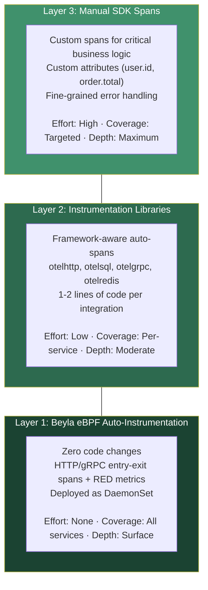
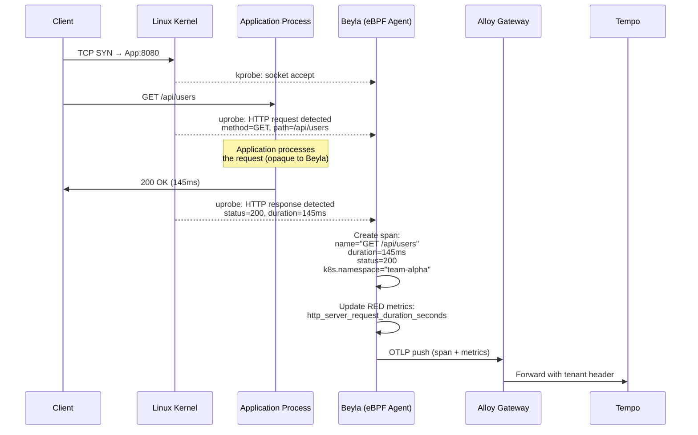
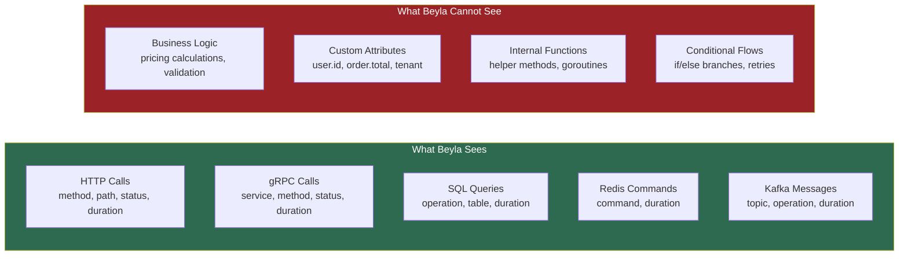
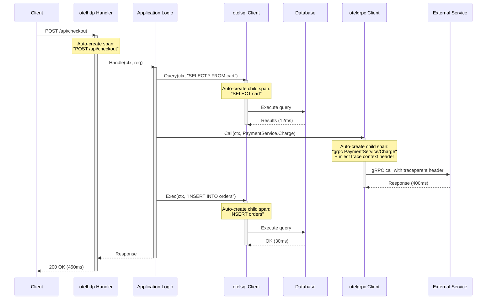
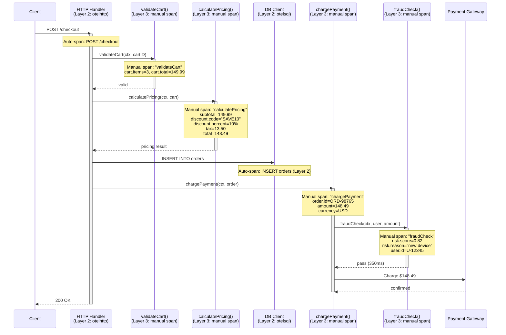
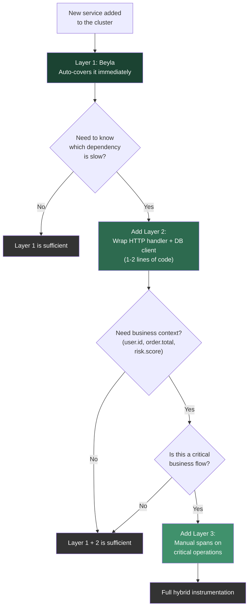
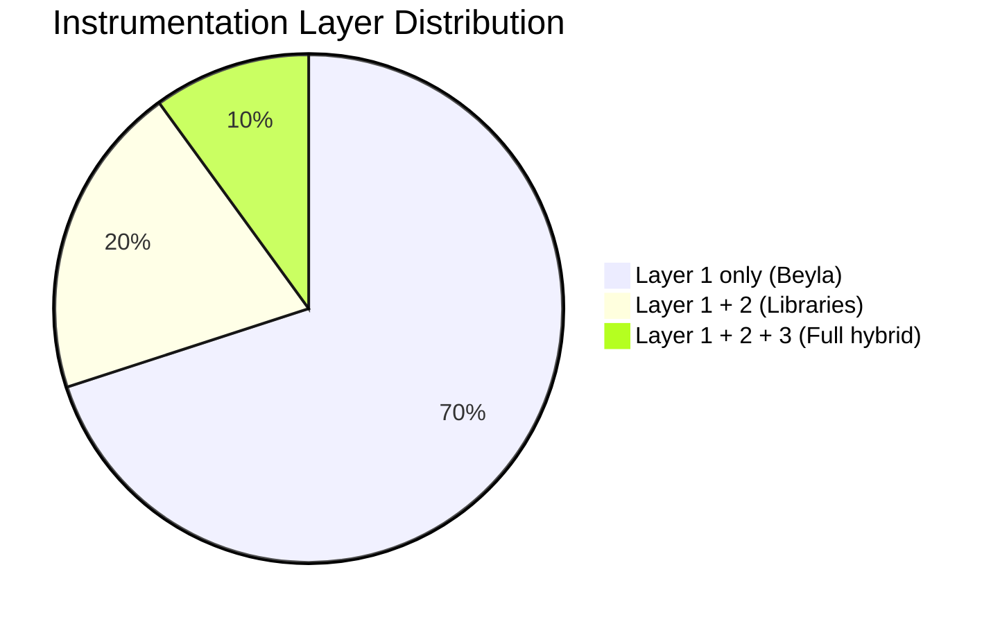
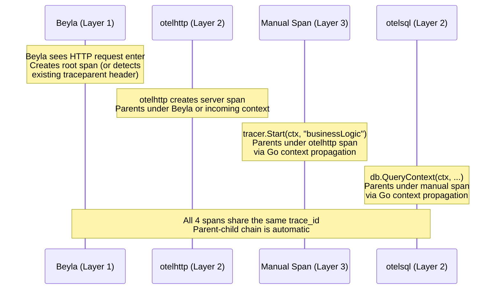
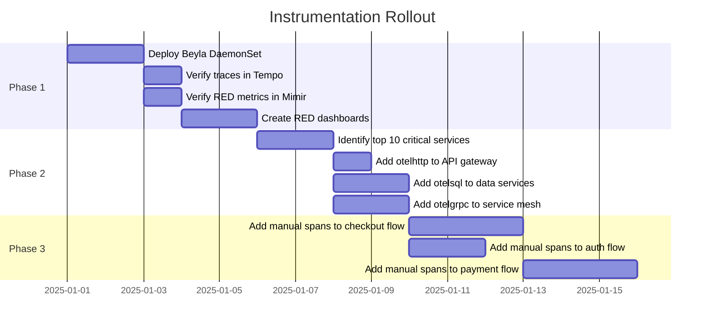

# Instrumentation Strategy

## 1. Overview

This document defines the instrumentation strategy for the observability platform. We use a **hybrid layered approach** — combining auto-instrumentation with targeted manual instrumentation to balance coverage, depth, and developer effort.

### Guiding Principle

> Instrument everything automatically. Instrument important things deeply. Instrument critical things manually.

---

## 2. Instrumentation Layers



### Layer Summary

| Layer | What | How | Code Changes | Coverage | Depth |
|-------|------|-----|-------------|----------|-------|
| **Layer 1** | Beyla eBPF | DaemonSet on every node | None | All services | Entry/exit spans |
| **Layer 2** | Instrumentation libraries | Wrap handlers/clients | 1-2 lines per integration | Per-service opt-in | Framework-level spans |
| **Layer 3** | Manual SDK spans | `tracer.Start(ctx, "name")` | Per-operation | Targeted | Full business context |

---

## 3. Layer 1: Beyla eBPF Auto-Instrumentation

### 3.1 How It Works

Beyla attaches eBPF probes to the Linux kernel's networking stack. It observes HTTP/gRPC requests entering and leaving processes without modifying the application.



### 3.2 What Beyla Captures



### 3.3 What a Beyla-Only Trace Looks Like

```
POST /api/checkout → 200 (450ms)
```

Single span. You know the request happened and how long it took. You don't know why it took 450ms.

### 3.4 When Layer 1 Is Sufficient

- Services with simple request/response patterns
- Third-party or legacy services you can't modify
- Early-stage services where you just need RED metrics
- Broad coverage during initial observability rollout

---

## 4. Layer 2: Instrumentation Libraries

### 4.1 How It Works

OpenTelemetry provides instrumentation libraries that wrap common frameworks and clients. You replace your HTTP handler or DB client with an instrumented version. The library automatically creates spans for every operation.



### 4.2 Code Changes Required

**Go — before (no instrumentation):**
```go
mux := http.NewServeMux()
mux.HandleFunc("/checkout", checkoutHandler)
http.ListenAndServe(":8080", mux)
```

**Go — after (Layer 2 instrumentation):**
```go
import "go.opentelemetry.io/contrib/instrumentation/net/http/otelhttp"

mux := http.NewServeMux()
mux.HandleFunc("/checkout", checkoutHandler)
http.ListenAndServe(":8080", otelhttp.NewHandler(mux, "checkout-svc"))
//                           ^^^^^^^^^^^^^^^^^^^^^^^^^^^^^^^^^^^^^^^^
//                           One line wraps all routes with tracing
```

**Database client:**
```go
import "github.com/XSAM/otelsql"

db, _ := otelsql.Open("postgres", dsn)
// Every query now auto-generates a span
```

### 4.3 Available Instrumentation Libraries

| Integration | Library | Auto-generates |
|------------|---------|---------------|
| **net/http** | `otelhttp` | Span per HTTP request + response attributes |
| **gRPC** | `otelgrpc` | Span per RPC call + status codes |
| **database/sql** | `otelsql` | Span per query with statement text |
| **Redis** | `otelredis` | Span per Redis command |
| **Kafka** | `otelkafka` | Span per produce/consume |
| **AWS SDK** | `otelaws` | Span per AWS API call |
| **Gin** | `otelgin` | Span per Gin route |
| **Echo** | `otelecho` | Span per Echo route |

### 4.4 What a Layer 2 Trace Looks Like

```
POST /api/checkout → 200 (450ms)
├── DB: SELECT * FROM cart (12ms)
├── gRPC: PaymentService/Charge (400ms)
│     └── [payment-svc] POST /charge → 200 (395ms)     ← cross-service
└── DB: INSERT INTO orders (30ms)
```

You can now see that the payment service call is the bottleneck. No custom code was written — just wrapping the HTTP handler and DB client.

### 4.5 When to Add Layer 2

- Services identified as important through Layer 1 RED metrics
- When you need to know *which dependency* is causing latency
- Services that make multiple downstream calls (APIs, databases, caches)
- Cross-service trace correlation is needed

---

## 5. Layer 3: Manual SDK Spans

### 5.1 How It Works

Developers create custom spans around specific code blocks to capture business-level context that no auto-instrumentation can see.



### 5.2 Code Example

```go
func checkoutHandler(w http.ResponseWriter, r *http.Request) {
    ctx := r.Context()
    tracer := otel.Tracer("checkout-svc")

    // Manual span for business logic
    ctx, validateSpan := tracer.Start(ctx, "validateCart")
    cart, err := validateCart(ctx, cartID)
    validateSpan.SetAttributes(
        attribute.Int("cart.items", len(cart.Items)),
        attribute.Float64("cart.total", cart.Total),
    )
    if err != nil {
        validateSpan.RecordError(err)
        validateSpan.SetStatus(codes.Error, "cart validation failed")
    }
    validateSpan.End()

    // Manual span for pricing — captures business context
    ctx, priceSpan := tracer.Start(ctx, "calculatePricing")
    pricing := calculatePricing(ctx, cart)
    priceSpan.SetAttributes(
        attribute.Float64("subtotal", pricing.Subtotal),
        attribute.String("discount.code", pricing.DiscountCode),
        attribute.Float64("discount.percent", pricing.DiscountPercent),
        attribute.Float64("tax", pricing.Tax),
        attribute.Float64("total", pricing.Total),
    )
    priceSpan.End()

    // DB call — auto-instrumented by otelsql (Layer 2)
    db.ExecContext(ctx, "INSERT INTO orders ...")

    // Manual span for payment — captures order context
    ctx, paySpan := tracer.Start(ctx, "chargePayment")
    paySpan.SetAttributes(
        attribute.String("order.id", order.ID),
        attribute.Float64("amount", pricing.Total),
    )
    result, err := chargePayment(ctx, order)
    paySpan.End()
}
```

### 5.3 What a Full Hybrid Trace Looks Like

```
POST /api/checkout → 200 (450ms)                           ← Layer 1 (Beyla) or Layer 2 (otelhttp)
├── validateCart (5ms)                                      ← Layer 3 (manual)
│     cart.items=3, cart.total=149.99
├── calculatePricing (8ms)                                  ← Layer 3 (manual)
│     subtotal=149.99, discount=10%, tax=13.50
├── DB: SELECT * FROM cart (12ms)                           ← Layer 2 (otelsql)
├── chargePayment (400ms)                                   ← Layer 3 (manual)
│     order.id=ORD-98765, amount=148.49
│     ├── fraudCheck (350ms)                                ← Layer 3 (manual)
│     │     risk.score=0.82, reason="new device"
│     └── HTTP: POST stripe.com/v1/charges (45ms)           ← Layer 2 (otelhttp)
└── DB: INSERT INTO orders (30ms)                           ← Layer 2 (otelsql)
```

### 5.4 When to Add Layer 3

- Payment processing, checkout flows, order fulfillment
- Authentication and authorization decisions
- Complex business calculations (pricing, scoring, matching)
- Debugging a specific production issue
- Regulatory/audit requirements for traceability

---

## 6. Comparison Matrix

### 6.1 Capabilities

```mermaid
quadrantChart
    title Instrumentation Trade-offs
    x-axis Low Effort --> High Effort
    y-axis Shallow Depth --> Deep Depth
    quadrant-1 Manual SDK
    quadrant-2 Ideal (not real)
    quadrant-3 Beyla eBPF
    quadrant-4 Instrumentation Libraries
```

### 6.2 Detailed Comparison

| Aspect | Layer 1: Beyla | Layer 2: Libraries | Layer 3: Manual |
|--------|---------------|-------------------|----------------|
| **Code changes** | None | 1-2 lines per integration | Per-operation |
| **Deploy method** | DaemonSet | Per-service code change | Per-service code change |
| **Span depth** | Entry/exit only | Per-framework operation | Full custom |
| **Custom attributes** | No | Limited (framework attrs) | Full control |
| **Cross-service traces** | Yes (via headers) | Yes (context propagation) | Yes (context propagation) |
| **Business context** | No | No | Yes |
| **Error detail** | HTTP status code | Framework errors | Custom error messages |
| **Performance overhead** | Very low (~1%) | Low (~2-3%) | Low-moderate (~3-5%) |
| **Maintenance** | None | Update library versions | Update with code changes |
| **Language support** | Any | Language-specific | Language-specific |
| **Kernel requirement** | Linux 5.8+, privileged | None | None |
| **Rollout speed** | Minutes (one DaemonSet) | Hours (per service) | Days/weeks (per feature) |

---

## 7. Decision Framework

### 7.1 When to Use What



### 7.2 Typical Service Distribution

In a production environment with ~50 services:



- **~70% of services**: Layer 1 only — background services, simple CRUD, internal tools
- **~20% of services**: Layer 1 + 2 — API gateways, services with multiple dependencies
- **~10% of services**: Full hybrid — checkout, payments, auth, core business logic

---

## 8. Trace Context Propagation

### 8.1 How Layers Merge Into One Trace

All three layers use the **W3C Trace Context** standard (`traceparent` header). Spans from different layers automatically parent correctly because they share the same trace context.



### 8.2 Context Flow

```
trace_id: abc123 (shared across all spans)

Beyla span         ─────────────────────────────────── (450ms)
 └─ otelhttp span  ────────────────────────────────── (448ms)
     ├─ manual span  ──── (5ms)   validateCart
     ├─ otelsql span  ─── (12ms)  SELECT cart
     ├─ manual span  ────────────────────────── (400ms) chargePayment
     │   ├─ manual span  ──────────────────── (350ms)   fraudCheck
     │   └─ otelhttp span  ──── (45ms)                  POST stripe
     └─ otelsql span  ─── (30ms)  INSERT orders
```

When Beyla and OTel SDK both create spans for the same request, the deduplication happens naturally: Beyla's span becomes an outer wrapper, and the SDK spans nest inside via context propagation. If the SDK already provides a root span, Beyla detects the existing `traceparent` and avoids creating a duplicate.

---

## 9. Implementation Rollout Plan

### Phase 1: Baseline (Week 1)

Deploy Beyla as a DaemonSet. Every service gets auto-instrumented immediately.



**Outcome**: RED metrics and basic traces for all services.

### Phase 2: Targeted Depth (Week 2-3)

Add instrumentation libraries to the top 10 most critical services.

**Outcome**: Dependency-level visibility for important services.

### Phase 3: Business Context (Week 3-4)

Add manual spans to the 3-5 most critical business flows.

**Outcome**: Full business observability for critical paths.

---

## 10. Guidelines for Developers

### Do

- Let Beyla handle baseline coverage — don't manually instrument what Beyla already captures
- Use instrumentation libraries before writing manual spans
- Pass `context.Context` through all function calls (required for span parenting)
- Add attributes that help with debugging: IDs, counts, amounts, status reasons
- Use `span.RecordError(err)` to attach errors to spans
- Keep span names stable (use `"processOrder"` not `"processOrder-12345"`)

### Don't

- Don't create a span for every function — instrument boundaries, not internals
- Don't put high-cardinality values in span **names** (use attributes instead)
- Don't log and trace the same thing redundantly — link them via `trace_id`
- Don't instrument tight loops (millions of spans = performance degradation)
- Don't skip `span.End()` — use `defer span.End()` immediately after creation

### Span Naming Conventions

| Pattern | Example | Good For |
|---------|---------|----------|
| `verb + noun` | `validateCart`, `chargePayment` | Business operations |
| `HTTP method + route` | `GET /api/users` | HTTP handlers (auto-generated) |
| `DB operation + table` | `SELECT users` | Database queries (auto-generated) |
| `service/method` | `PaymentService/Charge` | gRPC calls (auto-generated) |

### Attribute Naming Conventions

Follow [OpenTelemetry Semantic Conventions](https://opentelemetry.io/docs/specs/semconv/):

| Attribute | Example | When |
|-----------|---------|------|
| `http.method` | `GET` | Auto (Layer 1/2) |
| `http.status_code` | `200` | Auto (Layer 1/2) |
| `db.statement` | `SELECT * FROM users` | Auto (Layer 2) |
| `user.id` | `U-12345` | Manual (Layer 3) |
| `order.id` | `ORD-98765` | Manual (Layer 3) |
| `payment.amount` | `148.49` | Manual (Layer 3) |
| `error.reason` | `insufficient_funds` | Manual (Layer 3) |
