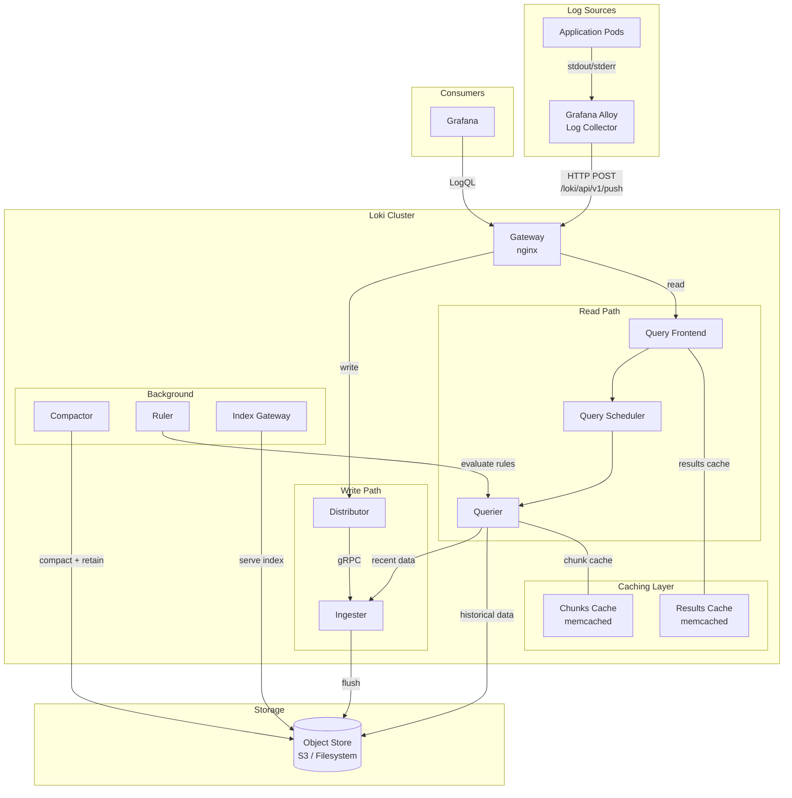
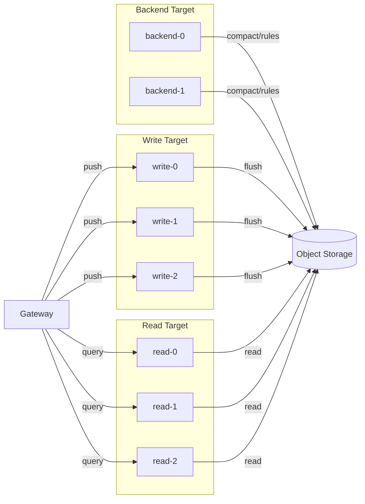
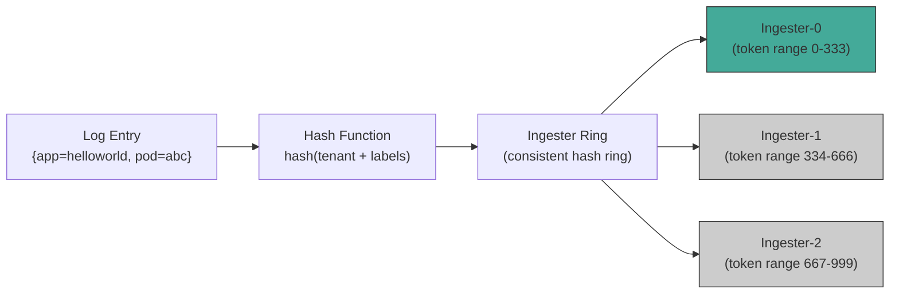
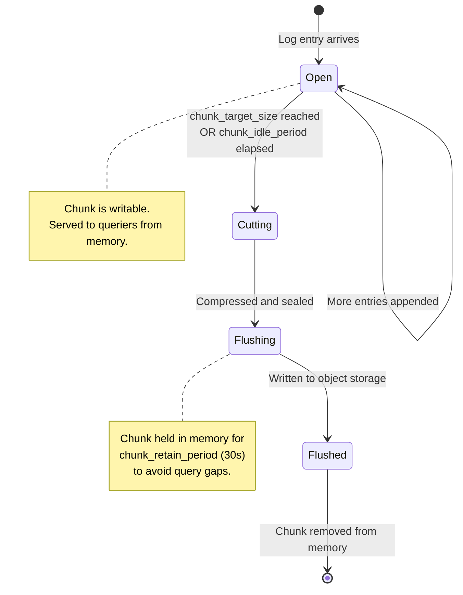
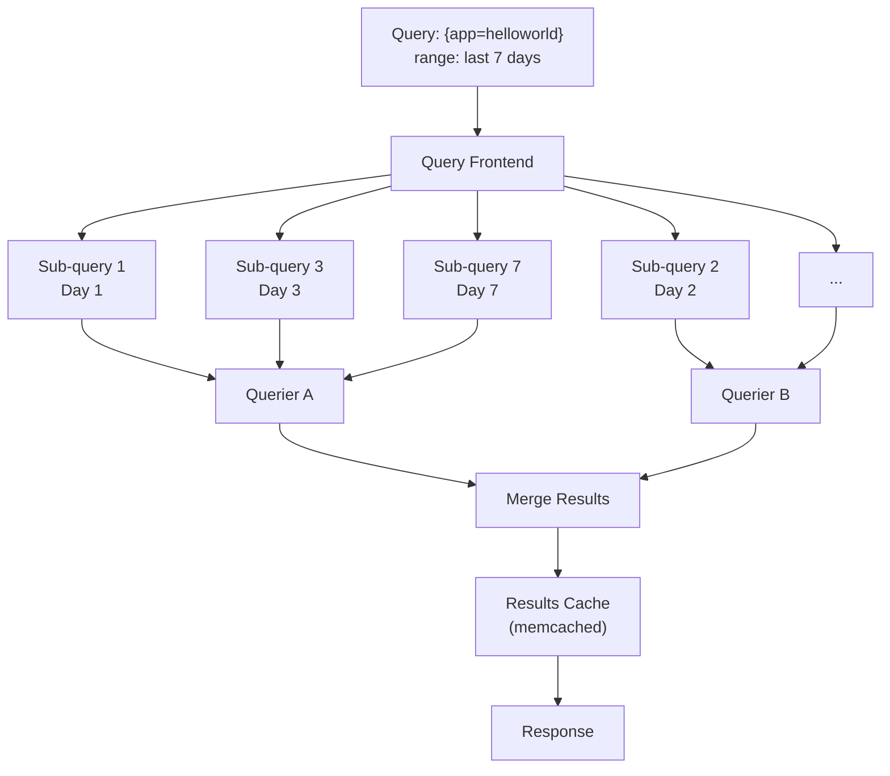
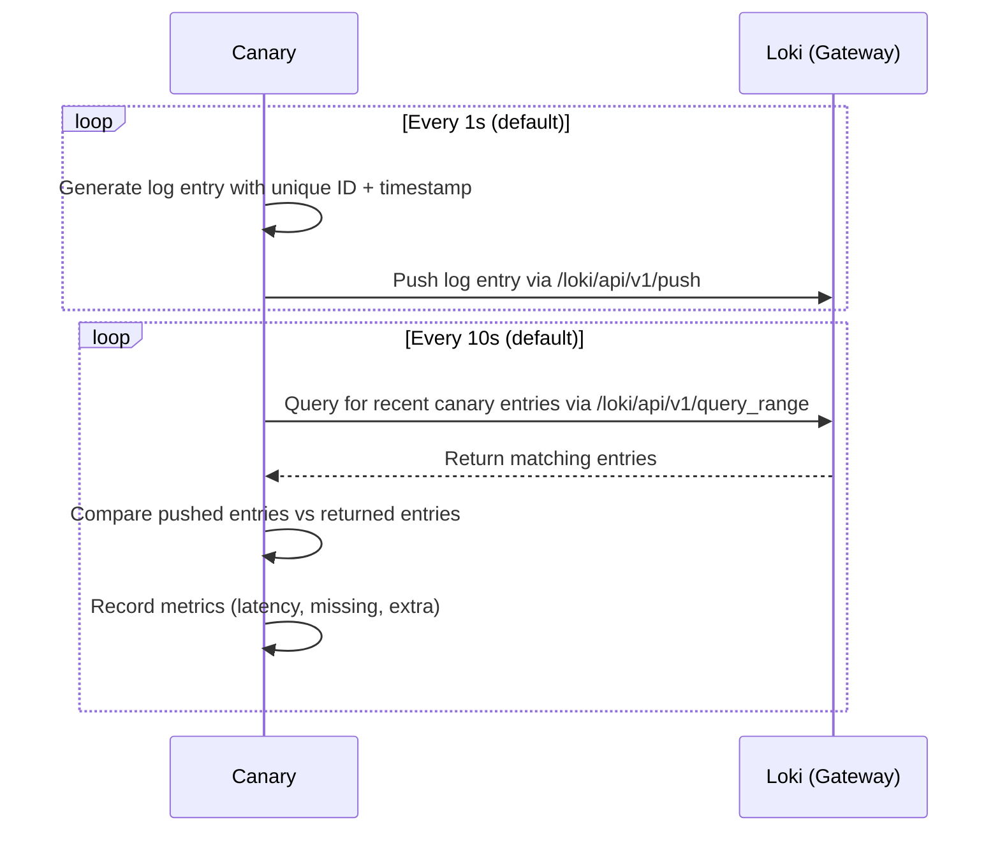
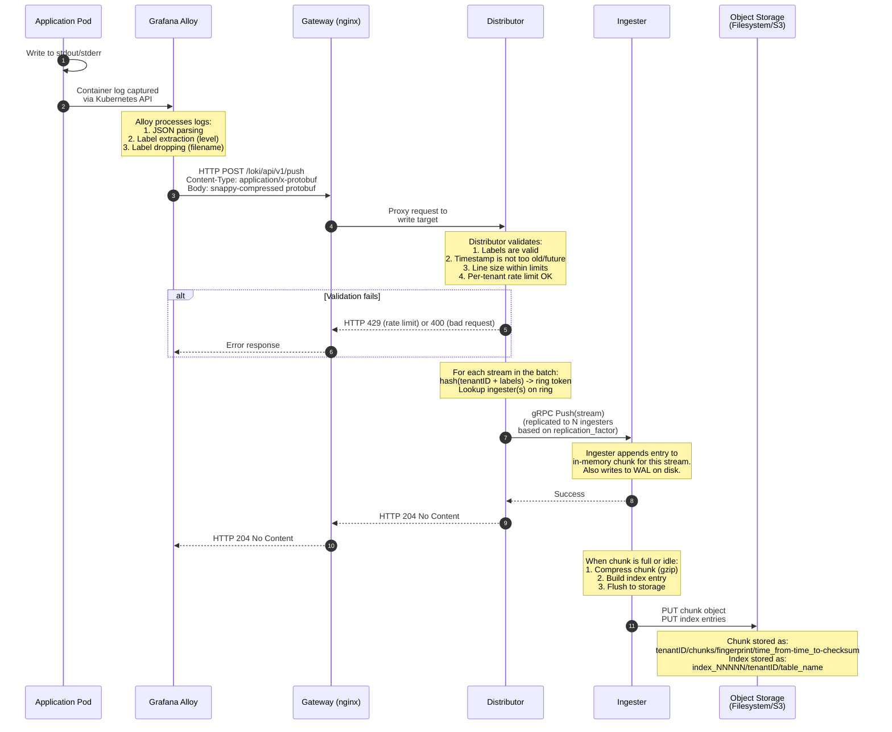
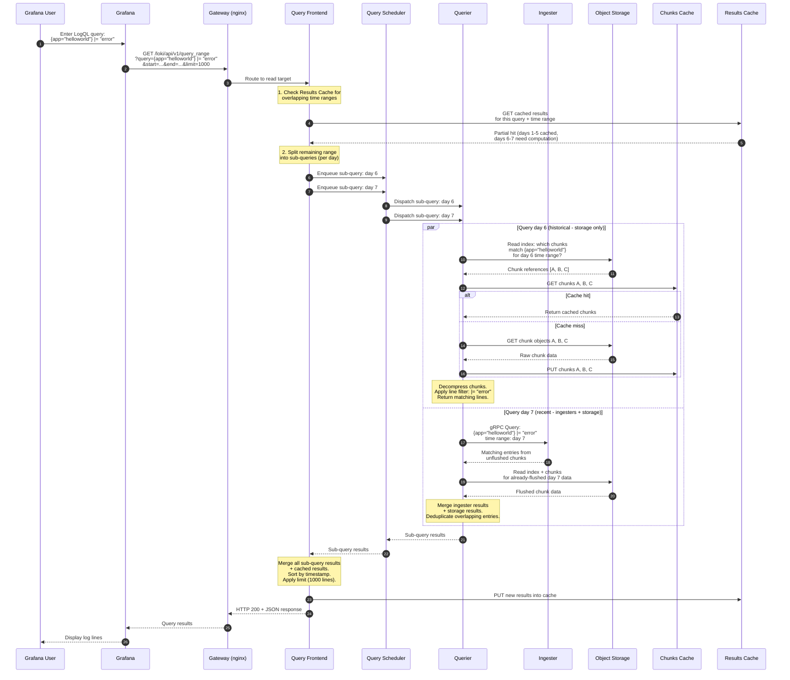
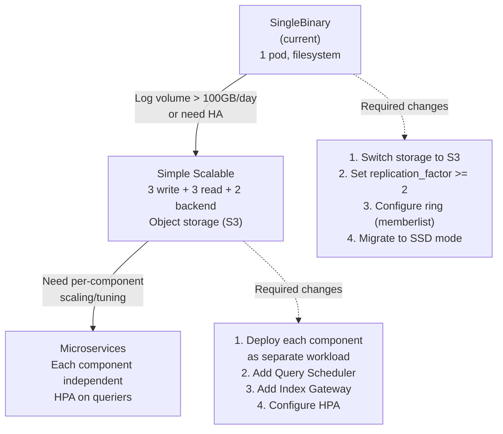
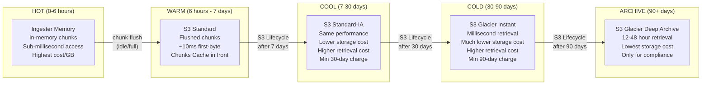

# Grafana Loki -- Deep Dive

## Table of Contents

1. [Overview](#1-overview)
2. [Architecture](#2-architecture)
3. [Deployment Modes](#3-deployment-modes)
4. [Component Deep Dive](#4-component-deep-dive)
5. [Write Path](#5-write-path)
6. [Read Path](#6-read-path)
7. [Scaling Guide](#7-scaling-guide)
8. [Hot and Cold Data with S3](#8-hot-and-cold-data-with-s3)
9. [Production Checklist](#9-production-checklist)

---

## 1. Overview

Grafana Loki is a horizontally scalable, highly available, multi-tenant log aggregation system inspired by Prometheus. Its core design philosophy can be summarized as **"Prometheus, but for logs"** -- it indexes metadata (labels) rather than the full text of log lines.

### Why This Matters

Traditional log systems (Elasticsearch/OpenSearch, Splunk) build a full-text inverted index over every log line. This makes arbitrary text search fast but is extremely expensive in terms of storage, memory, and CPU. Loki takes a fundamentally different approach:

| Aspect | Traditional (Elasticsearch) | Loki |
|---|---|---|
| What is indexed | Every word in every log line | Only the label set (key-value metadata) |
| Index size | Often larger than raw logs | Orders of magnitude smaller |
| Storage cost | High (index + raw data) | Low (small index + compressed chunks) |
| Query model | Full-text search | Label selection + optional regex/filter |
| Operational cost | High (JVM tuning, shard management) | Low (stateless components, simple scaling) |

Loki groups log entries into **streams**, where a stream is defined by a unique set of labels (e.g., `{namespace="observability", pod="helloworld-abc123", container="app"}`). Log entries within a stream are stored in compressed **chunks**. Queries first select streams by label matchers, then optionally filter or parse the raw log lines within those streams.

### Current Deployment Context

This repository deploys Loki as part of the LGTM stack (Loki, Grafana, Tempo, Mimir) in the `observability` namespace. The current configuration:

- **Deployment mode**: SingleBinary (one pod running all Loki components)
- **Storage**: Filesystem (local PVC, 10Gi)
- **Schema**: TSDB v13 with 24h index period
- **Retention**: 168 hours (7 days)
- **Auth**: Disabled (single-tenant)
- **Replication factor**: 1
- **Log collector**: Grafana Alloy shipping logs to `http://loki-gateway.observability.svc/loki/api/v1/push`

---

## 2. Architecture

### High-Level Architecture



### SingleBinary Mode (Current Deployment)

In SingleBinary mode, all components run within a single process. The architecture simplifies to:

```
+----------------------------------------------------------+
|                    loki-gateway (nginx)                    |
|              Routes /loki/api/v1/push -> write            |
|              Routes /loki/api/v1/query -> read            |
+----------------------------+-----------------------------+
                             |
                             v
+----------------------------------------------------------+
|                   loki-0 (SingleBinary)                   |
|                                                           |
|  +-------------+ +----------+ +---------+ +----------+   |
|  | Distributor | | Ingester | | Querier | | Query    |   |
|  |             | |          | |         | | Frontend |   |
|  +-------------+ +----------+ +---------+ +----------+   |
|  +-------------+ +----------+ +---------+                 |
|  | Compactor   | | Ruler    | | Index   |                 |
|  |             | |          | | Gateway |                 |
|  +-------------+ +----------+ +---------+                 |
|                                                           |
|  Storage: /loki/chunks (PVC 10Gi)                         |
+----------------------------------------------------------+
        |                               |
        v                               v
+------------------+      +--------------------+
| loki-chunks-     |      | loki-results-      |
| cache-0          |      | cache-0            |
| (memcached)      |      | (memcached)        |
+------------------+      +--------------------+
```

---

## 3. Deployment Modes

Loki offers three deployment modes, each trading simplicity for scalability.

### 3.1 SingleBinary Mode (Current)

All Loki components run in a single process within a single pod.

```
+-------------------------------------------+
|           loki-0 (SingleBinary)            |
|                                            |
|  All components in one process:            |
|  - Distributor    - Query Frontend         |
|  - Ingester       - Query Scheduler        |
|  - Querier        - Compactor              |
|  - Index Gateway  - Ruler                  |
|                                            |
|  Ring: inmemory KV store                   |
|  Storage: local filesystem / S3            |
+-------------------------------------------+
```

**When to use:**
- Development and testing environments
- Low-volume production (less than ~100GB/day of log ingestion)
- Teams that want simplicity over scalability
- Proof-of-concept deployments

**Limitations:**
- Cannot scale individual components independently
- Single point of failure (one pod holds all state)
- Memory-bound: the ingester, querier, and compactor all share the same memory pool
- Filesystem storage prevents horizontal scaling (only 1 replica meaningful)
- Replication factor locked to 1 in filesystem mode

**Current values-loki.yaml configuration:**
```yaml
deploymentMode: SingleBinary

singleBinary:
  replicas: 1
  persistence:
    enabled: true
    size: 10Gi
    storageClass: standard

# All other modes disabled
read:
  replicas: 0
write:
  replicas: 0
backend:
  replicas: 0
```

### 3.2 Simple Scalable Mode (SSD -- Read/Write/Backend)

Components are grouped into three deployment targets. This is the **recommended mode for most production deployments**.



**Component grouping:**

| Target | Components Included | Scaling Dimension |
|---|---|---|
| `write` | Distributor + Ingester | Ingestion throughput |
| `read` | Query Frontend + Querier | Query concurrency and speed |
| `backend` | Compactor + Index Gateway + Ruler + Query Scheduler | Background processing |

**When to use:**
- Production environments with moderate to high log volume (100GB--1TB+/day)
- When you need independent scaling of writes vs reads
- When you want the simplicity of fewer deployment targets but need more than a single binary

**Migration from SingleBinary:**
```yaml
deploymentMode: SimpleScalable

singleBinary:
  replicas: 0

write:
  replicas: 3
  persistence:
    size: 10Gi

read:
  replicas: 3

backend:
  replicas: 2
  persistence:
    size: 10Gi

loki:
  storage:
    type: s3   # Object storage required for multi-replica
  commonConfig:
    replication_factor: 3
```

### 3.3 Microservices Mode (Full Distributed)

Every component runs as its own Kubernetes Deployment or StatefulSet. This is for large-scale deployments where fine-grained control is required.

```
                        +-------------+
                        |   Gateway   |
                        |   (nginx)   |
                        +------+------+
                               |
                 +-------------+-------------+
                 |                           |
          +------v------+           +-------v--------+
          | Distributor |           | Query Frontend |
          | (Deployment)|           | (Deployment)   |
          |  x3 replicas|           |  x2 replicas   |
          +------+------+           +-------+--------+
                 |                          |
                 v                  +-------v--------+
          +------+------+          | Query Scheduler |
          |  Ingester   |          | (Deployment)    |
          |(StatefulSet)|          |  x2 replicas    |
          |  x3 replicas|          +-------+---------+
          +------+------+                  |
                 |                  +------v------+
                 |                  |   Querier   |
                 v                  | (Deployment)|
          +------+------+          |  x6 replicas|
          |Object Store |<---------+------+------+
          |  (S3/GCS)   |                 |
          +------+------+          +------v------+
                 ^                 | Index       |
                 |                 | Gateway     |
          +------+------+         | (Stful.Set) |
          |  Compactor  |         |  x2 replicas|
          |(StatefulSet)|         +-------------+
          |  x1 replica |
          +-------------+         +-------------+
                                  |   Ruler     |
                                  | (Stful.Set) |
                                  |  x2 replicas|
                                  +-------------+
```

**When to use:**
- Very large scale (1TB+/day log ingestion)
- When you need per-component resource tuning (e.g., ingesters need lots of memory, queriers need lots of CPU)
- When you need per-component autoscaling (HPA on queriers for bursty query loads)
- When different components have different availability requirements

**Tradeoffs:**
- Highest operational complexity
- Many more Kubernetes resources to manage
- Requires a ring backend (memberlist, consul, or etcd) for coordination
- Requires object storage (filesystem is not viable)

### Mode Comparison Summary

| Aspect | SingleBinary | Simple Scalable | Microservices |
|---|---|---|---|
| Number of deployment targets | 1 | 3 | 8--12 |
| Minimum pods | 1 | 8 (3W+3R+2B) | 15--20+ |
| Independent component scaling | No | Partial (W/R/B) | Full |
| Storage requirement | Filesystem or object | Object storage | Object storage |
| Operational complexity | Low | Medium | High |
| Max practical throughput | ~100 GB/day | ~1 TB/day | 10+ TB/day |
| Recommended for | Dev, small prod | Most production | Large enterprise |

---

## 4. Component Deep Dive

### 4.1 Gateway

**What it does:**
The Gateway is an nginx reverse proxy that sits in front of all Loki components. It routes incoming HTTP requests to the appropriate backend component based on the URL path.

**Why it exists:**
- Provides a single entry point for all Loki API interactions
- Handles load balancing across multiple replicas of each component
- Enforces tenant ID headers in multi-tenant mode
- Applies rate limiting and request size constraints
- Terminates TLS in front of Loki

**Routing rules:**

| Path Pattern | Routed To | Purpose |
|---|---|---|
| `/loki/api/v1/push` | Distributor (write) | Log ingestion |
| `/loki/api/v1/query` | Query Frontend (read) | Instant queries |
| `/loki/api/v1/query_range` | Query Frontend (read) | Range queries |
| `/loki/api/v1/tail` | Querier (read) | Live tailing |
| `/loki/api/v1/series` | Query Frontend (read) | Series lookup |
| `/loki/api/v1/labels` | Query Frontend (read) | Label discovery |
| `/api/prom/rules` | Ruler (backend) | Alerting rules |
| `/compactor/ring` | Compactor (backend) | Compactor ring status |

**Key configuration (current):**
```yaml
gateway:
  enabled: true
  replicas: 1
  ingress:
    enabled: true
    ingressClassName: nginx
    hosts:
      - host: loki.192-168-49-2.nip.io
        paths:
          - path: /
            pathType: Prefix

  # Custom nginx settings
  nginxConfig:
    httpSnippet: |
      client_max_body_size 50m;
```

**Key configuration parameters:**

| Parameter | Description | Default |
|---|---|---|
| `gateway.replicas` | Number of gateway pods | 1 |
| `gateway.nginxConfig.httpSnippet` | Raw nginx config to inject | (none) |
| `client_max_body_size` | Max request body size for log pushes | 1m (nginx default) |
| `proxy_read_timeout` | Timeout for upstream reads | 60s |

**Resource characteristics:**
- CPU: Low (nginx is very efficient for proxying)
- Memory: Low (stateless, just proxies)
- Disk: None
- Network: High (all traffic passes through)
- Scaling: Horizontal, stateless. Add replicas behind a LoadBalancer or Ingress.

---

### 4.2 Distributor

**What it does:**
The Distributor is the first component on the write path. It receives log push requests from clients (e.g., Grafana Alloy, Promtail, Fluentd), validates them, and distributes them to the appropriate Ingester(s) using consistent hashing.

**Why it exists:**
- Validates incoming log entries (labels, timestamps, line size)
- Enforces per-tenant rate limits
- Hashes each stream (tenant ID + label set) to determine which ingester(s) should receive it
- Replicates writes to multiple ingesters based on `replication_factor`
- Acts as a stateless fan-out layer, so it can be scaled independently of ingesters

**How hashing works:**



With `replication_factor: 3`, the distributor writes each entry to 3 consecutive ingesters on the ring. With `replication_factor: 1` (current), it writes to only 1.

**Key configuration parameters:**

| Parameter | Description | Current Value |
|---|---|---|
| `limits_config.ingestion_rate_mb` | Per-tenant ingestion rate limit (MB/s) | 10 |
| `limits_config.ingestion_burst_size_mb` | Per-tenant burst size (MB) | 20 |
| `limits_config.per_stream_rate_limit` | Max rate per stream | 3MB |
| `limits_config.per_stream_rate_limit_burst` | Burst per stream | 15MB |
| `distributor.ring.kvstore.store` | Ring backend | inmemory |

**Resource characteristics:**
- CPU: Moderate (hashing, validation, serialization)
- Memory: Low (stateless, no data held beyond in-flight requests)
- Disk: None
- Network: High (receives all incoming logs, fans out to ingesters via gRPC)

---

### 4.3 Ingester

**What it does:**
The Ingester receives log entries from distributors and builds compressed log chunks in memory. Once a chunk is "full" (by size or age), the ingester flushes it to long-term object storage. Ingesters also serve recent (unflushed) data to queriers for queries covering the latest time window.

**Why it exists:**
- Batching: Writing every individual log line to object storage would be prohibitively expensive. The ingester batches thousands of log lines into compressed chunks before writing.
- Compression: Chunks are compressed (gzip, snappy, or lz4) before flushing, achieving 5--10x compression ratios.
- Hot data serving: Since recently ingested data has not yet been flushed, the ingester must serve it directly for queries.

**Chunk lifecycle:**



**Key configuration parameters:**

| Parameter | Description | Current Value |
|---|---|---|
| `ingester.chunk_idle_period` | Close chunk after this idle time | 30m |
| `ingester.chunk_retain_period` | Keep flushed chunk in memory for queries | 30s |
| `ingester.max_transfer_retries` | Retries for transferring chunks on shutdown | 0 |
| `ingester.lifecycler.ring.replication_factor` | How many ingesters each stream is written to | 1 |
| `ingester.lifecycler.ring.kvstore.store` | Ring KV backend | inmemory |
| `chunk_target_size` | Target uncompressed chunk size | 1572864 (1.5MB) |
| `chunk_encoding` | Compression algorithm | gzip |
| `max_chunk_age` | Maximum time a chunk stays open | 2h |

**Resource characteristics:**
- CPU: Moderate (compression, serialization)
- Memory: **HIGH** -- this is typically the most memory-hungry component. Each active stream consumes memory for its open chunk. Memory usage is proportional to: `(number of active streams) * (average chunk size)`
- Disk: Requires persistent storage for the WAL (Write-Ahead Log) to survive restarts
- Network: Moderate (receives from distributors, serves to queriers, flushes to storage)

**Memory estimation formula:**
```
Ingester memory ~= active_streams * chunk_target_size * replication_factor / num_ingesters
                 + WAL buffer
                 + overhead (~30%)
```

---

### 4.4 Querier

**What it does:**
The Querier executes LogQL queries. It reads data from two sources: recent unflushed data from ingesters (via gRPC) and historical data from object storage (via the index and chunk store).

**Why it exists:**
- Unifies the two data sources (ingesters for hot data, storage for cold data) into a single query result
- Handles the actual LogQL evaluation: label matchers, line filters, parsers, and metric aggregations
- Deduplicates overlapping data that may exist in both ingesters and storage (due to replication or flush timing)

**Query execution flow:**

```
                    LogQL Query
                        |
                        v
              +-------------------+
              | Parse LogQL       |
              | Extract matchers  |
              +-------------------+
                        |
           +------------+------------+
           |                         |
           v                         v
   +---------------+        +---------------+
   | Query         |        | Query Object  |
   | Ingesters     |        | Storage       |
   | (gRPC)        |        | (index+chunks)|
   | [recent data] |        | [old data]    |
   +-------+-------+        +-------+-------+
           |                         |
           +------------+------------+
                        |
                        v
              +-------------------+
              | Merge + Deduplicate|
              | Sort by timestamp  |
              +-------------------+
                        |
                        v
                  Query Result
```

**Key configuration parameters:**

| Parameter | Description | Default |
|---|---|---|
| `querier.max_concurrent` | Max parallel queries per querier | 10 |
| `querier.query_timeout` | Max query execution time | 1m |
| `querier.engine.timeout` | LogQL engine timeout | 5m |
| `querier.multi_tenant_queries_enabled` | Allow cross-tenant queries | false |

**Resource characteristics:**
- CPU: **HIGH** -- log line filtering and regex evaluation is CPU-intensive, especially for queries without good label selectivity
- Memory: Moderate to high (depends on query result size and whether metric aggregations are computed)
- Disk: Optional (can use local disk to cache index and chunk data)
- Network: High (reads from ingesters and object storage)

---

### 4.5 Query Frontend

**What it does:**
The Query Frontend is a stateless proxy that sits in front of queriers. It receives incoming queries, splits them into smaller sub-queries by time, and optionally caches results to accelerate repeated queries.

**Why it exists:**
- **Query splitting**: A query for "last 7 days" is split into 7 daily sub-queries. Each sub-query can be executed in parallel across multiple queriers, dramatically reducing latency.
- **Result caching**: If the same time range is queried again, cached results are returned instantly.
- **Query alignment**: Aligns queries to cache-friendly time boundaries.
- **Queue management**: Internal FIFO queue with per-tenant fairness to prevent one tenant from monopolizing queriers.
- **Retry logic**: Automatically retries failed sub-queries.

**Splitting behavior:**



**Key configuration parameters:**

| Parameter | Description | Current Value |
|---|---|---|
| `frontend.max_outstanding_per_tenant` | Max queued queries per tenant | 2048 |
| `frontend.compress_responses` | gzip compress HTTP responses | true |
| `query_range.split_queries_by_interval` | Time interval for splitting | 24h |
| `query_range.parallelise_shardable_queries` | Parallelize across shards | true |
| `query_range.cache_results` | Enable result caching | true |

**Resource characteristics:**
- CPU: Low to moderate (splitting and merging logic, not actual query execution)
- Memory: Moderate (holds sub-query results temporarily for merging)
- Disk: None
- Network: High (proxies all query traffic)

---

### 4.6 Query Scheduler

**What it does:**
The Query Scheduler is an optional component that decouples the Query Frontend from the Queriers. It maintains a queue of sub-queries and distributes them to available queriers.

**Why it exists:**
- Without the scheduler, queriers must connect to every query frontend instance. With N frontends and M queriers, that is N*M connections.
- With the scheduler, both frontends and queriers connect only to the scheduler, reducing connection complexity to N+M.
- Provides better load balancing: the scheduler can distribute work based on querier availability rather than random assignment.
- Enables better scaling: queriers can be added or removed without reconfiguring frontends.

**Connection topology:**

```
Without Scheduler:           With Scheduler:

Frontend-1 --+-- Querier-1   Frontend-1 --+
              |               Frontend-2 --+--> Scheduler --> Querier-1
Frontend-2 --+-- Querier-2                                --> Querier-2
              |                                           --> Querier-3
Frontend-1 --+-- Querier-3
              |
Frontend-2 --+
  (6 connections)             (2 + 3 = 5 connections)
```

At scale (e.g., 5 frontends, 20 queriers), the difference becomes significant: 100 connections vs. 25.

**Key configuration parameters:**

| Parameter | Description | Default |
|---|---|---|
| `query_scheduler.max_outstanding_requests_per_tenant` | Queue depth per tenant | 32768 |
| `query_scheduler.grpc_client_config.max_send_msg_size` | Max gRPC message size | 100MB |

**Resource characteristics:**
- CPU: Very low (just a queue dispatcher)
- Memory: Low
- Disk: None
- Network: Moderate (acts as connection hub)

---

### 4.7 Compactor

**What it does:**
The Compactor runs as a background process that compacts index files in object storage and enforces retention policies by deleting expired chunks and index entries.

**Why it exists:**
- **Index compaction**: Each ingester writes its own index files every `period` (24h in current config). Over time, many small index files accumulate. The compactor merges these into fewer, larger files for more efficient querying.
- **Retention enforcement**: The compactor is the only component that actually deletes old data. Without it, `retention_period: 168h` would have no effect.
- **Deduplication**: Removes duplicate index entries that can arise from ingester replication.

**Important**: Only one compactor instance should run at a time (it uses a lock in the ring to ensure this). Running multiple compactors concurrently can cause data corruption.

**Key configuration parameters:**

| Parameter | Description | Default |
|---|---|---|
| `compactor.working_directory` | Local temp directory for compaction | `/loki/compactor` |
| `compactor.compaction_interval` | How often to run compaction | 10m |
| `compactor.retention_enabled` | Whether to enforce retention | false (must enable!) |
| `compactor.retention_delete_delay` | Delay before deleting marked data | 2h |
| `compactor.retention_delete_worker_count` | Parallelism for deletion | 150 |
| `limits_config.retention_period` | Global retention period | 168h (current) |

**Resource characteristics:**
- CPU: Moderate to high during compaction runs (reading, merging, rewriting index files)
- Memory: Moderate (loads index tables into memory for compaction)
- Disk: Requires local disk for temporary compaction work
- Network: High during compaction (reads and writes large index files from/to object storage)

---

### 4.8 Index Gateway

**What it does:**
The Index Gateway serves index queries on behalf of queriers and rulers. Instead of each querier downloading and caching index files from object storage directly, they query the Index Gateway, which maintains a shared index cache.

**Why it exists:**
- Without it, every querier downloads and caches index files independently, leading to redundant object storage reads and redundant memory usage.
- With it, index data is cached once in the Index Gateway and served to all queriers efficiently.
- Reduces object storage API calls (and associated costs).

**Key configuration parameters:**

| Parameter | Description | Default |
|---|---|---|
| `index_gateway.mode` | `ring` (distributed) or `simple` | ring |
| `index_gateway.ring.kvstore.store` | Ring KV backend | memberlist |

**Resource characteristics:**
- CPU: Low to moderate
- Memory: Moderate to high (caches index data)
- Disk: Optional (can use local disk for index caching)
- Network: Moderate

---

### 4.9 Ruler

**What it does:**
The Ruler continuously evaluates LogQL alerting rules and recording rules. Alerting rules fire alerts to Alertmanager when a LogQL expression crosses a threshold. Recording rules evaluate LogQL metric queries and write the results as time-series data (to a remote Prometheus-compatible endpoint like Mimir).

**Why it exists:**
- Enables log-based alerting (e.g., "alert if more than 10 error logs per minute from the payment service")
- Enables log-based recording rules (e.g., "record the rate of error logs per service as a metric for dashboarding")
- Evaluates rules continuously without requiring a user to be running a query in Grafana

**Example alerting rule:**
```yaml
groups:
  - name: high_error_rate
    rules:
      - alert: HighErrorRate
        expr: |
          sum(rate({app="helloworld"} |= "error" [5m])) > 10
        for: 5m
        labels:
          severity: critical
        annotations:
          summary: "High error rate in helloworld"
```

**Key configuration parameters:**

| Parameter | Description | Default |
|---|---|---|
| `ruler.storage.type` | Where rules are stored | local |
| `ruler.storage.local.directory` | Local directory for rules | `/loki/rules` |
| `ruler.alertmanager_url` | Alertmanager endpoint | (none) |
| `ruler.evaluation_interval` | How often to evaluate rules | 1m |
| `ruler.ring.kvstore.store` | Ring KV backend | memberlist |

**Resource characteristics:**
- CPU: Low to moderate (depends on number and complexity of rules)
- Memory: Low to moderate
- Disk: Minimal (stores rule files)
- Network: Moderate (queries queriers, sends alerts to Alertmanager)

---

### 4.10 Chunks Cache (memcached)

**What it does:**
A memcached instance that caches chunk data (the actual compressed log data) retrieved from object storage.

**Why it exists:**
- Queriers frequently read the same chunks (e.g., when multiple users query the same time range). Caching avoids redundant object storage reads.
- Object storage reads have latency (10--100ms per GET). Memcached reads are sub-millisecond.
- Reduces object storage costs (fewer GET requests).

**Current configuration:**
```yaml
chunksCache:
  enabled: true
  replicas: 1
  resources:
    requests:
      cpu: 100m
      memory: 256Mi
```

**Key configuration parameters:**

| Parameter | Description | Current Value |
|---|---|---|
| `chunksCache.enabled` | Enable chunk caching | true |
| `chunksCache.replicas` | Number of memcached pods | 1 |
| `memcached.maxItemSize` | Max size of a single cached item | 5m |
| `memcached.memory` | Max memory for memcached | 8192 (MB) |
| `memcached.timeout` | Operation timeout | 500ms |

**Resource characteristics:**
- CPU: Low
- Memory: **HIGH** -- purpose-built to consume memory. Size based on your working set (how much recent chunk data you want cached).
- Disk: None (in-memory only)
- Network: Moderate

---

### 4.11 Results Cache (memcached)

**What it does:**
A memcached instance that caches the final results of LogQL queries (the assembled, processed output, not raw chunks).

**Why it exists:**
- When the Query Frontend splits a 7-day query into 7 daily sub-queries, the results for completed days (days 1--6) will never change. Caching these results means they are never recomputed.
- Dashboard auto-refresh queries often cover overlapping time ranges. The cache avoids re-executing the overlapping portion.

**Current configuration:**
```yaml
resultsCache:
  enabled: true
  replicas: 1
  resources:
    requests:
      cpu: 100m
      memory: 256Mi
```

**Key configuration parameters:**

| Parameter | Description | Current Value |
|---|---|---|
| `resultsCache.enabled` | Enable result caching | true |
| `resultsCache.replicas` | Number of memcached pods | 1 |
| `resultsCache.defaultValidity` | Default TTL for cached results | 12h |

**Resource characteristics:**
- CPU: Low
- Memory: Moderate to high (size based on query diversity and result size)
- Disk: None (in-memory only)
- Network: Low to moderate

---

### 4.12 Canary (loki-canary)

**What it does:**
Loki Canary is a health-check sidecar that continuously writes known test log entries to Loki and reads them back, measuring the end-to-end latency, completeness, and correctness of the Loki pipeline.

**Why it exists:**
- Provides a synthetic end-to-end test: "Can Loki receive and return logs?"
- Measures write-to-read latency (how long from push to query-ability)
- Detects missing log entries (logs that were pushed but never appear in queries)
- Exposes Prometheus metrics for alerting on Loki health:
  - `loki_canary_missing_entries` -- entries written but not read back
  - `loki_canary_unexpected_entries` -- entries read that were never written
  - `loki_canary_response_latency` -- end-to-end latency histogram

**How it works:**



**Key configuration parameters:**

| Parameter | Description | Default |
|---|---|---|
| `canary.push_interval` | How often to push a test log | 1s |
| `canary.query_interval` | How often to query for test logs | 10s |
| `canary.max_wait` | Max wait for an entry to appear | 5m |
| `canary.label_name` | Label used to identify canary entries | `__canary__` |

**Resource characteristics:**
- CPU: Very low
- Memory: Very low
- Disk: None
- Network: Low (small, periodic push and query operations)

---

## 5. Write Path

The write path covers the journey of a log entry from an application to persistent storage.

### Step-by-Step Sequence



### Detailed Breakdown

**Step 1: Log emission.** The application writes structured JSON logs to stdout. In the current setup, the helloworld app outputs lines like:
```json
{"level":"info","msg":"Handling request","trace_id":"abc123","timestamp":"2024-01-15T10:00:00Z"}
```

**Step 2: Collection by Alloy.** Grafana Alloy discovers pods via `discovery.kubernetes` with role `pod`, filters for `app=helloworld` pods, and tails their container logs via the Kubernetes API. It processes logs through the `loki.process` pipeline:
- Extracts `level`, `msg`, and `trace_id` from JSON
- Promotes `level` to a label
- Drops the `filename` label (reduces cardinality)

**Step 3: Push to Gateway.** Alloy batches log entries and sends them as snappy-compressed protobuf to `http://loki-gateway.observability.svc/loki/api/v1/push`.

**Step 4: Gateway routing.** Nginx matches the `/loki/api/v1/push` path and forwards to the write target (the single binary in current mode).

**Step 5: Distributor validation.** The distributor validates:
- Label names match regex `[a-zA-Z_][a-zA-Z0-9_]*`
- Total label size does not exceed `max_label_name_length` and `max_label_value_length`
- Timestamp is within `reject_old_samples_max_age` (default 1 week) of current time
- Line size does not exceed `max_line_size` (default 256KB)
- Tenant ingestion rate is within `ingestion_rate_mb` (10 MB/s current)
- Per-stream rate is within `per_stream_rate_limit` (3 MB/s current)

**Step 6: Consistent hash ring lookup.** The distributor hashes each stream's tenant ID + label set to produce a 32-bit token, then looks up the ingester(s) responsible for that token range on the hash ring.

**Step 7: Ingester append.** The ingester appends the log entry to the correct in-memory chunk. If no chunk exists for this stream yet, a new one is created. The entry is also written to the WAL (Write-Ahead Log) on disk for durability.

**Step 8: Chunk flush.** When a chunk reaches `chunk_target_size` (~1.5MB uncompressed), reaches `max_chunk_age` (2h), or has been idle for `chunk_idle_period` (30m), the ingester:
1. Compresses the chunk (gzip by default)
2. Generates index entries mapping labels to chunk references
3. Writes the chunk and index entries to object storage
4. Retains the chunk in memory for `chunk_retain_period` (30s) to avoid query gaps
5. Removes the chunk from memory

---

## 6. Read Path

The read path covers LogQL query execution from request to response.

### Step-by-Step Sequence



### Detailed Breakdown

**Step 1: LogQL parsing.** The query `{app="helloworld"} |= "error"` is parsed into:
- Stream selector: `{app="helloworld"}` (label matcher)
- Line filter: `|= "error"` (substring match on log content)

**Step 2: Result cache check.** The Query Frontend checks the Results Cache for previously computed results that overlap with the requested time range. If the user is viewing a dashboard that auto-refreshes every 30 seconds, most of the time range has already been computed.

**Step 3: Query splitting.** The remaining uncached time range is split into sub-queries aligned to `split_queries_by_interval` (24h). For a 7-day query, this produces up to 7 sub-queries.

**Step 4: Dispatch.** Sub-queries are enqueued in the Query Scheduler (or directly dispatched to queriers if no scheduler is present). The scheduler ensures per-tenant fairness and distributes work to available queriers.

**Step 5: Index lookup.** For each sub-query, the querier looks up the index to find which chunks match the label selector `{app="helloworld"}`. The TSDB index is organized by:
- Tenant ID
- Label set fingerprint
- Time range

This returns a list of chunk references (pointers to objects in storage).

**Step 6: Chunk retrieval.** The querier fetches chunks, checking the Chunks Cache first. On a cache miss, it reads from object storage and populates the cache.

**Step 7: Line filtering.** The querier decompresses each chunk and applies the line filter `|= "error"`, streaming through log lines and keeping only matches. This is where Loki's design trade-off becomes clear: because log content is not indexed, the querier must scan every line in every matching chunk. Good label selectivity (matching fewer streams) is critical for query performance.

**Step 8: Ingester query.** For the most recent time window (data not yet flushed), the querier also queries ingesters directly via gRPC. The ingester scans its in-memory chunks for the matching stream and applies the same line filter.

**Step 9: Merge and deduplicate.** Results from storage and ingesters are merged by timestamp. Duplicate entries (which can occur when data exists in both ingesters and storage due to flush timing or replication) are removed.

**Step 10: Final assembly.** The Query Frontend merges results from all sub-queries plus cached results, sorts by timestamp, applies the `limit` parameter, and returns the response.

---

## 7. Scaling Guide

### Key Insight

Loki's architecture is designed so that **different components have different scaling bottlenecks**. The write path and read path can be scaled independently, and within each path, individual components have distinct resource profiles.

Because Loki only indexes labels (not log content), its storage and indexing costs are a fraction of full-text systems. The trade-off is that query performance depends heavily on label selectivity -- queries that match many streams must scan more data.

### Scaling Matrix

| Component | Scaling Trigger (Symptom) | How to Scale | Stateful? | Key Resource | Notes |
|---|---|---|---|---|---|
| **Gateway** | High latency on all requests, nginx connection limits | Add replicas | No | Network | Stateless; scale behind LB |
| **Distributor** | Push errors (429/503), high latency on writes | Add replicas | No | CPU, Network | Stateless; scale horizontally |
| **Ingester** | OOM kills, high memory usage, slow flushes, write timeouts | Add replicas (redistribute ring tokens) | Yes (WAL) | **Memory** | Must use object storage + replication_factor >= 2 for HA |
| **Querier** | Slow queries, high CPU, query timeouts | Add replicas | No | **CPU** | Stateless; most queries are CPU-bound from log scanning |
| **Query Frontend** | Queue depth growing, high `max_outstanding_per_tenant` usage | Add replicas | No | Memory | Rarely the bottleneck |
| **Query Scheduler** | Queue depth growing | Add replicas | No | CPU (minimal) | Rarely the bottleneck |
| **Compactor** | Compaction falling behind, retention not being enforced | Scale vertically (more CPU/memory) | Yes | CPU, Memory | **Only 1 active instance**; cannot horizontally scale |
| **Index Gateway** | Index queries slow, high memory from index caching | Add replicas | Yes | Memory | Reduces load on queriers |
| **Ruler** | Rule evaluation falling behind, alerting delays | Add replicas (shard rule groups across instances) | Yes | CPU | Scales via ring-based sharding |
| **Chunks Cache** | Low cache hit rate, high storage read latency | Add replicas + increase memory per pod | No | **Memory** | More memory = higher hit rate |
| **Results Cache** | Repeated queries hitting backend instead of cache | Add replicas + increase memory per pod | No | **Memory** | More memory = more cached results |
| **Canary** | N/A (monitoring component) | Not typically scaled | No | Minimal | One per cluster is sufficient |

### Scaling Each Component: Details

#### Ingester Scaling

The ingester is typically the first component to hit limits as log volume grows.

**Symptoms indicating you need more ingesters:**
- Pods OOM-killed (memory exhaustion from too many active streams)
- `loki_ingester_memory_streams` metric growing beyond capacity
- Slow chunk flushes (`loki_ingester_chunk_age_seconds` increasing)
- Write errors from the distributor (ingester backpressure)

**How to scale:**
1. Switch to object storage (S3/GCS) if not already -- filesystem mode does not support multiple ingesters.
2. Increase `replication_factor` to at least 2 (ideally 3) for data durability.
3. Add ingester replicas. The hash ring automatically redistributes token ranges.
4. Set `ingester.lifecycler.join_after` to a short duration (e.g., 10s) so new ingesters join the ring quickly.

**Example calculation:**
```
Scenario: 500,000 active streams, each with ~1.5MB chunk target size
Memory per ingester = (500,000 / N_ingesters) * 1.5MB * 1.3 (overhead)
For 3 ingesters: ~325 MB per ingester (manageable)
For 1 ingester: ~975 MB (approaching limits with GC pressure)
```

#### Querier Scaling

**Symptoms indicating you need more queriers:**
- Queries timing out
- Dashboard loading slowly
- High CPU utilization on querier pods
- Query Frontend queue depth growing

**How to scale:**
1. Add querier replicas (stateless, trivial to scale).
2. Consider adding a Query Scheduler to improve work distribution.
3. Tune `querier.max_concurrent` to control per-pod parallelism.
4. Use HPA (Horizontal Pod Autoscaler) based on CPU utilization:

```yaml
apiVersion: autoscaling/v2
kind: HorizontalPodAutoscaler
metadata:
  name: loki-querier
spec:
  scaleTargetRef:
    apiVersion: apps/v1
    kind: Deployment
    name: loki-querier
  minReplicas: 3
  maxReplicas: 20
  metrics:
    - type: Resource
      resource:
        name: cpu
        target:
          type: Utilization
          averageUtilization: 70
```

#### Cache Scaling

**Symptoms indicating caches need scaling:**
- Cache hit rate below 80% (check `memcached_commands_total{command="get"}` vs `memcached_commands_total{command="set"}`)
- Object storage read latency dominating query times
- High object storage API costs

**How to scale:**
- Increase memory allocated to each memcached pod
- Add memcached replicas (client-side consistent hashing distributes keys across pods)
- Typical production sizing:
  - Chunks cache: 4--32 GB per replica, 2--3 replicas
  - Results cache: 1--4 GB per replica, 2--3 replicas

### Scaling Path: SingleBinary to Production



---

## 8. Hot and Cold Data with S3

### How Loki Stores Data

Loki stores two types of data:

1. **Index files**: Small files that map label sets to chunk references. Think of them as the "table of contents." Created by ingesters, compacted by the compactor.
2. **Chunk files**: Compressed blobs of actual log content. Each chunk contains log entries for one stream over a time window. Typically 1--2 MB compressed.

```
Storage Layout (conceptual):

  object-store-bucket/
  +-- index/
  |   +-- index_19745/                  (table for a 24h period)
  |   |   +-- fake/                     (tenant ID, or "fake" when auth disabled)
  |   |       +-- compactor-1705276800  (compacted index file)
  |   +-- index_19746/
  |       +-- fake/
  |           +-- compactor-1705363200
  +-- chunks/
      +-- fake/                         (tenant ID)
          +-- ZmFrZS8yNjE5...          (base64-encoded chunk reference)
          +-- ZmFrZS8yNjE5...
          +-- ...
```

### Current Setup: Filesystem Storage

The current deployment uses filesystem storage backed by a PVC:

```yaml
loki:
  storage:
    type: filesystem
    filesystem:
      chunks_directory: /loki/chunks
      rules_directory: /loki/rules

singleBinary:
  persistence:
    enabled: true
    size: 10Gi
    storageClass: standard
```

This is simple but limited:
- Tied to a single pod (no shared filesystem)
- Cannot scale horizontally
- Data durability depends on the underlying PV
- PVC size is a hard ceiling

### Production Setup: S3 for Object Storage

For production, both chunks and index files should live in S3 (or compatible object storage like MinIO, GCS, Azure Blob).

```yaml
loki:
  storage:
    type: s3
    s3:
      endpoint: s3.us-east-1.amazonaws.com
      region: us-east-1
      bucketnames: company-loki-chunks
      access_key_id: ${AWS_ACCESS_KEY_ID}      # Use IRSA or env injection
      secret_access_key: ${AWS_SECRET_ACCESS_KEY}
      insecure: false
      sse_encryption: true
      http_config:
        idle_conn_timeout: 90s
        response_header_timeout: 10s
        insecure_skip_verify: false

  schemaConfig:
    configs:
      - from: 2024-01-01
        store: tsdb
        object_store: s3
        schema: v13
        index:
          prefix: index_
          period: 24h
```

### Data Temperature Tiers

Loki data naturally has a "temperature" that decreases with age. Recent data is queried frequently ("hot"), while older data is rarely accessed ("cold").



### Data Flow Through Temperature Tiers

```
Time ------>

t=0          t=30m         t=2h          t=24h         t=7d          t=30d         t=90d
 |            |             |              |             |              |             |
 v            v             v              v             v              v             v
[Log Entry]-->[Ingester]--->[Chunk Flush]-->[Compacted]-->[Lifecycle]--->[Lifecycle]-->[Lifecycle]
              (memory)      (S3 Standard)  (Index merged) (S3 -> S3-IA) (IA->Glacier) (Deep Archive)
              HOT           WARM           WARM           COOL           COLD          ARCHIVE

 Access:     Immediate     ~10ms+cache    ~10ms+cache   ~10ms          ~ms(Instant)  12-48 hours
 Cost/GB:    $$$$$         $$             $$             $              $              pennies
```

### S3 Lifecycle Policy Configuration

Configure S3 lifecycle rules to automatically transition objects between storage classes:

```json
{
  "Rules": [
    {
      "ID": "loki-chunks-lifecycle",
      "Status": "Enabled",
      "Filter": {
        "Prefix": "chunks/"
      },
      "Transitions": [
        {
          "Days": 7,
          "StorageClass": "STANDARD_IA"
        },
        {
          "Days": 30,
          "StorageClass": "GLACIER_IR"
        },
        {
          "Days": 90,
          "StorageClass": "DEEP_ARCHIVE"
        }
      ]
    },
    {
      "ID": "loki-index-lifecycle",
      "Status": "Enabled",
      "Filter": {
        "Prefix": "index/"
      },
      "Transitions": [
        {
          "Days": 30,
          "StorageClass": "STANDARD_IA"
        }
      ]
    }
  ]
}
```

**Important notes on lifecycle policies:**
- **Do NOT transition index files to Glacier.** Queriers need to read the index for every query, regardless of the time range. Index files should stay in S3 Standard or S3-IA.
- **Glacier Instant Retrieval** is recommended over Glacier Flexible for log data because log queries are interactive and users expect sub-second latency.
- **Minimum object size**: S3-IA charges for a minimum 128KB object. Loki chunks are typically 1--2 MB compressed, so this is not a concern.
- **Minimum storage duration**: S3-IA has a 30-day minimum charge; Glacier has 90 days. Align lifecycle transitions with these minimums to avoid paying for storage class transitions on data that will be deleted soon.

### Aligning Retention with Lifecycle

The Loki compactor's retention policy should be coordinated with S3 lifecycle rules:

```
Retention Strategy Example:

|<-------- 7 days --------->|<--- 23 days --->|<--- 60 days --->|<- 90+ days ->|
|        S3 Standard        |    S3 Standard-IA |  Glacier Instant |  Deep Archive |
|     (hot, frequent query) | (warm, occasional)| (cold, rare)     | (compliance)  |
|                            |                   |                  |               |
|<------ Loki retention: 90 days ------------------------------------------->|
|                            |                   |                  | Compactor    |
|                            |                   |                  | deletes here |
```

Configuration for 90-day retention:
```yaml
loki:
  limits_config:
    retention_period: 2160h  # 90 days

  compactor:
    retention_enabled: true
    retention_delete_delay: 2h
    retention_delete_worker_count: 150
```

### S3 Cost Estimation

Rough cost model for 100 GB/day log ingestion with 90-day retention (us-east-1 pricing, 2024):

| Tier | Duration | Data Volume | Storage Class | Monthly Storage Cost |
|---|---|---|---|---|
| Hot | 0--7 days | 700 GB | S3 Standard | ~$16 |
| Warm | 7--30 days | 2,300 GB | S3 Standard-IA | ~$29 |
| Cold | 30--90 days | 6,000 GB | Glacier Instant | ~$24 |
| **Total** | | **9,000 GB** | | **~$69/month** |

Add approximately $5--20/month for GET/PUT request costs depending on query frequency. Compare this to the Elasticsearch equivalent of the same data, which would require 3--5x the raw storage (due to full-text indexing) stored on EBS volumes at approximately $0.10/GB -- roughly $900--$1,500/month for the same data.

---

## 9. Production Checklist

### Storage and Durability

- [ ] **Switch to object storage (S3/GCS/Azure Blob).** Filesystem storage is a single point of failure and prevents horizontal scaling.
- [ ] **Set `replication_factor` to 3.** Ensures that the loss of any single ingester does not lose data.
- [ ] **Enable the WAL (Write-Ahead Log) on ingesters.** Enabled by default; verify it is not disabled. Ensures data survives ingester restarts.
- [ ] **Enable compactor retention.** Set `compactor.retention_enabled: true`. Without this, data is never deleted regardless of `retention_period`.
- [ ] **Configure S3 lifecycle policies** to transition old chunks to cheaper storage classes.
- [ ] **Enable server-side encryption** on the S3 bucket (SSE-S3 or SSE-KMS).
- [ ] **Enable S3 bucket versioning** as a safety net against accidental deletion.

### Scaling and High Availability

- [ ] **Deploy in Simple Scalable or Microservices mode** for production workloads.
- [ ] **Run at least 3 ingester replicas** to match the replication factor of 3.
- [ ] **Run at least 2 querier replicas** for availability during rolling updates.
- [ ] **Run at least 2 query frontend replicas** for availability.
- [ ] **Use memberlist for ring coordination** instead of inmemory (which only works for single-instance).
- [ ] **Configure pod disruption budgets (PDBs)** to prevent too many instances from being evicted simultaneously.
- [ ] **Set resource requests and limits** for all components based on observed usage.
- [ ] **Enable HPA on queriers** if query load is bursty.

### Caching

- [ ] **Size the chunks cache appropriately.** A good starting point is 4--8 GB per replica with 2--3 replicas.
- [ ] **Size the results cache appropriately.** Start with 1--2 GB per replica.
- [ ] **Monitor cache hit rates** via `memcached_commands_total` metrics. Target >80% hit rate.
- [ ] **Set `max_item_size`** in memcached to at least 5 MB (Loki chunks can be large after decompression).

### Limits and Rate Limiting

- [ ] **Set per-tenant ingestion rate limits** (`ingestion_rate_mb`, `ingestion_burst_size_mb`) to prevent runaway logging from overwhelming the cluster.
- [ ] **Set per-stream rate limits** (`per_stream_rate_limit`) to prevent a single noisy stream from consuming all capacity.
- [ ] **Set `max_entries_limit_per_query`** to prevent unbounded query results from OOMing queriers.
- [ ] **Set `max_query_length`** to limit the time range of a single query (e.g., 30 days).
- [ ] **Set `max_streams_per_user`** to limit label cardinality explosions (e.g., using pod IP as a label).
- [ ] **Set `max_label_name_length`** and `max_label_value_length`** to reject malformed label data.

### Monitoring and Alerting

- [ ] **Enable Loki's self-monitoring ServiceMonitor** to expose Prometheus metrics.
- [ ] **Deploy loki-canary** and alert on `loki_canary_missing_entries > 0` for more than 5 minutes.
- [ ] **Alert on ingester memory usage** approaching limits (>80% of memory request).
- [ ] **Alert on compactor lag** -- if compaction falls behind, index queries will degrade.
- [ ] **Alert on query error rate** -- track 5xx responses from the query frontend.
- [ ] **Alert on push error rate** -- track 4xx/5xx responses from the distributor.
- [ ] **Monitor `loki_ingester_memory_streams`** -- unexpectedly high stream count indicates cardinality issues.
- [ ] **Import Loki operational dashboards** from Grafana.com (dashboard IDs: 13407, 14055).

### Security

- [ ] **Enable multi-tenancy** (`auth_enabled: true`) if serving multiple teams.
- [ ] **Use IRSA (IAM Roles for Service Accounts)** or equivalent for S3 credentials instead of static access keys.
- [ ] **Apply NetworkPolicies** to restrict which pods can reach Loki internals (only the gateway should be externally accessible).
- [ ] **Enable TLS between components** if required by compliance.
- [ ] **Change default Grafana admin credentials** (currently `admin/admin123` in values.yaml).

### Label Design

- [ ] **Avoid high-cardinality labels.** Do NOT use request IDs, user IDs, timestamps, or IP addresses as label values. These create millions of unique streams and overwhelm the ingester.
- [ ] **Good labels**: `namespace`, `pod`, `container`, `app`, `environment`, `level` (info/warn/error).
- [ ] **Bad labels**: `trace_id`, `request_id`, `user_email`, `source_ip`.
- [ ] **Keep total stream count manageable.** Target <100,000 active streams per tenant as a starting guideline.
- [ ] **Use LogQL's parsing capabilities** (`| json`, `| logfmt`, `| pattern`) to extract high-cardinality values at query time instead of indexing them as labels.

---

*This document reflects the LGTM stack configuration as deployed in the `observability` namespace. The current deployment uses SingleBinary mode with filesystem storage. Refer to sections 3, 7, and 8 for guidance on migrating to a production-grade distributed deployment with S3 storage.*
