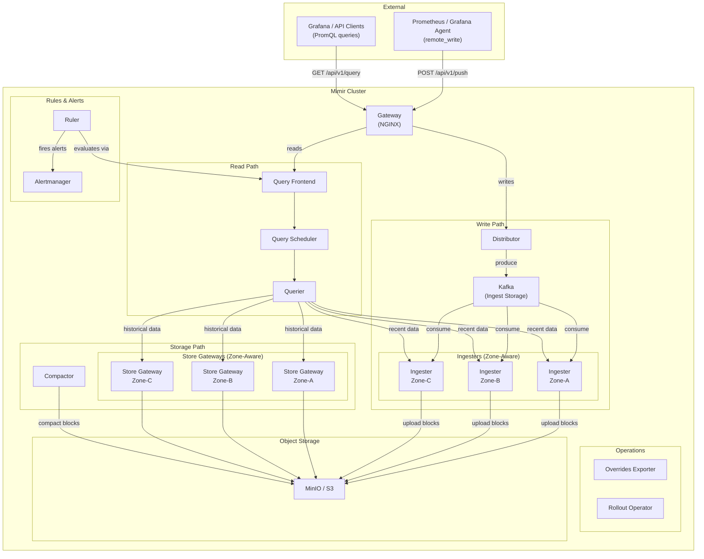
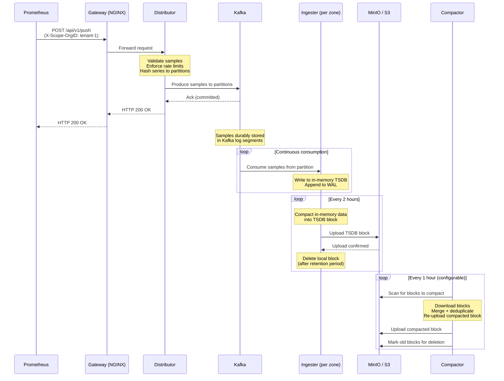
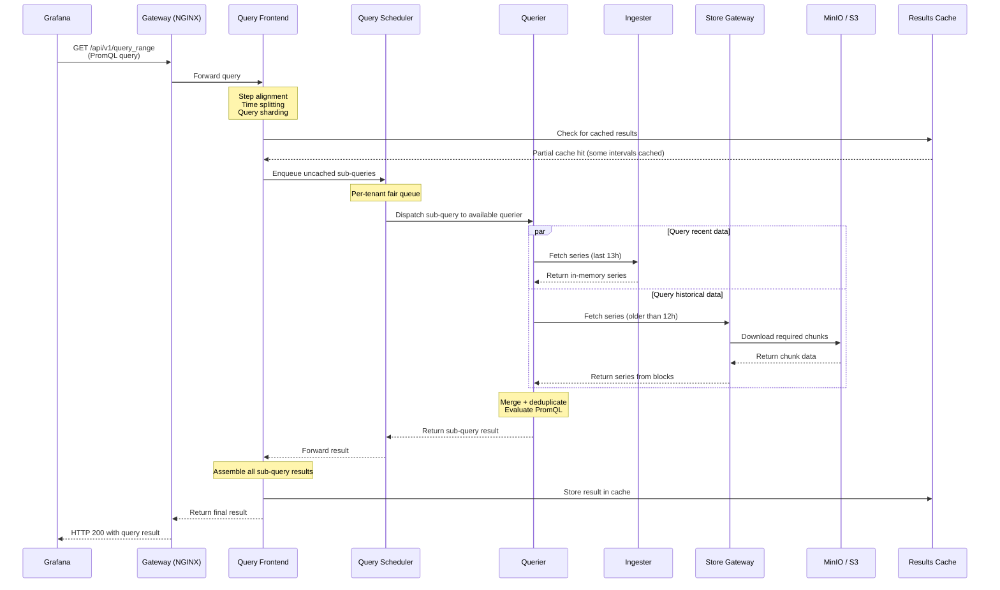
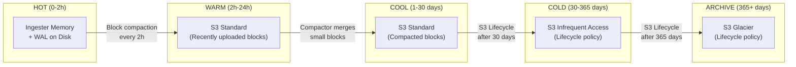
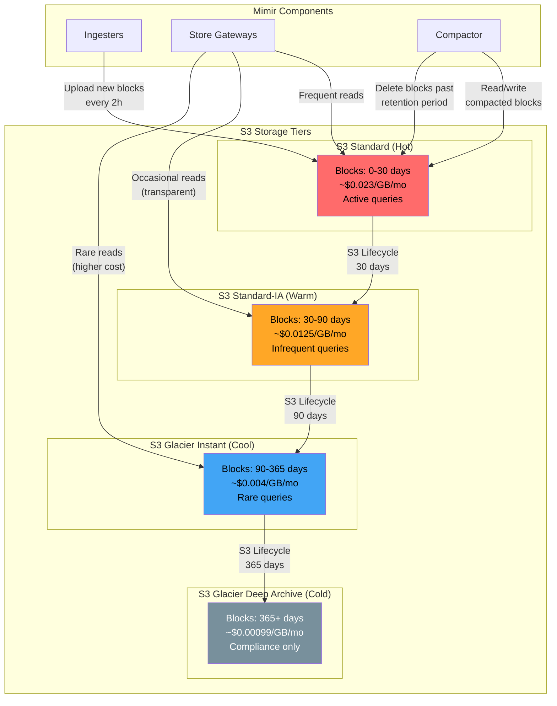

# Grafana Mimir Deep Dive

## Table of Contents

1. [Overview](#1-overview)
2. [Architecture](#2-architecture)
3. [Component Deep Dive](#3-component-deep-dive)
4. [Write Path](#4-write-path)
5. [Read Path](#5-read-path)
6. [Scaling Guide](#6-scaling-guide)
7. [Hot and Cold Data with S3](#7-hot-and-cold-data-with-s3)
8. [Production Checklist](#8-production-checklist)

---

## 1. Overview

Grafana Mimir is an open-source, horizontally scalable, highly available, multi-tenant, long-term storage backend for Prometheus-compatible metrics. It is designed to handle metrics at massive scale -- from tens of millions to billions of active series -- while maintaining full compatibility with the Prometheus query language (PromQL) and remote write protocol.

### Why Mimir Exists

Prometheus, while excellent for single-cluster monitoring, has fundamental limitations:

- **Single-node storage**: Prometheus stores data locally, making it vulnerable to data loss and limiting retention.
- **No native multi-tenancy**: Running multiple Prometheus instances for different teams is operationally expensive.
- **No horizontal scalability**: A single Prometheus instance cannot scale beyond the resources of one machine.
- **Limited long-term retention**: Local disk constraints prevent cost-effective long-term storage of metrics.

Mimir solves all of these problems by providing a distributed TSDB (Time Series Database) that:

- Accepts data via the Prometheus `remote_write` API, requiring no proprietary agents.
- Stores data in object storage (S3, GCS, Azure Blob, or MinIO) for durability and cost efficiency.
- Supports multi-tenancy with per-tenant limits, isolation, and billing.
- Scales horizontally by adding more instances of individual components.
- Provides high availability through replication and zone-aware deployment.

### Key Characteristics

| Property | Value |
|---|---|
| License | AGPL v3 |
| Query Language | PromQL (fully compatible) |
| Ingestion Protocol | Prometheus remote_write |
| Storage Backend | S3, GCS, Azure Blob, MinIO, filesystem |
| Multi-tenancy | Native, via `X-Scope-OrgID` header |
| Deployment Modes | Monolithic, Read-Write, Microservices |
| Max Tested Scale | 1+ billion active series |

---

## 2. Architecture

Mimir uses a microservices architecture where each component can be independently deployed and scaled. The system is divided into a **write path** (ingestion) and a **read path** (querying), with shared infrastructure for storage and coordination.

### High-Level Architecture



### Component Layout (Spatial View)

The following ASCII diagram shows how requests flow through the system and where data is stored at each stage:

```
                        +---------------------------+
                        |     External Clients      |
                        |  (Prometheus, Grafana)     |
                        +------------+--------------+
                                     |
                          writes     |     reads
                        +------------|-------------+
                        |            v              |
                        |     +-----------+         |
                        |     |  Gateway  |         |
                        |     |  (NGINX)  |         |
                        |     +-----+-----+         |
                        |      /         \          |
                        |     v           v         |
                   +----------+     +-----------+   |
                   |Distributor|    |Query       |   |
                   +-----+----+    |Frontend    |   |
                         |         +------+-----+   |
                         v                |         |
                   +----------+    +------+------+  |
                   |  Kafka   |    |Query        |  |
                   | (buffer) |    |Scheduler    |  |
                   +----+-----+    +------+------+  |
                        |                 |         |
            +-----------+-----------+     |         |
            |           |           |     v         |
       +----+----+ +----+----+ +---+---+ +-------+ |
       |Ingester | |Ingester | |Ingester| |Querier| |
       | Zone-A  | | Zone-B  | | Zone-C | |  (x2) | |
       +----+----+ +----+----+ +---+----+ +---+---+ |
            |           |          |         / \    |
            +-----+-----+----+----+        /   \   |
                  |           |           /     \  |
                  v           v          v       v |
            +----------+  +--------+ +--------+   |
            |          |  | Store  | | Store  |   |
            | Compactor|  |Gateway | |Gateway |   |
            |          |  | Zone-A | | Zone-B |   |
            +----+-----+  +---+----+ +---+----+   |
                 |             |          |        |
                 v             v          v        |
            +----------------------------------+   |
            |        MinIO / S3 Buckets        |   |
            |   +--------+ +------+ +-------+  |   |
            |   | blocks | | ruler| | alerts|  |   |
            |   +--------+ +------+ +-------+  |   |
            +----------------------------------+   |
                                                   |
                        +-----------+-----------+  |
                        |   Ruler   |Alertmanager|  |
                        +-----------+-----------+  |
                        +---------------------------+
```

---

## 3. Component Deep Dive

### 3.1 Gateway (NGINX)

**What it does**: The gateway is an NGINX-based reverse proxy that serves as the single entry point for all external traffic to the Mimir cluster. It routes requests to the appropriate backend components based on the URL path.

**Why it exists**: Having a single entry point simplifies load balancing, TLS termination, and access control. It decouples external clients from the internal service topology, so internal components can be reorganized without affecting clients.

**Routing rules**:

| Path Pattern | Target Component |
|---|---|
| `/api/v1/push` | Distributor |
| `/api/v1/query`, `/api/v1/query_range`, `/api/v1/labels`, `/api/v1/series` | Query Frontend |
| `/api/v1/rules`, `/api/v1/alerts` | Ruler |
| `/api/v1/alerts` (Alertmanager API) | Alertmanager |
| `/prometheus/*` | Query Frontend |

**Key configuration parameters**:

| Parameter | Description | Default |
|---|---|---|
| `gateway.replicas` | Number of gateway pods | 1 |
| `gateway.resources` | CPU/memory requests and limits | Varies |
| `gateway.ingress.enabled` | Enable Kubernetes ingress | false |
| `gateway.nginx.config` | Custom NGINX configuration | Auto-generated |

**Resource characteristics**: CPU-bound (minimal). The gateway performs no data processing -- it is purely a routing proxy. Memory and CPU requirements are low unless handling extremely high request rates (100k+ RPS). Scale horizontally behind a Kubernetes Service or external load balancer.

---

### 3.2 Distributor

**What it does**: The distributor is the first component in the write path. It receives incoming time series data via the Prometheus `remote_write` API, validates and sanitizes the data, applies per-tenant rate limits, and forwards the data to the next component in the pipeline (Kafka in ingest storage mode, or directly to ingesters in classic mode).

**Why it exists**: Centralizing validation and rate limiting at the edge prevents invalid or excessive data from consuming resources deeper in the pipeline. The distributor also handles the critical task of sharding data across partitions or ingesters using consistent hashing.

**Key responsibilities**:
- Validate incoming samples (label names, values, timestamps, sample counts).
- Enforce per-tenant ingestion limits (samples/sec, series count, metadata count).
- Remove duplicate labels, sort labels, and normalize data.
- Forward valid samples to Kafka partitions (ingest storage) or ingesters (classic mode).
- Participate in a hash ring for distributed rate limiting.

**Key configuration parameters**:

| Parameter | Description | Default |
|---|---|---|
| `-distributor.ingestion-rate-limit` | Max samples/sec per tenant across cluster | 10,000 |
| `-distributor.ingestion-burst-size` | Burst size for ingestion rate limiter | 200,000 |
| `-distributor.ha-tracker.enable-ha-tracker` | Enable HA tracker for dedup | false |
| `-distributor.ring.store` | Backend for distributor ring (memberlist, consul, etcd) | memberlist |
| `-validation.max-label-names-per-series` | Max labels per series | 30 |
| `-validation.max-length-label-name` | Max length of a label name | 1024 |
| `-validation.max-length-label-value` | Max length of a label value | 2048 |
| `-validation.max-metadata-length` | Max length of metadata | 1024 |

**Resource characteristics**: CPU-bound. Distributors perform hashing, validation, and serialization. They are stateless and can be scaled horizontally without restriction. Memory usage is moderate, primarily for buffering incoming requests.

---

### 3.3 Ingester

**What it does**: The ingester is the most critical stateful component in Mimir. In classic mode, it receives samples from the distributor; in ingest storage mode, it consumes samples from Kafka partitions. It stores recent data in-memory, writes a WAL (Write-Ahead Log) to local disk for crash recovery, and periodically compacts in-memory data into TSDB blocks that are uploaded to object storage.

**Why it exists**: Object storage is not suitable for real-time querying of the most recent data. The ingester bridges this gap by holding the latest data (typically the last 2 hours) in memory, providing low-latency access for queries about recent metrics. It also handles the critical transition from streaming writes to immutable block storage.

**Key responsibilities**:
- Maintain in-memory TSDB with active series.
- Write all incoming data to WAL for durability.
- Compact in-memory data into 2-hour TSDB blocks.
- Upload completed blocks to object storage (S3/MinIO).
- Serve queries for recent data (data not yet in object storage).
- Participate in zone-aware replication for high availability.

**Zone-aware replication**: Your deployment uses three zones (zone-a, zone-b, zone-c). With zone-aware replication enabled, Mimir ensures that replicas of each time series are distributed across different zones. If an entire zone fails, data remains available from the other two zones. The replication factor is typically 3 (one replica per zone).

```
                    Series: http_requests_total{job="api"}
                                    |
                    +---------------+---------------+
                    |               |               |
              +-----+-----+  +-----+-----+  +------+----+
              | Ingester   |  | Ingester   |  | Ingester  |
              |  Zone-A    |  |  Zone-B    |  |  Zone-C   |
              | (replica 1)|  | (replica 2)|  | (replica 3)|
              +-----+------+  +-----+------+  +-----+-----+
                    |               |               |
              [local WAL]     [local WAL]     [local WAL]
              [local TSDB]    [local TSDB]    [local TSDB]
                    |               |               |
                    +-------+-------+-------+-------+
                            |               |
                            v               v
                    +---------------------------+
                    |     Object Storage (S3)    |
                    +---------------------------+
```

**Key configuration parameters**:

| Parameter | Description | Default |
|---|---|---|
| `-ingester.ring.replication-factor` | Number of replicas per series | 3 |
| `-ingester.ring.zone-awareness-enabled` | Enable zone-aware replication | true |
| `-ingester.ring.instance-availability-zone` | Zone identifier for this instance | (set per pod) |
| `-blocks-storage.tsdb.block-ranges-period` | Duration of each TSDB block | 2h |
| `-blocks-storage.tsdb.retention-period` | How long to keep blocks locally after upload | 24h |
| `-blocks-storage.tsdb.ship-interval` | How often to upload blocks to storage | 1m |
| `-blocks-storage.tsdb.wal-compression-enabled` | Compress WAL entries | false |
| `-ingester.ring.tokens-file-path` | Path to persist ring tokens | (varies) |

**Resource characteristics**: Memory-bound and disk-bound. Each active series consumes approximately 5-8 KB of memory in the ingester. Disk I/O is critical for WAL writes and TSDB compaction. Ingesters require persistent volumes for WAL durability. CPU usage spikes during compaction and block upload.

---

### 3.4 Compactor

**What it does**: The compactor is a background process that operates on blocks stored in object storage. It merges smaller blocks into larger, more efficient blocks, deduplicates samples (from replication), and enforces retention by deleting blocks that have aged beyond the configured retention period.

**Why it exists**: Without compaction, object storage would accumulate a large number of small 2-hour blocks, making queries slow and storage inefficient. The compactor reduces the total number of blocks, removes duplicate samples introduced by replication, and optimizes the index for faster query performance.

**Key responsibilities**:
- **Vertical compaction**: Merge overlapping blocks (from replicated ingesters) into a single block, deduplicating samples.
- **Horizontal compaction**: Merge adjacent time-range blocks into larger blocks (e.g., six 2-hour blocks into one 12-hour block).
- **Split-and-merge compaction**: For very large tenants, split blocks by series into shards, compact each shard independently, then merge results. This enables horizontal scaling of compaction.
- **Retention enforcement**: Delete blocks older than the configured retention period.
- **Block cleanup**: Remove partial uploads, corrupted blocks, and blocks marked for deletion.

**Key configuration parameters**:

| Parameter | Description | Default |
|---|---|---|
| `-compactor.blocks-retention-period` | How long to keep blocks | 0 (unlimited) |
| `-compactor.block-ranges` | Compaction ranges | 2h,12h,24h |
| `-compactor.split-and-merge-shards` | Number of shards for split-and-merge | 0 (disabled) |
| `-compactor.split-and-merge-stage-size` | Max block size per stage | 0 |
| `-compactor.compaction-interval` | How often to run compaction | 1h |
| `-compactor.data-dir` | Local directory for temporary compaction data | /data |
| `-compactor.deletion-delay` | Delay before physically deleting marked blocks | 12h |
| `-compactor.compaction-concurrency` | Number of concurrent compaction jobs | 1 |

**Resource characteristics**: CPU-bound and disk-bound. Compaction is CPU-intensive (deduplication, index building) and requires substantial temporary disk space to download, merge, and re-upload blocks. Memory usage is moderate. The compactor is stateless in terms of persistent data -- it reads from and writes to object storage -- but needs fast local SSD for temporary files.

---

### 3.5 Querier

**What it does**: The querier executes PromQL queries by fetching data from two sources: ingesters (for recent, in-memory data) and store gateways (for historical data in object storage). It merges results from both sources, deduplicates overlapping data, and evaluates the PromQL expression.

**Why it exists**: The separation of recent data (ingesters) and historical data (store gateways) means a single component is needed to query both and present a unified view. The querier handles this fan-out and merge operation, making the storage architecture transparent to the query client.

**Key responsibilities**:
- Receive query jobs from the query scheduler.
- Fan out to ingesters for recent data and store gateways for historical data.
- Merge and deduplicate results from multiple sources.
- Evaluate PromQL expressions using the Mimir Query Engine (MQE).
- Return results to the query frontend via the query scheduler.

**Key configuration parameters**:

| Parameter | Description | Default |
|---|---|---|
| `-querier.max-concurrent` | Max concurrent queries per querier | 20 |
| `-querier.query-store-after` | Only query store gateways for data older than this | 12h |
| `-querier.query-ingesters-within` | Only query ingesters for data within this window | 13h |
| `-querier.max-fetched-chunks-per-query` | Max chunks fetched per query | 2,000,000 |
| `-querier.max-fetched-series-per-query` | Max series fetched per query | 0 (unlimited) |

**Resource characteristics**: CPU-bound and memory-bound. CPU is consumed by PromQL evaluation, especially for complex queries or those scanning many series. Memory is consumed by intermediate query results. Queriers are stateless and can be freely scaled horizontally.

---

### 3.6 Query Frontend

**What it does**: The query frontend is the entry point for all read (query) requests. It improves query performance and fairness through several mechanisms: query splitting (breaking large time ranges into smaller sub-queries), query sharding (parallelizing queries across series), results caching, and per-tenant query queuing.

**Why it exists**: Without the query frontend, a single large query could monopolize a querier for minutes, starving other tenants. The frontend breaks large queries into smaller, parallelizable pieces, caches results for repeated queries, and provides fair queuing across tenants.

**Key responsibilities**:
- Split range queries by time interval (e.g., a 24h query into 24 one-hour sub-queries).
- Shard queries by series (e.g., split a query matching 100k series into 16 parallel shards).
- Cache query results (supports memcached, Redis, or in-memory).
- Enforce per-tenant query concurrency limits.
- Retry failed queries.
- Align query step intervals to improve cache hit rates.

**Key configuration parameters**:

| Parameter | Description | Default |
|---|---|---|
| `-query-frontend.split-queries-by-interval` | Interval for splitting range queries | 24h |
| `-query-frontend.query-sharding-target-series-per-shard` | Target series count per shard | 0 (disabled) |
| `-query-frontend.cache-results` | Enable results caching | false |
| `-query-frontend.align-queries-with-step` | Align query timestamps to step | false |
| `-query-frontend.max-retries` | Max retries for failed queries | 5 |
| `-query-frontend.scheduler-address` | Address of query scheduler | (auto-discovered) |
| `-query-frontend.max-outstanding-per-tenant` | Max queued queries per tenant | 100 |

**Resource characteristics**: CPU-bound (light). The query frontend is stateless and relatively lightweight. It does not execute queries itself; it orchestrates them. Memory usage is proportional to the number of in-flight queries and their result sizes.

---

### 3.7 Query Scheduler

**What it does**: The query scheduler sits between the query frontend and the queriers. It receives query jobs from the query frontend and holds them in an in-memory queue until a querier is available to execute them. It provides per-tenant fair queuing.

**Why it exists**: The query scheduler decouples the query frontend from the queriers, allowing them to scale independently. Without it, the query frontend would need to maintain direct connections to every querier, and adding/removing queriers would require restarting frontends. The scheduler also ensures fair distribution of queries across tenants.

**Key configuration parameters**:

| Parameter | Description | Default |
|---|---|---|
| `-query-scheduler.max-outstanding-requests-per-tenant` | Max queued requests per tenant | 100 |
| `-query-scheduler.ring.store` | Backend for scheduler ring | memberlist |
| `-query-scheduler.ring.tokens` | Tokens per scheduler in the ring | 128 |

**Resource characteristics**: CPU-bound (minimal). The query scheduler is extremely lightweight. It holds query metadata in memory (not query data) and dispatches work. Two replicas are recommended for high availability.

---

### 3.8 Store Gateway

**What it does**: The store gateway serves queries for historical data stored in object storage (S3/MinIO). It downloads and caches block index headers locally, and when a query arrives, it reads only the required portions of the block index and chunk data from object storage.

**Why it exists**: Object storage is high-latency and not designed for the fine-grained random access patterns required by PromQL queries. The store gateway bridges this gap by caching block metadata locally and performing efficient, targeted reads from object storage.

**Key responsibilities**:
- Periodically sync the bucket index to discover new and deleted blocks.
- Download and cache block index headers on local disk.
- Lazy-load index headers into memory on demand.
- Serve series and chunk data from object storage for queries.
- Participate in a hash ring with zone-aware replication for block sharding.

**Key configuration parameters**:

| Parameter | Description | Default |
|---|---|---|
| `-blocks-storage.bucket-store.sync-interval` | Bucket sync interval | 15m |
| `-blocks-storage.bucket-store.index-header.lazy-loading-idle-timeout` | Idle timeout before unloading index header | 60m |
| `-blocks-storage.bucket-store.index-cache.backend` | Index cache backend (inmemory, memcached) | inmemory |
| `-blocks-storage.bucket-store.chunks-cache.backend` | Chunks cache backend | (none) |
| `-store-gateway.sharding-ring.zone-awareness-enabled` | Enable zone-aware sharding | true |
| `-store-gateway.sharding-ring.replication-factor` | Replication factor for blocks | 3 |

**Resource characteristics**: Memory-bound and network I/O-bound. Store gateways hold index headers in memory (proportional to the total number of blocks and series). Network bandwidth is consumed downloading chunks from object storage during queries. Disk I/O is needed for the local index header cache. CPU usage is moderate.

---

### 3.9 Ruler

**What it does**: The ruler evaluates Prometheus-compatible recording rules and alerting rules on a periodic schedule. It executes PromQL queries (via the query frontend) to evaluate rules, writes recording rule results back into Mimir as new time series, and fires alerts to the Alertmanager.

**Why it exists**: Many users rely on recording rules for pre-aggregating expensive queries and on alerting rules for triggering notifications. Rather than requiring a separate Prometheus instance for rule evaluation, Mimir includes a built-in ruler that scales horizontally and is multi-tenant aware.

**Key responsibilities**:
- Load rule configurations from object storage (per-tenant).
- Shard rule group evaluation across ruler replicas using a hash ring.
- Execute PromQL queries against the query frontend to evaluate rules.
- Write recording rule results back into the distributor.
- Fire alerts to the Alertmanager.

**Key configuration parameters**:

| Parameter | Description | Default |
|---|---|---|
| `-ruler.evaluation-interval` | Default evaluation interval | 1m |
| `-ruler.poll-interval` | How often to poll for rule config changes | 1m |
| `-ruler.rule-path` | Local path for temporary rule storage | /data/rules |
| `-ruler.ring.store` | Backend for ruler hash ring | memberlist |
| `-ruler-storage.backend` | Backend for rule config storage | (s3, gcs, etc.) |
| `-ruler.max-rules-per-rule-group` | Max rules per group per tenant | 20 |
| `-ruler.max-rule-groups-per-tenant` | Max rule groups per tenant | 70 |
| `-ruler.alertmanager-url` | URL of the Alertmanager | (required) |

**Resource characteristics**: CPU-bound. CPU is consumed by PromQL evaluation during rule execution. Memory usage depends on the number and complexity of rules. The ruler is stateless (rule configs are in object storage) and can be scaled horizontally.

---

### 3.10 Alertmanager

**What it does**: The Mimir Alertmanager is a multi-tenant, horizontally scalable version of the Prometheus Alertmanager. It receives alert notifications from the ruler, deduplicates and groups them, applies silences and inhibition rules, and routes them to notification channels (email, PagerDuty, Slack, OpsGenie, webhooks, etc.).

**Why it exists**: In a multi-tenant Mimir deployment, each tenant needs isolated alert routing and notification configuration. The built-in Alertmanager provides per-tenant configuration and state management, persisting state to object storage for durability.

**Key responsibilities**:
- Receive alerts from the ruler.
- Deduplicate alerts across ruler replicas.
- Group related alerts.
- Apply per-tenant routing, silencing, and inhibition rules.
- Send notifications to configured receivers.
- Replicate state across Alertmanager instances for high availability.
- Persist state (silences, notification log) to object storage.

**Key configuration parameters**:

| Parameter | Description | Default |
|---|---|---|
| `-alertmanager.storage.path` | Local path for Alertmanager data | /data |
| `-alertmanager-storage.backend` | Backend for Alertmanager config/state | (s3, gcs, etc.) |
| `-alertmanager.sharding-ring.replication-factor` | Replication factor | 3 |
| `-alertmanager.sharding-ring.zone-awareness-enabled` | Enable zone-aware sharding | false |
| `-alertmanager.fallback-config-file` | Fallback config for tenants without config | (none) |

**Resource characteristics**: Memory-bound (light). The Alertmanager holds alert state in memory. Resource usage is generally low unless the cluster processes a very high volume of alerts. It is stateful (state is replicated across instances and persisted to object storage).

---

### 3.11 Overrides Exporter

**What it does**: The overrides exporter exposes per-tenant limit configurations as Prometheus metrics. This allows operators to monitor how close each tenant is to their configured limits and create alerts when tenants approach their thresholds.

**Why it exists**: Mimir supports extensive per-tenant configuration overrides (ingestion rate, series limits, query limits, etc.). Without the overrides exporter, operators would have no visibility into these limits via their monitoring system. This component bridges the gap between configuration and observability.

**Key metrics exported**:

| Metric | Description |
|---|---|
| `cortex_limits_overrides{limit_name="ingestion_rate"}` | Per-tenant ingestion rate limit |
| `cortex_limits_overrides{limit_name="max_global_series_per_user"}` | Per-tenant max active series |
| `cortex_limits_overrides{limit_name="max_fetched_chunks_per_query"}` | Per-tenant max chunks per query |
| `cortex_limits_overrides{limit_name="ingestion_burst_size"}` | Per-tenant burst size |

**Key configuration parameters**:

| Parameter | Description | Default |
|---|---|---|
| `-overrides-exporter.ring.enabled` | Enable ring for deduplication | true |
| `-overrides-exporter.ring.store` | Backend for ring | memberlist |

**Resource characteristics**: Minimal. The overrides exporter is extremely lightweight. It reads the runtime configuration and exposes it as metrics. A single replica is sufficient, though two can be run for HA.

---

### 3.12 Rollout Operator

**What it does**: The rollout operator is a Kubernetes operator that coordinates safe rollouts of stateful Mimir components (ingesters, store gateways, Alertmanagers) across availability zones. It ensures that only one zone is updated at a time, preventing data unavailability during deployments.

**Why it exists**: Kubernetes' native StatefulSet rolling update strategy does not understand Mimir's zone-aware replication. Without the rollout operator, a naive rollout could simultaneously restart ingesters in multiple zones, causing data unavailability or loss. The rollout operator adds Mimir-specific safety logic on top of Kubernetes.

**Key behaviors**:
- Coordinates rollout order across zone-specific StatefulSets.
- Ensures only one zone is unavailable during updates.
- Validates readiness of updated pods before proceeding to the next zone.
- Can coordinate scaling operations across zones (leader/follower scaling).

**Key annotations**:

| Annotation | Description |
|---|---|
| `grafana.com/rollout-group` | Groups StatefulSets that should be rolled together |
| `grafana.com/rollout-max-unavailable` | Max pods unavailable during rollout |
| `grafana.com/rollout-upscale-only-when-leader-ready` | Wait for leader zone before scaling followers |

**Resource characteristics**: Minimal. The rollout operator watches Kubernetes resources and makes API calls. It consumes negligible CPU and memory.

---

### 3.13 Kafka (Ingest Storage)

**What it does**: In the ingest storage architecture, Kafka acts as an asynchronous, durable buffer between the distributor and the ingesters. Distributors produce time series data to Kafka partitions, and ingesters consume from those partitions. This decouples the write path from the read path.

**Why it exists**: In the classic architecture, the ingester is involved in both the write path and read path, meaning a heavy query load can impact ingestion. Kafka decouples these paths: a write is considered successful once it is committed to Kafka, regardless of ingester availability. This improves reliability, simplifies scaling, and reduces the blast radius of ingester failures.

**Key characteristics**:
- Each time series is hashed to a specific Kafka partition (similar to how series are sharded to ingesters).
- Each partition is consumed by exactly one ingester per zone.
- Write requests are acknowledged after being committed to Kafka, not after ingester processing.
- Kafka retention should be set long enough for ingesters to recover from extended outages (typically 1-6 hours).
- Supports strong read consistency via the `X-Read-Consistency` header.

**Key configuration parameters**:

| Parameter | Description | Default |
|---|---|---|
| `-ingest-storage.enabled` | Enable ingest storage | false |
| `-ingest-storage.kafka.address` | Kafka broker address | (required) |
| `-ingest-storage.kafka.topic` | Kafka topic name | ingest |
| `-ingest-storage.kafka.auto-create-topic-default-partitions` | Auto-create partitions | 1000 |
| `-ingest-storage.kafka.write-timeout` | Timeout for Kafka writes | 10s |
| `-ingest-storage.kafka.consumer-group` | Consumer group for ingesters | (auto) |

**Resource characteristics**: Disk-bound and network I/O-bound. Kafka requires fast, durable storage for its log segments. Memory is needed for page cache. CPU usage is moderate. Kafka should be sized based on the ingestion throughput (bytes/sec) and desired retention.

---

### 3.14 MinIO (S3-Compatible Object Storage)

**What it does**: MinIO provides S3-compatible object storage for the Mimir cluster. It stores TSDB blocks (the primary metrics data), ruler configurations, Alertmanager state, and other persistent data. In your deployment, MinIO replaces AWS S3 for local/on-premises storage.

**Why it exists**: Mimir requires durable, scalable object storage for its long-term data. MinIO provides an S3-compatible API that works identically to AWS S3, enabling the same Mimir configuration to work both on-premises and in the cloud.

**Buckets used by Mimir**:

| Bucket | Purpose |
|---|---|
| `mimir-blocks` | TSDB blocks (metrics data) |
| `mimir-ruler` | Ruler rule configurations |
| `mimir-alertmanager` | Alertmanager state and configs |

**Key configuration parameters**:

| Parameter | Description |
|---|---|
| `-blocks-storage.s3.endpoint` | MinIO endpoint |
| `-blocks-storage.s3.bucket-name` | Bucket name for blocks |
| `-blocks-storage.s3.access-key-id` | Access key |
| `-blocks-storage.s3.secret-access-key` | Secret key |
| `-blocks-storage.s3.insecure` | Disable TLS (for local MinIO) |

**Resource characteristics**: Disk-bound. MinIO performance is directly tied to the underlying disk I/O. For production, use SSDs and consider MinIO's erasure coding for durability. Memory is used for caching. CPU usage is moderate.

---

## 4. Write Path

The write path is the journey of a metric sample from a Prometheus `remote_write` request to durable long-term storage in S3.

### Step-by-Step Data Flow

1. **Prometheus** sends a batch of time series samples via HTTP POST to `/api/v1/push` with the `X-Scope-OrgID` header identifying the tenant.

2. **Gateway (NGINX)** receives the request, terminates TLS, and routes it to one of the distributor replicas based on load balancing.

3. **Distributor** performs the following:
   - Deserializes the protobuf-encoded request.
   - Validates each sample: checks label names, label values, timestamp freshness, and series metadata.
   - Applies per-tenant rate limits (samples/sec, series count).
   - Removes invalid samples and returns errors for them (valid samples are still ingested).
   - Hashes each series by its label set to determine the target Kafka partition.
   - Produces the samples to the appropriate Kafka partitions.
   - Returns HTTP 200 once all samples are committed to Kafka.

4. **Kafka** durably stores the incoming samples in partition-specific log segments. Data is retained for the configured retention period (typically several hours).

5. **Ingesters** (one per zone per partition) consume samples from their assigned Kafka partition:
   - Write each sample to the in-memory TSDB.
   - Append each sample to the WAL on local disk.
   - Periodically (every 2 hours by default) compact in-memory samples into a TSDB block.
   - Upload the completed block to object storage (MinIO/S3).
   - After successful upload and a configurable retention period, delete the local block.

6. **MinIO/S3** stores the block durably. The block is now available for querying by store gateways.

7. **Compactor** periodically scans object storage and:
   - Merges overlapping blocks (from zone replication) into deduplicated blocks.
   - Merges adjacent blocks into larger time ranges.
   - Deletes blocks past the retention period.
   - Cleans up partial or corrupted blocks.

### Write Path Sequence Diagram



### Write Path Latency Characteristics

| Stage | Typical Latency | Bottleneck |
|---|---|---|
| Gateway to Distributor | < 1ms | Network |
| Distributor validation | 1-5ms | CPU |
| Distributor to Kafka | 5-20ms | Kafka disk I/O |
| Kafka to Ingester | 50-500ms | Consumer lag |
| Ingester to S3 (block upload) | 1-30s | Network / S3 throughput |
| Compaction cycle | Minutes to hours | CPU / disk / S3 |

---

## 5. Read Path

The read path handles PromQL queries from Grafana dashboards, the Ruler, or API clients. It is designed for parallelism, caching, and efficiency.

### Step-by-Step Query Execution

1. **Client (Grafana)** sends a PromQL query via HTTP GET/POST to the gateway (e.g., `GET /prometheus/api/v1/query_range?query=rate(http_requests_total[5m])&start=...&end=...&step=15s`).

2. **Gateway (NGINX)** routes the request to the query frontend.

3. **Query Frontend** performs the following optimizations:
   - **Step alignment**: Aligns the query time range to step boundaries for better cache hit rates.
   - **Time splitting**: Splits the query into sub-queries by time interval (e.g., a 24h query into 24 one-hour sub-queries).
   - **Query sharding**: If enabled, splits each sub-query into N shards by series fingerprint, allowing parallel execution.
   - **Cache check**: Checks the results cache for previously computed sub-queries. Cached results are returned immediately.
   - Enqueues uncached sub-queries into the query scheduler.

4. **Query Scheduler** holds the sub-queries in per-tenant fair queues. When a querier becomes available, it dequeues the next sub-query and dispatches it.

5. **Querier** receives a sub-query and determines where to fetch data:
   - For data within `query-ingesters-within` (e.g., last 13h): query ingesters.
   - For data older than `query-store-after` (e.g., older than 12h): query store gateways.
   - For data in the overlap window: query both and deduplicate.

6. **Ingesters** return matching series from their in-memory TSDB for recent data.

7. **Store Gateways** serve matching series from object storage:
   - Look up the bucket index to find relevant blocks.
   - Use the cached index header to locate the required series and chunks within each block.
   - Download only the required chunk data from object storage.
   - Return the series data to the querier.

8. **Querier** merges results from ingesters and store gateways, deduplicates samples, evaluates the PromQL expression, and returns the result to the query scheduler.

9. **Query Scheduler** forwards the result back to the query frontend.

10. **Query Frontend** assembles all sub-query results into the final response, stores the result in cache, and returns it to the client via the gateway.

### Read Path Sequence Diagram



### Read Path Latency Characteristics

| Stage | Typical Latency | Notes |
|---|---|---|
| Gateway to Query Frontend | < 1ms | Network hop |
| Query Frontend processing | 1-5ms | Splitting, sharding logic |
| Queue wait in Scheduler | 0-100ms+ | Depends on load |
| Querier to Ingesters | 10-100ms | In-memory, fast |
| Querier to Store Gateways | 50-500ms | Depends on cache hit rate |
| Store Gateway to S3 | 20-200ms | Per chunk download |
| PromQL evaluation | 10ms-10s+ | Depends on query complexity |
| Cache hit (full) | 1-5ms | Best case |

---

## 6. Scaling Guide

### Scaling Matrix

| Component | Stateful | Scale Direction | Primary Bottleneck | Scaling Trigger |
|---|---|---|---|---|
| Gateway | No | Horizontal | Network I/O | High request rate, connection count |
| Distributor | No | Horizontal | CPU | High ingestion rate, validation latency |
| Kafka | Yes | Horizontal (partitions) | Disk I/O | Ingestion throughput, partition lag |
| Ingester | Yes | Horizontal (with care) | Memory, Disk | Active series count, memory pressure |
| Compactor | No (stateless compute) | Horizontal | CPU, Disk | Compaction backlog, block count |
| Querier | No | Horizontal | CPU, Memory | Query latency, queue depth |
| Query Frontend | No | Horizontal | CPU (light) | Request rate |
| Query Scheduler | No | Horizontal | CPU (minimal) | Queue depth |
| Store Gateway | Yes | Horizontal (with care) | Memory, Network | Block count, query latency from storage |
| Ruler | No | Horizontal | CPU | Rule count, evaluation duration |
| Alertmanager | Yes | Horizontal (with care) | Memory | Alert volume |
| Overrides Exporter | No | Fixed (1-2) | Minimal | N/A |
| Rollout Operator | No | Fixed (1) | Minimal | N/A |

### Per-Component Scaling Details

#### Gateway

| Aspect | Detail |
|---|---|
| **When to scale** | Connection count saturating, request queuing in NGINX, 5xx errors from NGINX itself |
| **How to scale** | Horizontal. Add more replicas behind the Kubernetes Service. Stateless -- no coordination needed. |
| **Watch out for** | Ensure readiness probes are configured. NGINX worker_connections limit. |

#### Distributor

| Aspect | Detail |
|---|---|
| **When to scale** | Ingestion rate approaching rate limits, high CPU utilization (>80%), increased validation latency, Kafka produce latency increasing |
| **How to scale** | Horizontal. Add more replicas. The distributor ring automatically rebalances rate limits across healthy instances (local limit = global limit / N). |
| **Watch out for** | After scaling up, per-instance rate limits decrease. Ensure the total cluster rate limit is still appropriate. Too many distributors increase Kafka connection count. |

#### Kafka

| Aspect | Detail |
|---|---|
| **When to scale** | Consumer lag increasing, produce latency increasing, disk utilization high, partition-level throughput saturating |
| **How to scale** | Add more brokers for capacity. Increase partition count for parallelism (but note: partition count must match ingester count per zone). Vertical scaling (faster disks, more memory for page cache) is also effective. |
| **Watch out for** | Increasing partitions requires coordinated ingester scaling. Partition rebalancing can cause temporary consumer lag spikes. Use SSDs for Kafka storage. |

#### Ingester

| Aspect | Detail |
|---|---|
| **When to scale** | Memory utilization >60% (leave headroom for compaction spikes), active series approaching limits, WAL replay time increasing on restart, disk usage high |
| **How to scale** | Horizontal, but with care. Adding ingesters requires updating Kafka partition count (in ingest storage mode) or hash ring rebalancing (classic mode). Use the rollout operator. Scale in multiples that match zone count (e.g., add 3 ingesters: one per zone). Vertical scaling (more memory) is also effective for increasing series capacity per instance. |
| **Watch out for** | **Critical**: Never scale down ingesters abruptly. In classic mode, scaling down requires the "hand-over" or "flush-on-shutdown" process. In ingest storage mode, partition reassignment must complete before termination. Always use the rollout operator. Budget approximately 5-8 KB of memory per active series. |

#### Compactor

| Aspect | Detail |
|---|---|
| **When to scale** | Compaction backlog growing (metric: `cortex_compactor_runs_completed_total` with `status="success"` not keeping up), high compaction time, disk space on compactor filling up |
| **How to scale** | Horizontal. Enable split-and-merge compaction (`-compactor.split-and-merge-shards`) to distribute work across instances. Increase `-compactor.compaction-concurrency` for vertical scaling. Ensure sufficient temporary disk space. |
| **Watch out for** | Each compactor needs fast local disk (SSD) for temporary files. For tenants with >8M series, configure split-and-merge with ~1 shard per 8M series. Compactor failures do not lose data -- blocks remain in S3 -- but delay optimization. |

#### Querier

| Aspect | Detail |
|---|---|
| **When to scale** | Query latency increasing, query queue depth in scheduler growing, CPU utilization high, out-of-memory kills |
| **How to scale** | Horizontal. Queriers are stateless. Simply add more replicas. They automatically connect to the query scheduler and start picking up work. |
| **Watch out for** | Each querier opens connections to all ingesters and store gateways. Very high querier counts can create connection pressure on ingesters. Monitor `cortex_query_scheduler_inflight_requests`. |

#### Query Frontend

| Aspect | Detail |
|---|---|
| **When to scale** | Request rate very high, latency in query splitting/sharding logic, connection count high |
| **How to scale** | Horizontal. Add more replicas. Stateless. |
| **Watch out for** | Query frontends connect to query schedulers. Ensure scheduler can handle the connection count. Typically 2-3 replicas are sufficient even at high scale. |

#### Query Scheduler

| Aspect | Detail |
|---|---|
| **When to scale** | Queue depth consistently high, dispatching latency increasing |
| **How to scale** | Horizontal. Add more replicas (3-5). Uses a ring for service discovery. |
| **Watch out for** | Too many schedulers can fragment the queue and reduce fairness. 2-3 replicas are sufficient for most deployments. |

#### Store Gateway

| Aspect | Detail |
|---|---|
| **When to scale** | Memory utilization high (index headers consuming memory), query latency from store gateways increasing, high block count per instance |
| **How to scale** | Horizontal, but with care. Scale in zone-aligned multiples (add 3: one per zone). The hash ring will redistribute block ownership. Vertical scaling (more memory) helps when index header caching is the bottleneck. |
| **Watch out for** | After scaling, new store gateways need time to download index headers. This "warming up" period can temporarily increase query latency. Use the rollout operator. Ensure the replication factor is maintained. |

#### Ruler

| Aspect | Detail |
|---|---|
| **When to scale** | Rule evaluation duration exceeding the evaluation interval, rule evaluation failures increasing |
| **How to scale** | Horizontal. Rule groups are sharded across ruler replicas via a hash ring. Adding replicas automatically distributes the load. |
| **Watch out for** | Rulers query via the query frontend, so ruler scaling increases query load. Ensure querier capacity is sufficient. |

#### Alertmanager

| Aspect | Detail |
|---|---|
| **When to scale** | Alert volume very high, notification delivery delays |
| **How to scale** | Horizontal, but no more than the replication factor minus one at a time. Default replication factor is 3, so scale down by at most 2 at a time. |
| **Watch out for** | Alertmanager state is replicated across instances. Scaling too aggressively can cause state inconsistency. Always maintain at least `replication-factor` instances running. |

---

## 7. Hot and Cold Data with S3

### How Mimir Uses Object Storage

Mimir's storage architecture is fundamentally built around object storage (S3/MinIO). All metrics data eventually resides in object storage as immutable TSDB blocks. However, the most recent data is held in-memory by ingesters for fast access. This creates a natural temperature gradient.

### Data Temperature Model

```
  Data Temperature          Where It Lives           Access Pattern
  ================          ==============           ==============

  HOT (0-2 hours)           Ingester Memory          Every query for
                            + WAL on disk             recent data

  WARM (2-24 hours)         Object Storage (S3)      Frequent queries,
                            + Ingester local cache    dashboards

  COOL (1-30 days)          Object Storage (S3)      Ad-hoc queries,
                            Served by Store Gateway   investigations

  COLD (30-365 days)        Object Storage (S3)      Rare queries,
                            Served by Store Gateway   compliance

  ARCHIVE (365+ days)       Object Storage (S3)      Very rare,
                            Glacier/Deep Archive      regulatory
```

### Data Temperature Flow



### How Each Component Participates

**Ingesters hold "hot" data**: The most recent data (typically the last 2 hours, aligned to block boundaries) lives in the ingester's in-memory TSDB. This data is also written to the WAL on the ingester's local persistent volume for crash recovery. Every query for recent data hits the ingesters.

**Store gateways serve "cold" data**: Once blocks are uploaded to object storage, the store gateways are responsible for serving queries against them. Store gateways cache block index headers locally and download chunk data from S3 on demand. They are the bridge between the PromQL engine and object storage.

**Compactor manages data lifecycle**: The compactor merges, deduplicates, and eventually deletes old blocks. It is the component that enforces retention by removing blocks older than `-compactor.blocks-retention-period`.

### S3 Storage Classes for Cost Optimization

AWS S3 (and S3-compatible stores) offer multiple storage classes with different cost and access characteristics:

| Storage Class | Cost ($/GB/mo) | Retrieval Cost | Retrieval Latency | Use Case in Mimir |
|---|---|---|---|---|
| S3 Standard | ~$0.023 | None | Milliseconds | Active blocks (0-30 days) |
| S3 Standard-IA | ~$0.0125 | $0.01/GB | Milliseconds | Older blocks (30-365 days) |
| S3 Glacier Instant Retrieval | ~$0.004 | $0.03/GB | Milliseconds | Rarely queried blocks (90-365 days) |
| S3 Glacier Flexible Retrieval | ~$0.0036 | $0.03-0.05/GB | Minutes to hours | Archival blocks (365+ days) |
| S3 Glacier Deep Archive | ~$0.00099 | $0.02-0.05/GB | 12-48 hours | Compliance/regulatory retention |

**Important considerations for Mimir**:

- **S3 Standard**: Required for blocks that Mimir actively reads. All blocks within the compactor's working range and the store gateway's active range must be in S3 Standard or S3 Standard-IA (with millisecond retrieval).
- **S3 Standard-IA**: Suitable for blocks older than 30 days that are infrequently queried but still need millisecond access. Store gateways can read from IA-class objects seamlessly.
- **S3 Glacier Instant Retrieval**: Suitable for blocks older than 90 days. Provides millisecond access but with a per-GB retrieval fee. Only use if queries for this time range are rare.
- **S3 Glacier Flexible Retrieval and Deep Archive**: NOT suitable for blocks that Mimir might query, because retrieval takes minutes to hours. Only use these for blocks that have been explicitly "aged out" of Mimir's retention but must be kept for compliance. Mimir cannot query data in these classes without manual restoration.

### Configuring S3 Lifecycle Policies

S3 lifecycle policies automate the transition of objects between storage classes based on age. Here is a recommended configuration for Mimir blocks:

```json
{
  "Rules": [
    {
      "ID": "TransitionToIA",
      "Status": "Enabled",
      "Filter": {
        "Prefix": "blocks/"
      },
      "Transitions": [
        {
          "Days": 30,
          "StorageClass": "STANDARD_IA"
        }
      ]
    },
    {
      "ID": "TransitionToGlacierInstant",
      "Status": "Enabled",
      "Filter": {
        "Prefix": "blocks/"
      },
      "Transitions": [
        {
          "Days": 90,
          "StorageClass": "GLACIER_IR"
        }
      ]
    },
    {
      "ID": "TransitionToGlacierArchive",
      "Status": "Enabled",
      "Filter": {
        "Prefix": "blocks/"
      },
      "Transitions": [
        {
          "Days": 365,
          "StorageClass": "DEEP_ARCHIVE"
        }
      ]
    },
    {
      "ID": "CleanupDeletedBlocks",
      "Status": "Enabled",
      "Filter": {
        "Prefix": "blocks/"
      },
      "Expiration": {
        "Days": 730
      }
    }
  ]
}
```

**Coordination with Mimir retention**: The S3 lifecycle policy must be aligned with Mimir's compactor retention setting. If `-compactor.blocks-retention-period` is set to `365d`, the compactor will mark blocks for deletion after 365 days and physically delete them after the `-compactor.deletion-delay` (default 12h). Any S3 lifecycle transition to non-queryable classes (Glacier Flexible/Deep Archive) should only occur AFTER the Mimir retention period, or for data that is explicitly excluded from Mimir queries.

### Production S3 Tiering Architecture



### Cost Optimization Example

For a deployment ingesting 1 million active series at 15-second scrape intervals with 1 year retention:

```
Estimated storage growth: ~15 GB/day (after compaction)
Total storage at 1 year: ~5.5 TB

WITHOUT lifecycle policies (all S3 Standard):
  5,500 GB x $0.023/GB/mo = $126.50/month

WITH lifecycle policies:
  Standard  (0-30d):    450 GB x $0.023   = $10.35/month
  Standard-IA (30-90d): 900 GB x $0.0125  = $11.25/month
  Glacier IR (90-365d): 4,150 GB x $0.004 = $16.60/month
  -------------------------------------------
  Total:                                    = $38.20/month
  Savings:                                  = ~70%
```

> **Note**: MinIO (used in your deployment) does not natively support S3 storage class transitions. These lifecycle policies apply when using AWS S3, Google Cloud Storage, or Azure Blob Storage. For MinIO, cost optimization relies on the compactor's retention enforcement and underlying disk management.

---

## 8. Production Checklist

### Infrastructure

- [ ] **Object storage**: Use a dedicated, production-grade object storage backend (AWS S3, GCS, or a MinIO cluster with erasure coding). Single-node MinIO is not suitable for production.
- [ ] **Persistent volumes**: Ingesters, store gateways, and Kafka require durable persistent volumes (PVCs) backed by SSDs. Use storage classes with `reclaimPolicy: Retain`.
- [ ] **Network policies**: Restrict inter-component communication to only required paths. The gateway should be the only component exposed externally.
- [ ] **Resource requests and limits**: Set CPU and memory requests for all components. Set memory limits for ingesters and queriers to prevent OOM-induced cascading failures.

### High Availability

- [ ] **Zone-aware replication**: Enable zone-aware replication for ingesters and store gateways with a replication factor of 3 across 3 availability zones.
- [ ] **Rollout operator**: Deploy the rollout operator to manage safe rollouts of stateful components. Never perform rolling restarts of ingesters or store gateways without it.
- [ ] **Pod disruption budgets (PDBs)**: Configure PDBs for all stateful components to prevent Kubernetes from evicting too many pods simultaneously.
- [ ] **Anti-affinity rules**: Use pod anti-affinity to spread replicas of the same component across nodes and zones.

### Per-Tenant Limits

- [ ] **Ingestion rate limits**: Configure global ingestion rate (`-distributor.ingestion-rate-limit`) and burst size per tenant. Start conservative and increase based on observed traffic.
- [ ] **Series limits**: Set `-validation.max-global-series-per-user` and `-validation.max-global-series-per-metric` to prevent cardinality explosion.
- [ ] **Query limits**: Configure max fetched series, chunks, and bytes per query to prevent expensive queries from consuming excessive resources.
- [ ] **Runtime overrides**: Set up the runtime configuration file for per-tenant limit overrides. Use the overrides exporter to monitor proximity to limits.

### Storage

- [ ] **Retention period**: Configure `-compactor.blocks-retention-period` based on business requirements and cost constraints.
- [ ] **S3 lifecycle policies**: For AWS S3, configure lifecycle policies to transition older blocks to cheaper storage classes.
- [ ] **S3 bucket policies**: Apply least-privilege IAM policies. Mimir needs `s3:GetObject`, `s3:PutObject`, `s3:DeleteObject`, and `s3:ListBucket`.
- [ ] **Separate buckets**: Use separate buckets for blocks, ruler, and Alertmanager data to enable independent lifecycle and access policies.

### Caching

- [ ] **Query results cache**: Enable the query frontend results cache with memcached or Redis to reduce query load.
- [ ] **Store gateway index cache**: Configure memcached for the store gateway index cache to reduce S3 API calls.
- [ ] **Store gateway chunks cache**: Configure memcached for the store gateway chunks cache to reduce data transfer from S3.
- [ ] **Metadata cache**: Enable the metadata cache for the store gateway to reduce bucket index lookups.

### Monitoring and Alerting

- [ ] **Mimir dashboards**: Deploy the official Grafana Mimir dashboards (available in the mimir-mixin):
  - Mimir / Writes
  - Mimir / Reads
  - Mimir / Scaling
  - Mimir / Compactor
  - Mimir / Object Store
  - Mimir / Alertmanager
  - Mimir / Ruler
- [ ] **Mimir alerts**: Deploy the official Mimir alerting rules from the mimir-mixin. Key alerts include:
  - `MimirIngesterUnhealthy`: An ingester has left the ring.
  - `MimirRequestErrors`: High rate of 5xx errors.
  - `MimirCompactorHasNotSuccessfullyRunCompaction`: Compaction is failing.
  - `MimirQuerierAutoscalerNotActive`: Querier autoscaler is inactive (if using KEDA).
  - `MimirDistributorIngestionRateLimited`: Tenants are being rate limited.
- [ ] **Self-monitoring**: Ensure Mimir's own metrics are scraped by a monitoring Prometheus instance that is separate from Mimir itself.

### Capacity Planning

- [ ] **Ingester memory**: Budget 5-8 KB per active series per ingester. With a replication factor of 3, the total cluster memory for ingesters is `active_series x 3 x 8 KB`. Maintain at least 50% headroom.
- [ ] **Compactor disk**: Compactors need temporary disk space of at least 2x the largest block they will compact. For large tenants, this can be tens of GB.
- [ ] **Store gateway memory**: Budget for index header caching. Each block's index header is proportional to its series count. Monitor memory utilization and scale accordingly.
- [ ] **Kafka**: Size Kafka disks for `ingestion_rate_bytes_per_sec x retention_seconds`. Add 50% headroom.

### Security

- [ ] **Multi-tenancy enforcement**: Ensure `X-Scope-OrgID` headers are validated at the gateway. Do not allow clients to impersonate other tenants.
- [ ] **TLS**: Enable TLS for all external-facing endpoints. Consider mTLS for inter-component communication.
- [ ] **Authentication**: Integrate with an external authentication provider (e.g., OAuth2 proxy, Grafana Cloud token validation) at the gateway layer.
- [ ] **Secrets management**: Store S3 credentials, TLS certificates, and API keys in Kubernetes Secrets (or a secrets manager like Vault). Do not embed them in Helm values.

### Operational Procedures

- [ ] **Runbook**: Document procedures for common operational tasks: scaling ingesters, recovering from zone failures, handling compaction backlog, and rotating S3 credentials.
- [ ] **Backup and restore**: While Mimir data in S3 is inherently durable, maintain S3 versioning or cross-region replication for critical data. Test restore procedures.
- [ ] **Upgrade strategy**: Follow the documented upgrade path. Use the rollout operator. Test upgrades in a staging environment first. Read the changelog for breaking changes.
- [ ] **Load testing**: Before production launch, perform load testing with realistic data volumes to validate capacity planning. Use tools like `avalanche` or `prometheus-benchmark`.

---

## References

- [Grafana Mimir Architecture](https://grafana.com/docs/mimir/latest/get-started/about-grafana-mimir-architecture/)
- [Grafana Mimir Components](https://grafana.com/docs/mimir/latest/references/architecture/components/)
- [Grafana Mimir Advanced Architecture](https://grafana.com/docs/mimir/latest/references/architecture/)
- [About Ingest Storage Architecture](https://grafana.com/docs/mimir/latest/get-started/about-grafana-mimir-architecture/about-ingest-storage-architecture/)
- [Grafana Mimir Ingester](https://grafana.com/docs/mimir/latest/references/architecture/components/ingester/)
- [Grafana Mimir Store-Gateway](https://grafana.com/docs/mimir/latest/references/architecture/components/store-gateway/)
- [Grafana Mimir Compactor](https://grafana.com/docs/mimir/latest/references/architecture/components/compactor/)
- [Grafana Mimir Query-Frontend](https://grafana.com/docs/mimir/latest/references/architecture/components/query-frontend/)
- [Grafana Mimir Query-Scheduler](https://grafana.com/docs/mimir/latest/references/architecture/components/query-scheduler/)
- [Grafana Mimir Distributor](https://grafana.com/docs/mimir/latest/references/architecture/components/distributor/)
- [Grafana Mimir Ruler](https://grafana.com/docs/mimir/latest/references/architecture/components/ruler/)
- [Grafana Mimir Alertmanager](https://grafana.com/docs/mimir/latest/references/architecture/components/alertmanager/)
- [Grafana Mimir Overrides-Exporter](https://grafana.com/docs/mimir/latest/references/architecture/components/overrides-exporter/)
- [Configure Zone-Aware Replication](https://grafana.com/docs/mimir/latest/configure/configure-zone-aware-replication/)
- [Configure Metrics Storage Retention](https://grafana.com/docs/mimir/latest/configure/configure-metrics-storage-retention/)
- [Configure Object Storage Backend](https://grafana.com/docs/mimir/latest/configure/configure-object-storage-backend/)
- [Scaling Out Grafana Mimir](https://grafana.com/docs/mimir/latest/manage/run-production-environment/scaling-out/)
- [Planning Grafana Mimir Capacity](https://grafana.com/docs/mimir/latest/manage/run-production-environment/planning-capacity/)
- [Grafana Mimir Production Tips](https://grafana.com/docs/mimir/latest/manage/run-production-environment/production-tips/)
- [Grafana Rollout Operator](https://github.com/grafana/rollout-operator)
- [Configure the Kafka Backend](https://grafana.com/docs/mimir/latest/configure/configure-kafka-backend/)
- [Mimir 3.0 Announcement](https://grafana.com/about/press/2025/11/05/grafana-labs-launches-mimir-3.0-expanding-open-observability-at-scale-at-kubecon--cloudnativecon-north-america-2025/)
- [AWS S3 Storage Classes](https://aws.amazon.com/s3/storage-classes/)
- [Split-and-Merge Compactor](https://grafana.com/blog/how-grafana-mimirs-split-and-merge-compactor-enables-scaling-metrics-to-1-billion-active-series/)
