# Observability Platform Design

## 1. Overview

This document describes the design of a Kubernetes-native observability platform built on the Grafana LGTM stack. The platform provides full-stack observability across four telemetry signals — **metrics, logs, traces, and profiles** — with **namespace-based multi-tenancy** for project isolation.

### Goals

- **Full-stack observability**: Metrics, logs, traces, and continuous profiling
- **Zero-instrumentation application coverage**: eBPF-based auto-instrumentation via Beyla and Pyroscope
- **Infrastructure visibility**: Node metrics, Kubernetes object state, container metrics, system logs
- **Multi-tenancy**: Namespace-based data isolation with per-project Grafana access
- **Grafana-native**: All components from the Grafana ecosystem for tight integration

### Components

| Component | Role | Version |
|-----------|------|---------|
| **Grafana** | Visualization, alerting, dashboards | Latest |
| **Mimir** | Long-term metrics storage (Prometheus-compatible) | Distributed |
| **Loki** | Log aggregation and querying | Single Binary |
| **Tempo** | Distributed tracing backend | Single Binary |
| **Pyroscope** | Continuous profiling | Latest |
| **Alloy** | Telemetry collector (metrics, logs, traces, profiles) | Latest |
| **Beyla** | eBPF auto-instrumentation (traces + RED metrics) | Latest |
| **kube-state-metrics** | Kubernetes object metrics exporter | Latest |

---

## 2. High-Level Architecture

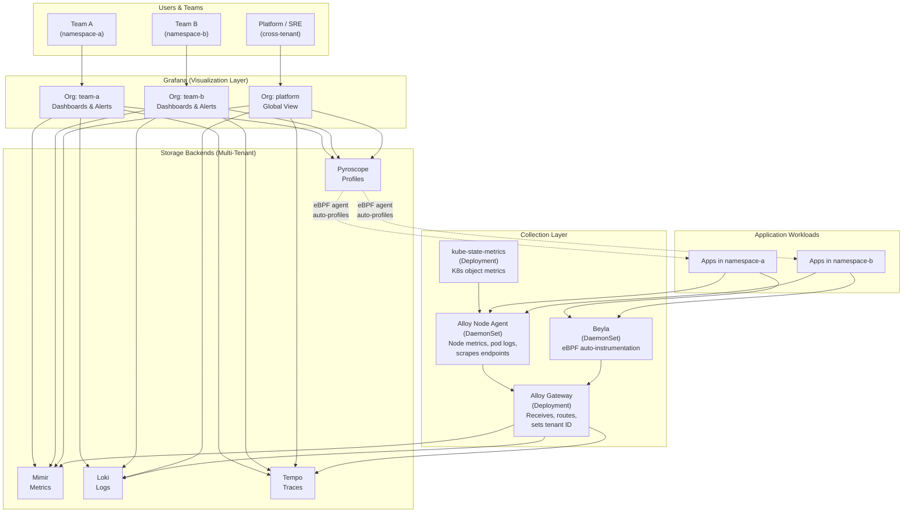

---

## 3. Component Architecture

### 3.1 Deployment Topology

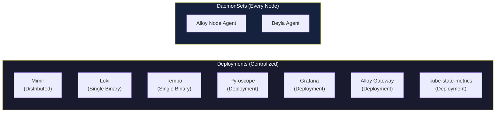

### 3.2 Component Roles

| Component | Controller | Purpose |
|-----------|-----------|---------|
| **Alloy Gateway** | Deployment (2 replicas) | Central OTLP receiver, tenant routing, fan-out to backends |
| **Alloy Node Agent** | DaemonSet | Node metrics, pod log collection, cAdvisor/kube-state-metrics scraping |
| **Beyla** | DaemonSet | eBPF-based HTTP/gRPC auto-instrumentation, produces traces + RED metrics |
| **Pyroscope** | Deployment | Continuous profiling via eBPF, CPU/memory/goroutine profiles |
| **kube-state-metrics** | Deployment (1 replica) | Exports Kubernetes object state as Prometheus metrics |
| **Mimir** | Distributed (multi-component) | Horizontally scalable metrics storage, PromQL-compatible |
| **Loki** | Single Binary | Log aggregation with LogQL query language |
| **Tempo** | Single Binary | Trace storage with TraceQL query language |
| **Grafana** | Deployment (1 replica) | Dashboards, alerting, explore, org-based multi-tenancy |

---

## 4. Data Flow by Signal

### 4.1 Metrics Flow

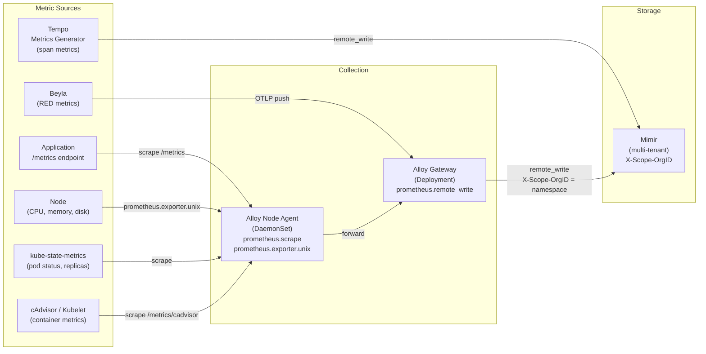

**Metric sources and their types:**

| Source | Metrics Examples | Scrape Target |
|--------|-----------------|---------------|
| **Application** | `http_requests_total`, `request_duration_seconds` | Pod `/metrics` endpoint |
| **Node (Alloy unix exporter)** | `node_cpu_seconds_total`, `node_memory_MemAvailable_bytes`, `node_disk_io_time_seconds_total` | Built-in Alloy exporter |
| **kube-state-metrics** | `kube_pod_status_phase`, `kube_deployment_spec_replicas`, `kube_node_status_condition` | kube-state-metrics `/metrics` |
| **cAdvisor** | `container_cpu_usage_seconds_total`, `container_memory_working_set_bytes` | Kubelet `/metrics/cadvisor` |
| **Beyla** | `http_server_request_duration_seconds`, `http_server_request_body_size_bytes`, `rpc_server_duration` | OTLP push |
| **Tempo generator** | `traces_spanmetrics_duration_bucket`, `traces_service_graph_request_total` | Direct remote_write |

### 4.2 Logs Flow

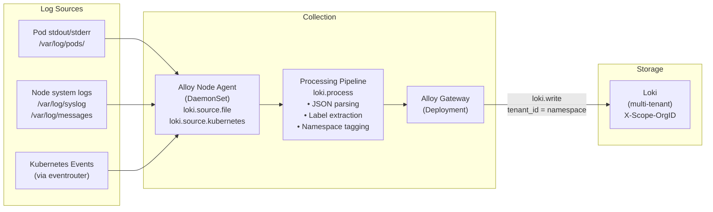

**Log processing pipeline:**

1. **Discovery**: Alloy discovers pods via `discovery.kubernetes`
2. **Collection**: Reads log files from `/var/log/pods/` on each node
3. **Processing**: Parses JSON structured logs, extracts fields (`level`, `msg`, `trace_id`)
4. **Labeling**: Adds `namespace`, `pod`, `container`, `app` labels
5. **Tenant routing**: Sets `X-Scope-OrgID` to the pod's namespace
6. **Write**: Pushes to Loki via the gateway

### 4.3 Traces Flow

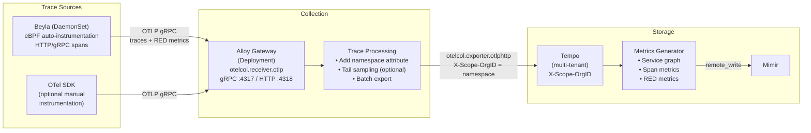

**Trace instrumentation options:**

| Method | Code Changes | Coverage | Best For |
|--------|-------------|----------|----------|
| **Beyla (eBPF)** | None | HTTP/gRPC entry/exit spans | Baseline coverage for all services |
| **OTel SDK + instrumentation libraries** | Minimal (wrap handlers) | Framework-level spans | Deeper visibility into specific services |
| **OTel SDK manual** | Per-operation | Custom business spans | Critical business logic |

### 4.4 Profiles Flow

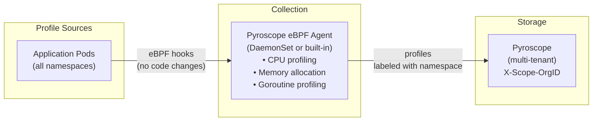

**Profile types collected:**

| Profile Type | Language | Description |
|-------------|----------|-------------|
| **CPU** | All | Where CPU time is spent (flame graphs) |
| **Memory (alloc)** | Go, Java, Python | Heap allocation hotspots |
| **Goroutine** | Go | Goroutine counts and blocking |
| **Mutex** | Go | Lock contention |
| **Block** | Go | Blocking operations |
| **Wall** | All | Wall-clock time (includes I/O waits) |

---

## 5. Multi-Tenancy Design

### 5.1 Tenant Model

Projects are isolated by **Kubernetes namespace**. Each namespace maps to a tenant ID used across all backends.

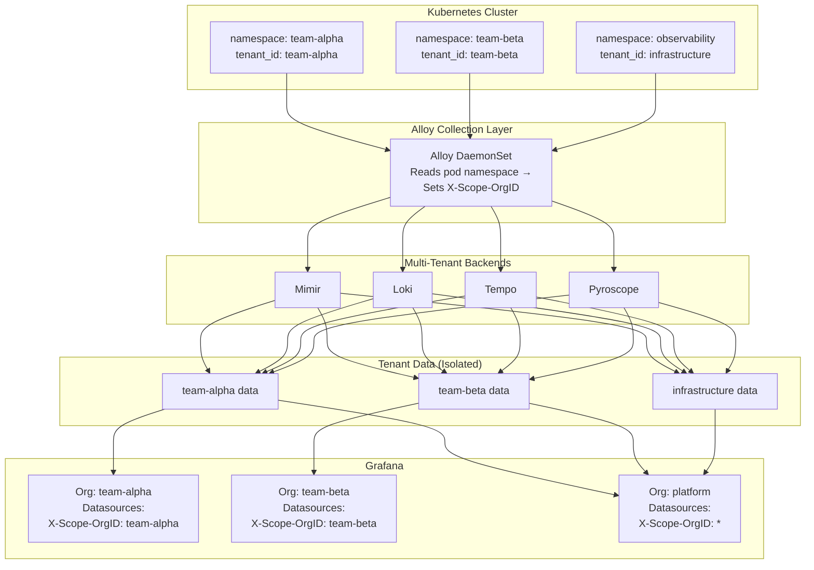

### 5.2 Isolation Enforcement

Isolation is enforced at **three layers**:

| Layer | Mechanism | Enforcement |
|-------|-----------|-------------|
| **Backend** | `X-Scope-OrgID` header on all reads/writes | Storage-level isolation. A tenant cannot query another tenant's data. |
| **Collector** | Alloy reads pod namespace from Kubernetes metadata | Automatic labeling. No application configuration needed. |
| **Grafana** | Organizations with pre-configured datasources | UI-level isolation. Each org's datasources have a fixed tenant header. |

### 5.3 Backend Multi-Tenancy Configuration

```yaml
# Mimir - enable multi-tenancy
mimir:
  structuredConfig:
    multitenancy_enabled: true

# Loki - enable multi-tenancy
loki:
  auth_enabled: true

# Tempo - enable multi-tenancy
tempo:
  multitenancy_enabled: true

# Pyroscope - enable multi-tenancy
pyroscope:
  multitenancy_enabled: true
```

### 5.4 Grafana Organization Mapping

| Grafana Org | Tenant ID | Access Scope | Users |
|-------------|-----------|-------------|-------|
| `team-alpha` | `team-alpha` | Own namespace only | Project team members |
| `team-beta` | `team-beta` | Own namespace only | Project team members |
| `platform` | `team-alpha\|team-beta\|infrastructure` | All tenants (federated) | SRE / Platform team |

Datasource provisioning per organization:

```yaml
# Example: team-alpha org datasources
datasources:
  - name: Mimir
    type: prometheus
    url: http://mimir-gateway.observability.svc/prometheus
    jsonData:
      httpHeaderName1: X-Scope-OrgID
    secureJsonData:
      httpHeaderValue1: team-alpha

  - name: Loki
    type: loki
    url: http://loki-gateway.observability.svc
    jsonData:
      httpHeaderName1: X-Scope-OrgID
    secureJsonData:
      httpHeaderValue1: team-alpha

  - name: Tempo
    type: tempo
    url: http://tempo.observability.svc:3200
    jsonData:
      httpHeaderName1: X-Scope-OrgID
    secureJsonData:
      httpHeaderValue1: team-alpha

  - name: Pyroscope
    type: grafana-pyroscope-datasource
    url: http://pyroscope.observability.svc:4040
    jsonData:
      httpHeaderName1: X-Scope-OrgID
    secureJsonData:
      httpHeaderValue1: team-alpha
```

---

## 6. Alloy Configuration Design

### 6.1 Two-Tier Alloy Architecture

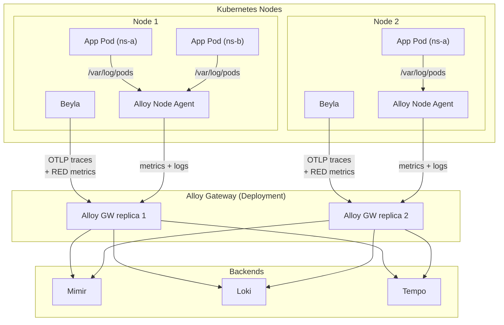

### 6.2 Alloy Node Agent (DaemonSet)

Responsibilities:
- **Node metrics**: `prometheus.exporter.unix` (replaces Node Exporter)
- **Pod logs**: `loki.source.file` reading from `/var/log/pods/`
- **Kubelet/cAdvisor scrape**: Container-level metrics
- **kube-state-metrics scrape**: Kubernetes object metrics
- **Forward all data** to Alloy Gateway

Host mounts required:

| Mount | Path | Purpose |
|-------|------|---------|
| `/var/log` | Read-only | Node system logs |
| `/var/log/pods` | Read-only | Pod log files |
| `/proc` | Read-only | Node metrics (unix exporter) |
| `/sys` | Read-only | Node metrics (unix exporter) |

### 6.3 Alloy Gateway (Deployment)

Responsibilities:
- **OTLP receiver**: gRPC (4317) and HTTP (4318) for traces and metrics from Beyla and OTel SDKs
- **Tenant routing**: Extract namespace from resource attributes, set `X-Scope-OrgID`
- **Fan-out**: Write to Mimir, Loki, Tempo with tenant headers
- **Processing**: Batching, filtering, attribute enrichment

---

## 7. Beyla Auto-Instrumentation

### 7.1 How Beyla Works

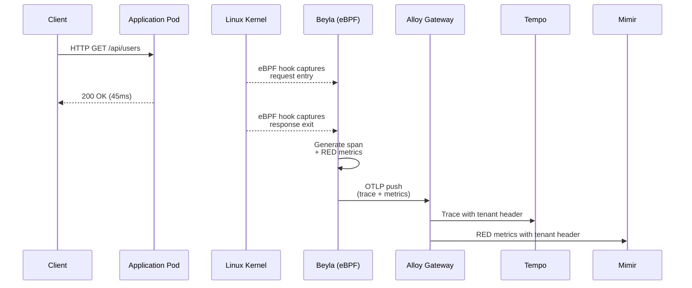

### 7.2 Beyla Coverage

| Protocol | Auto-detected | Metrics | Traces |
|----------|--------------|---------|--------|
| **HTTP** (any framework) | Yes | Request rate, error rate, duration | Full spans |
| **gRPC** | Yes | Request rate, error rate, duration | Full spans |
| **SQL** (postgres, mysql) | Yes | Query duration | DB spans |
| **Redis** | Yes | Command duration | Redis spans |
| **Kafka** | Yes | Produce/consume | Messaging spans |

### 7.3 Beyla vs OTel SDK

| Aspect | Beyla (eBPF) | OTel SDK |
|--------|-------------|----------|
| **Code changes** | None | Minimal to significant |
| **Deployment** | DaemonSet | Per-application |
| **Span depth** | Entry/exit only | Full internal spans |
| **Custom attributes** | Limited | Full control |
| **Language support** | Any compiled/interpreted | Language-specific SDKs |
| **Overhead** | Very low (kernel-level) | Low to moderate |
| **Best for** | Baseline coverage | Deep application tracing |

**Recommendation**: Use Beyla for baseline coverage across all services. Add OTel SDK instrumentation libraries only for services that need deeper visibility (e.g. internal span breakdown, custom business attributes).

---

## 8. Kubernetes Metrics (kube-state-metrics)

### 8.1 Metrics Provided

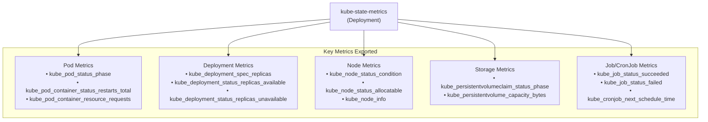

### 8.2 Collection Path

```
kube-state-metrics :8080/metrics
        │
        ▼
Alloy Node Agent (prometheus.scrape)
        │
        ▼
Alloy Gateway (prometheus.remote_write)
        │  X-Scope-OrgID: infrastructure
        ▼
      Mimir
```

kube-state-metrics runs as a single **Deployment** in the `kube-system` namespace (standard convention for cluster infrastructure components). It is scraped by the Alloy Node Agent. These metrics are tagged with the `infrastructure` tenant since they represent cluster-wide state.

---

## 9. Pyroscope Continuous Profiling

### 9.1 Architecture

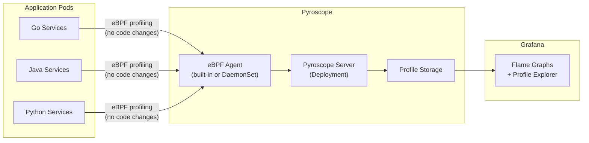

### 9.2 Profile Collection Methods

| Method | How | Languages | Code Changes |
|--------|-----|-----------|-------------|
| **eBPF (recommended)** | Kernel-level sampling | All | None |
| **SDK pull** | Pyroscope SDK in app | Go, Java, Python, Ruby, .NET | Minimal |
| **SDK push** | App pushes profiles | Go, Java, Python, Ruby, .NET | Minimal |

### 9.3 Grafana Integration

Pyroscope integrates into Grafana as a datasource. Key features:
- **Flame graphs**: Visualize CPU/memory hotspots
- **Diff view**: Compare profiles between time ranges or versions
- **Trace-to-profile**: Click a Tempo trace span → see the profile for that exact time window
- **Exemplars**: Link from metrics spikes to the profile that caused them

---

## 10. Grafana Datasource Correlation

### 10.1 Cross-Signal Navigation

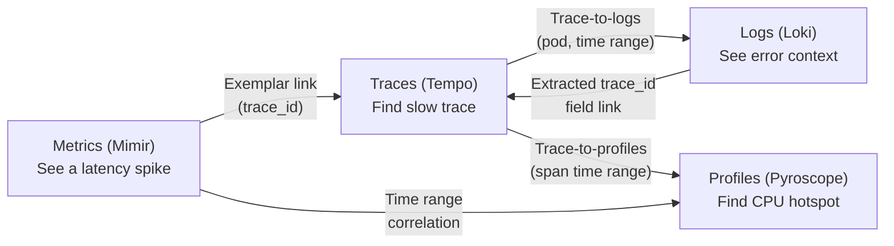

### 10.2 Correlation Configuration

| From | To | Link Mechanism |
|------|-----|---------------|
| **Metrics → Traces** | Exemplars embedded in metrics (trace_id) |
| **Traces → Logs** | `tracesToLogs` datasource config (match by pod, time range) |
| **Traces → Profiles** | `tracesToProfiles` datasource config (match by span time window) |
| **Traces → Metrics** | `tracesToMetrics` datasource config (generate PromQL from span tags) |
| **Logs → Traces** | Derived field regex extracting `trace_id` from log lines |

---

## 11. Network and Port Map

### 11.1 Internal Service Ports

| Service | Port | Protocol | Purpose |
|---------|------|----------|---------|
| **Alloy Gateway** | 4317 | gRPC | OTLP trace/metrics receiver |
| **Alloy Gateway** | 4318 | HTTP | OTLP trace/metrics receiver |
| **Alloy Gateway** | 12345 | HTTP | Alloy UI / health |
| **Alloy Node Agent** | 12345 | HTTP | Alloy UI / health |
| **Mimir Gateway** | 80 | HTTP | Prometheus remote_write + query |
| **Loki Gateway** | 80 | HTTP | Log push + LogQL query |
| **Tempo** | 3200 | HTTP | Tempo API / TraceQL query |
| **Tempo** | 4317 | gRPC | OTLP trace receiver |
| **Tempo** | 4318 | HTTP | OTLP trace receiver |
| **Pyroscope** | 4040 | HTTP | Profile push + query |
| **kube-state-metrics** | 8080 | HTTP | Prometheus metrics endpoint |
| **Grafana** | 3000 | HTTP | Web UI |

### 11.2 Data Flow Ports

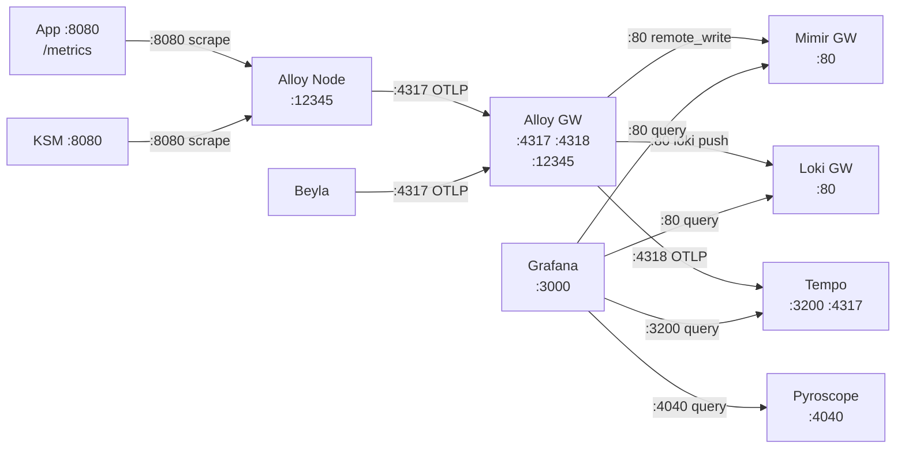

---

## 12. Resource Requirements

### 12.1 Per-Component Estimates (Small Cluster: 3-5 nodes)

| Component | CPU Request | Memory Request | CPU Limit | Memory Limit | Replicas |
|-----------|------------|---------------|-----------|-------------|----------|
| **Mimir (distributed)** | 500m total | 3Gi total | 2000m | 6Gi | Multiple |
| **Loki (single binary)** | 100m | 256Mi | 500m | 1Gi | 1 |
| **Tempo** | 100m | 256Mi | 500m | 1Gi | 1 |
| **Pyroscope** | 100m | 256Mi | 500m | 1Gi | 1 |
| **Grafana** | 100m | 256Mi | 500m | 512Mi | 1 |
| **Alloy Gateway** | 200m | 256Mi | 500m | 512Mi | 2 |
| **Alloy Node Agent** | 100m/node | 128Mi/node | 250m/node | 256Mi/node | 1/node |
| **Beyla** | 50m/node | 64Mi/node | 200m/node | 128Mi/node | 1/node |
| **kube-state-metrics** | 50m | 64Mi | 200m | 128Mi | 1 |

### 12.2 Storage Requirements

| Component | Storage | Retention | Type |
|-----------|---------|-----------|------|
| **Mimir (MinIO)** | 10Gi | Configurable | Object store |
| **Loki** | 10Gi | 7 days | Filesystem PVC |
| **Tempo** | 10Gi | 7 days | Filesystem PVC |
| **Pyroscope** | 10Gi | 7 days | Filesystem PVC |
| **Grafana** | 5Gi | N/A | Dashboards/config |

---

## 13. Helm Releases Summary

All components are deployed in the `observability` namespace.

| Helm Release | Chart | Repository |
|-------------|-------|------------|
| `mimir` | `grafana/mimir-distributed` | grafana |
| `loki` | `grafana/loki` | grafana |
| `tempo` | `grafana/tempo` | grafana |
| `pyroscope` | `grafana/pyroscope` | grafana |
| `grafana` | `grafana/grafana` | grafana |
| `alloy-gateway` | `grafana/alloy` | grafana |
| `alloy-node` | `grafana/alloy` | grafana |
| `beyla` | `grafana/beyla` | grafana |
| `kube-state-metrics` | `prometheus-community/kube-state-metrics` | prometheus-community |

---

## 14. Authentication and Access Control

### 14.1 User Authentication Flow

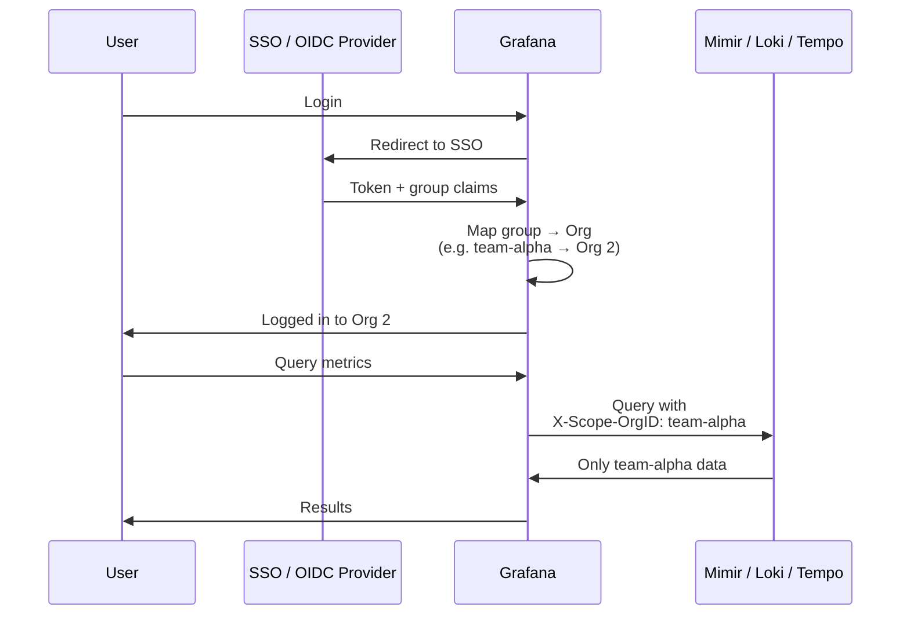

### 14.2 Access Matrix

| Role | Grafana Org | Can View | Can Edit Dashboards | Can Admin |
|------|------------|----------|-------------------|-----------|
| **Developer** | Project org | Own namespace data | Yes (own org) | No |
| **Tech Lead** | Project org | Own namespace data | Yes (own org) | Yes (own org) |
| **SRE / Platform** | Platform org | All namespace data | Yes (all) | Yes (all) |

---

## 15. Alerting Strategy

### 15.1 Alert Routing

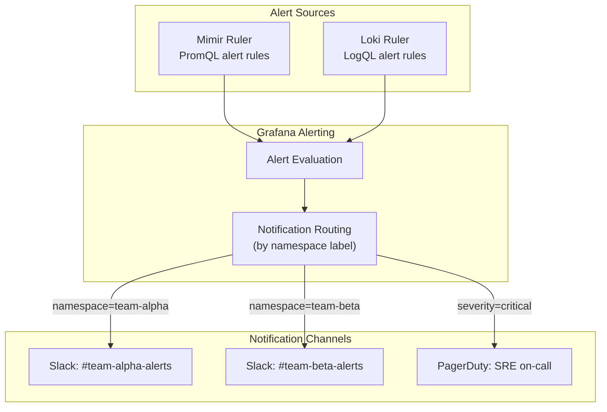

### 15.2 Recommended Alert Rules

| Category | Alert | Condition |
|----------|-------|-----------|
| **Application** | High error rate | `rate(http_requests_total{status=~"5.."}[5m]) / rate(http_requests_total[5m]) > 0.05` |
| **Application** | High latency | `histogram_quantile(0.99, rate(http_request_duration_seconds_bucket[5m])) > 1` |
| **Kubernetes** | Pod crash looping | `kube_pod_container_status_restarts_total > 5` |
| **Kubernetes** | Deployment unavailable | `kube_deployment_status_replicas_unavailable > 0` |
| **Node** | High CPU | `1 - avg(rate(node_cpu_seconds_total{mode="idle"}[5m])) > 0.9` |
| **Node** | Memory pressure | `node_memory_MemAvailable_bytes / node_memory_MemTotal_bytes < 0.1` |
| **Node** | Disk space low | `node_filesystem_avail_bytes / node_filesystem_size_bytes < 0.1` |
| **Logs** | Error log spike | `sum(rate({level="error"}[5m])) > 10` |
