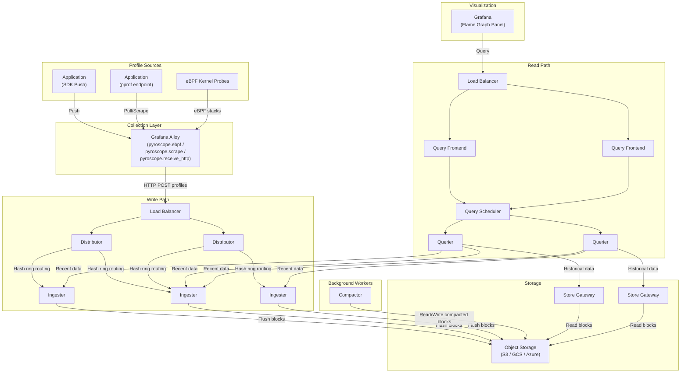
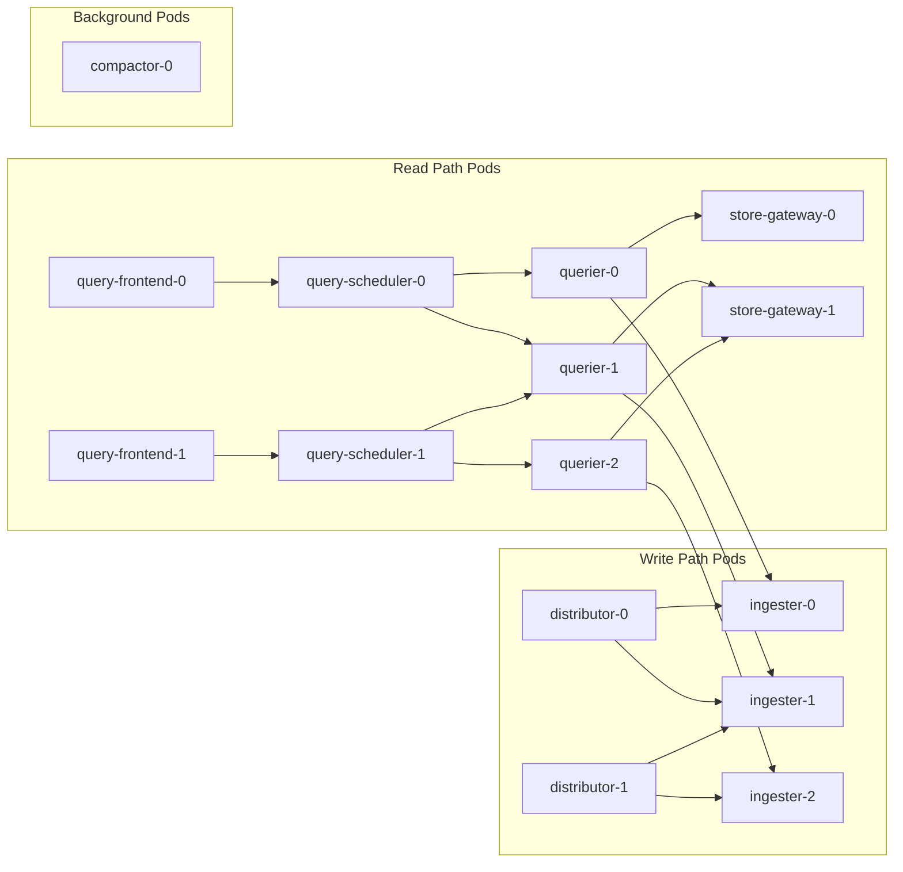
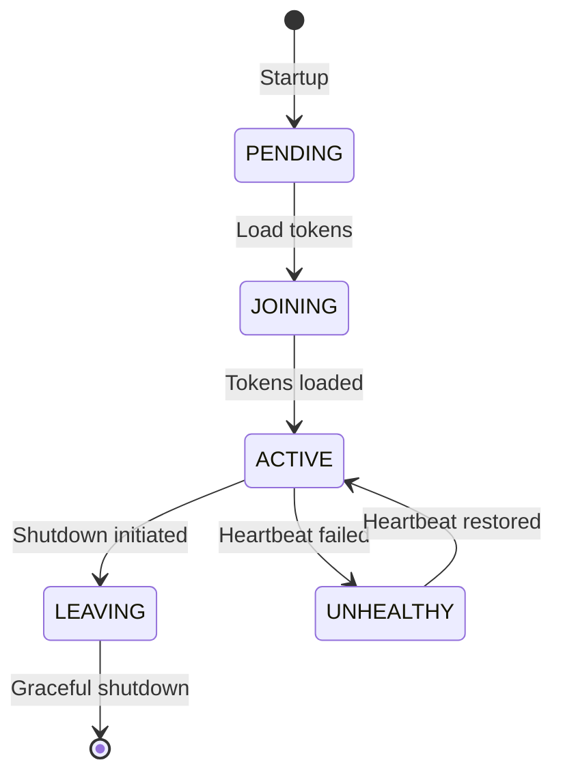
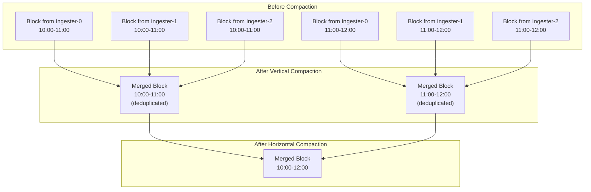
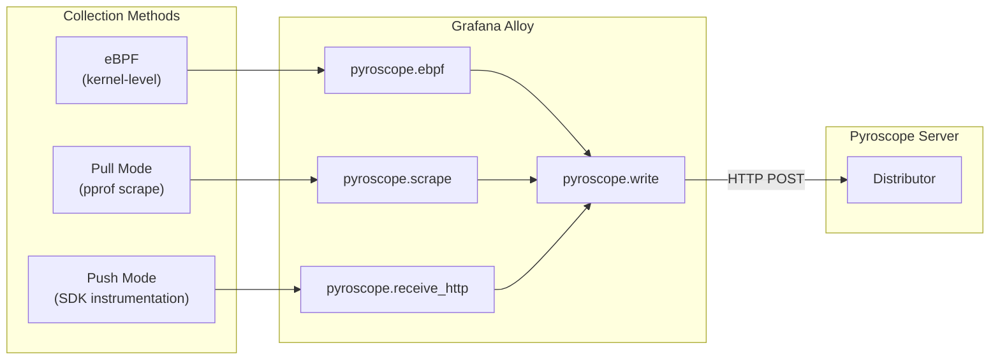
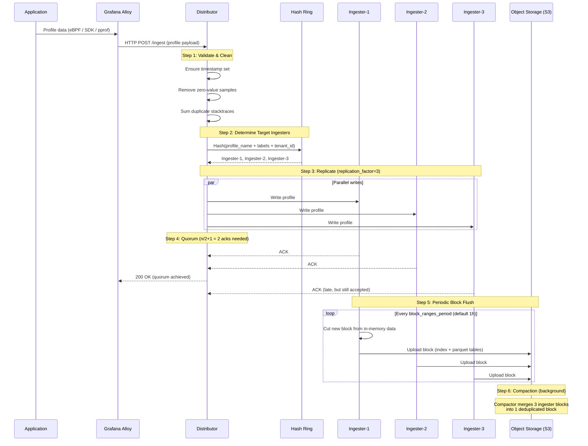
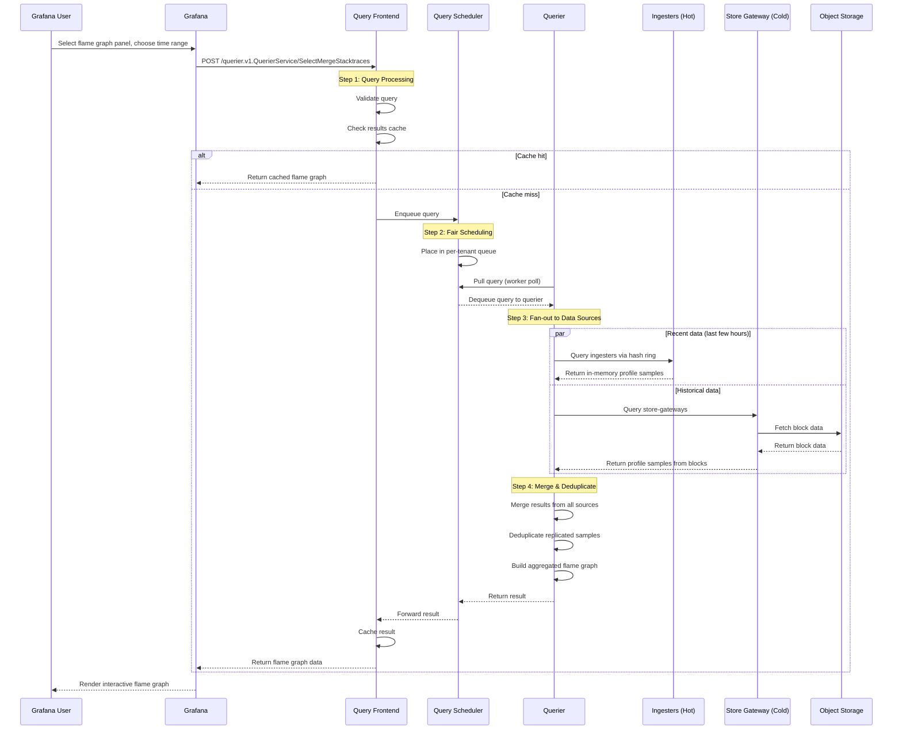
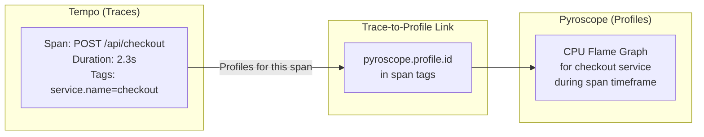

# Grafana Pyroscope Deep Dive

## Table of Contents

1. [Overview](#1-overview)
2. [Architecture](#2-architecture)
3. [Deployment Modes](#3-deployment-modes)
4. [Component Deep Dive](#4-component-deep-dive)
5. [Profile Collection Methods](#5-profile-collection-methods)
6. [Profile Types](#6-profile-types)
7. [Write Path](#7-write-path)
8. [Read Path](#8-read-path)
9. [Scaling Guide](#9-scaling-guide)
10. [Hot and Cold Data with S3](#10-hot-and-cold-data-with-s3)
11. [Grafana Integration](#11-grafana-integration)
12. [Production Checklist](#12-production-checklist)

---

## 1. Overview

### What Is Pyroscope?

Grafana Pyroscope is a **multi-tenant, horizontally scalable continuous profiling aggregation system**. While metrics tell you *what* is happening, logs tell you *what happened*, and traces tell you *where* it happened, profiling answers the fundamental question: **"Why is this slow, and why is it consuming so much memory?"**

Continuous profiling is increasingly recognized as the **4th pillar of observability**, completing the picture alongside metrics, logs, and traces.

```
+---------------------------------------------------------------------+
|                     THE FOUR PILLARS OF OBSERVABILITY                |
+---------------------------------------------------------------------+
|                                                                     |
|   METRICS          LOGS            TRACES          PROFILES         |
|   (What?)          (What happened?) (Where?)       (Why?)           |
|                                                                     |
|   CPU at 90%       "OOM killed"    POST /api/v1    malloc() in      |
|   Latency P99      "timeout at     took 2.3s       parse_json()     |
|   = 500ms          line 42"        across 5 svcs   using 4GB heap   |
|                                                                     |
|   Prometheus/       Loki            Tempo           Pyroscope        |
|   Mimir                                                             |
+---------------------------------------------------------------------+
```

### What Problems Does Pyroscope Solve?

- **CPU hotspots**: Identify which functions consume the most CPU cycles in production.
- **Memory leaks**: Pinpoint allocation patterns that cause gradual memory growth.
- **Lock contention**: Find mutex and blocking bottlenecks in concurrent code.
- **Goroutine leaks**: Detect runaway goroutine creation in Go services.
- **Regression detection**: Compare profiles across time ranges to identify when and where performance degraded.

### Key Design Principles

Pyroscope's architecture aligns with Grafana Mimir, Grafana Loki, and Grafana Tempo. All four share similar patterns:

- **Horizontally scalable microservices** compiled into a single binary.
- **Multi-tenant by design** with per-tenant isolation.
- **Object storage (S3/GCS/Azure)** for cost-effective long-term retention.
- **Write de-amplification** through ingester batching and compaction.
- **Dynamo-style quorum consistency** for reliable writes.

---

## 2. Architecture

### High-Level Architecture Diagram



### Component Interaction Map

```
+-----------------------------------------------------------------------------------+
|                           PYROSCOPE CLUSTER                                       |
|                                                                                   |
|  WRITE SIDE                              READ SIDE                                |
|  ----------                              ---------                                |
|                                                                                   |
|  +-----------+     +-----------+         +-----------------+                      |
|  |Distributor|---->| Ingester  |-------->| Object Storage  |                      |
|  |  (N)      |     |   (N)     |  flush  |  (S3/GCS/Azure) |                      |
|  +-----+-----+     +-----+-----+         +--------+--------+                     |
|        ^                  |                        |                              |
|        |                  | (recent data)          | (historical data)            |
|        |                  v                        v                              |
|  +-----+-----+     +-----+-------+        +-------+--------+                     |
|  |    Alloy   |     |   Querier   |<-------|Store Gateway   |                     |
|  | (Collector)|     |    (N)      |        |     (N)        |                     |
|  +-----------+      +------+------+        +----------------+                     |
|                            ^                                                      |
|                            |                                                      |
|                     +------+--------+                                             |
|                     |Query Scheduler|                                             |
|                     +------+--------+                                             |
|                            ^                                                      |
|                     +------+--------+                                             |
|                     |Query Frontend |                                             |
|                     +------+--------+                                             |
|                            ^                                                      |
|                            |                                                      |
|                     +------+--------+         +------------+                      |
|                     |   Grafana     |         |  Compactor  |----> Object Storage  |
|                     +---------------+         +------------+  (background merge)  |
|                                                                                   |
+-----------------------------------------------------------------------------------+
```

### Hash Ring

All stateful coordination between components uses a **hash ring** implemented via the memberlist gossip protocol. The ring determines:

- Which ingesters receive which profile series (based on hash of profile name + labels + tenant ID).
- Which store-gateways own which storage blocks.
- Which compactors process which tenants.

---

## 3. Deployment Modes

### 3.1 Single Binary (Monolithic) Mode

The simplest deployment mode. All components run within a single process.

```
+-------------------------------------------------+
|              SINGLE PYROSCOPE BINARY             |
|              -target=all (default)               |
|                                                  |
|  +------------+  +-----------+  +-----------+   |
|  |Distributor |  | Ingester  |  | Compactor |   |
|  +------------+  +-----------+  +-----------+   |
|  +------------+  +-----------+  +-----------+   |
|  |  Querier   |  |Query Front|  |Query Sched|   |
|  +------------+  +-----------+  +-----------+   |
|  +---------------+                              |
|  |Store Gateway  |                              |
|  +---------------+                              |
+-------------------------------------------------+
         |                    |
         v                    v
    Local Disk or        Object Storage
    Filesystem           (S3/GCS/Azure)
```

**Configuration:**

```yaml
# pyroscope.yaml (monolithic mode)
target: all

server:
  http_listen_port: 4040

storage:
  backend: filesystem
  filesystem:
    dir: /var/pyroscope/data
```

**When to use:**

- Development and testing environments.
- Small deployments with fewer than ~50 profiled services.
- Proof-of-concept and evaluation.
- Single-node setups where simplicity is the priority.

**Limitations:**

- Cannot scale individual components independently.
- Multiple monolithic instances do not share state with each other.
- No horizontal scaling of write or read paths.

**Launch command:**

```bash
pyroscope -target=all -config.file=pyroscope.yaml
```

### 3.2 Microservices Mode

Each component runs as its own process with its own `-target` flag. This is the **recommended production deployment**.



**Configuration (per component):**

```yaml
# Common configuration shared by all components
common:
  storage:
    backend: s3
    s3:
      bucket_name: pyroscope-blocks
      region: us-east-1
      endpoint: s3.us-east-1.amazonaws.com

memberlist:
  join_members:
    - pyroscope-memberlist.pyroscope.svc.cluster.local:7946
```

```bash
# Launch each component with its target
pyroscope -target=distributor    -config.file=common.yaml
pyroscope -target=ingester       -config.file=common.yaml
pyroscope -target=compactor      -config.file=common.yaml
pyroscope -target=querier        -config.file=common.yaml
pyroscope -target=query-frontend -config.file=common.yaml
pyroscope -target=query-scheduler -config.file=common.yaml
pyroscope -target=store-gateway  -config.file=common.yaml
```

**When to use:**

- Production environments requiring high availability.
- Organizations with more than ~50 profiled services.
- Environments that need independent scaling of write and read paths.
- Kubernetes-based infrastructure (recommended orchestrator).

**Deployment comparison:**

| Aspect                  | Single Binary          | Microservices           |
|-------------------------|------------------------|-------------------------|
| Complexity              | Minimal                | High                    |
| Scaling                 | Vertical only          | Horizontal per component|
| Fault isolation         | None (single process)  | Per component           |
| Resource efficiency     | Lower (over-provisioned)| Higher (right-sized)   |
| Recommended for         | Dev/test, small scale  | Production, large scale |
| Kubernetes required     | No                     | Strongly recommended    |
| High availability       | Not supported          | Supported               |

---

## 4. Component Deep Dive

### 4.1 Distributor

**What it does:** The distributor is a **stateless** gateway that receives incoming profile data from agents (Grafana Alloy), validates and cleans the data, then distributes it across ingesters using consistent hashing.

**Why it exists:** It decouples profile ingestion from storage. By sitting in front of the ingesters, the distributor handles validation, rate limiting, and hash-ring-based routing so that ingesters only receive clean, correctly routed data.

**How it works:**

1. Receives an HTTP POST containing profile data from Alloy or an SDK.
2. Validates the profile:
   - Ensures a timestamp is set (defaults to receipt time if missing).
   - Removes samples with zero values.
   - Sums samples sharing identical stacktraces.
   - Returns HTTP 400 for invalid data.
3. Computes a hash from profile name + labels + tenant ID.
4. Looks up the hash ring to determine the target ingesters.
5. Replicates the profile to N ingesters (configurable replication factor).
6. Waits for quorum (n/2 + 1) acknowledgments before returning success.

**Key configuration parameters:**

| Parameter                              | Default | Description                              |
|----------------------------------------|---------|------------------------------------------|
| `-distributor.replication-factor`      | 3       | Number of ingester replicas per series   |
| `-distributor.ring.kvstore.store`      | memberlist | Backend for the hash ring             |
| `-distributor.ha-tracker.enable`       | false   | Enable HA deduplication tracker          |
| `-server.http-listen-port`             | 4040    | HTTP listen port for profile ingestion   |

**Resource characteristics:**

- **CPU**: Moderate. Validation and hashing are lightweight per request, but high-volume environments drive CPU usage.
- **Memory**: Low. Stateless; does not buffer profiles.
- **Disk**: None. No local persistence.
- **Scaling**: Scale horizontally behind a load balancer. Use random load balancing across instances.

---

### 4.2 Ingester

**What it does:** The ingester is a **stateful** component that receives profiles from distributors, stores them in local on-disk databases, and periodically flushes completed blocks to long-term object storage. It also serves recent (hot) data for read queries.

**Why it exists:** The ingester implements **write de-amplification**. Rather than writing every incoming profile sample directly to object storage (which would be extremely expensive at scale), ingesters batch and compress samples in memory and on local disk, then upload completed blocks periodically. This batching is the primary driver of Pyroscope's low total cost of ownership.

**Ingester lifecycle (hash ring states):**



| State     | Accepts Writes | Accepts Reads | Description                        |
|-----------|:--------------:|:-------------:|-----------------------------------|
| PENDING   | No             | No            | Just started, waiting              |
| JOINING   | No             | No            | Loading ring tokens                |
| ACTIVE    | Yes            | Yes           | Fully operational                  |
| LEAVING   | No             | Yes           | Shutting down, draining reads      |
| UNHEALTHY | No             | No            | Failed heartbeat, bypassed         |

**Key configuration parameters:**

| Parameter                                  | Default    | Description                                |
|--------------------------------------------|------------|--------------------------------------------|
| `-ingester.ring.replication-factor`        | 3          | Number of replicas per series              |
| `-ingester.ring.tokens-file-path`          | (empty)    | Path to persist ring tokens on disk        |
| `-ingester.ring.kvstore.store`             | memberlist | Hash ring backend                          |
| `-blocks-storage.tsdb.block-ranges-period` | 1h         | How often to cut new blocks                |
| `-blocks-storage.tsdb.retention-period`    | 6h         | How long to retain local blocks            |

**Resource characteristics:**

- **CPU**: Moderate. Compresses incoming profiles.
- **Memory**: High. Holds recent profiles in memory before flush. Size depends on ingestion rate and retention.
- **Disk**: High. Stores on-disk blocks before upload. Use fast SSDs (NVMe recommended).
- **Scaling**: Scale horizontally. Add more ingesters to distribute the hash ring load. Always maintain at least 3 replicas for quorum writes.

---

### 4.3 Compactor

**What it does:** The compactor runs as a background process that merges and deduplicates profile blocks in object storage, and maintains the per-tenant bucket index that store-gateways and queriers use for block discovery.

**Why it exists:** Without compaction, each ingester writes its own blocks to storage, resulting in many small, overlapping blocks per time range. The compactor merges these into fewer, larger blocks, which dramatically reduces query latency and storage costs.

**Compaction stages:**



**Split-and-merge algorithm:**

For very large tenants, the compactor uses a split-and-merge strategy to avoid producing single blocks that are too large:

1. **Split stage**: Source blocks are divided into N groups, each compacted into M "split blocks" containing series subsets for specific shards.
2. **Merge stage**: The N split blocks per shard are consolidated into final compacted output.

This overcomes TSDB index size limitations and prevents unbounded block growth.

**Key configuration parameters:**

| Parameter                                   | Default   | Description                                   |
|---------------------------------------------|-----------|-----------------------------------------------|
| `-compactor.compaction-interval`            | 1h        | How often to run compaction                   |
| `-compactor.block-ranges`                   | 1h,2h,8h  | Block time range stages for compaction        |
| `-compactor.compaction-concurrency`         | 1         | Max concurrent compactions per instance       |
| `-compactor.split-and-merge-shards`         | 0         | Number of shards for split-and-merge          |
| `-compactor.split-groups`                   | 1         | Number of groups for split stage              |
| `-compactor.deletion-delay`                 | 12h       | Delay before deleting replaced blocks         |
| `-compactor.compaction-jobs-order`          | smallest-range-oldest-blocks-first | Compaction priority |
| `-compactor.compactor-tenant-shard-size`    | 0         | Shuffle sharding: compactors per tenant       |

**Resource characteristics:**

- **CPU**: High during compaction cycles. Each concurrent compaction uses one full CPU core.
- **Memory**: High. Must hold block data in memory during merge operations.
- **Disk**: Moderate. Temporary space for compaction intermediates.
- **Scaling**: Scale vertically (increase `-compactor.compaction-concurrency`) or horizontally (add more compactor instances with shuffle sharding).

---

### 4.4 Querier

**What it does:** The querier is a **stateless** component that executes profile queries. It fetches data from two sources: **ingesters** (for recent, not-yet-flushed profiles) and **store-gateways** (for historical profiles in object storage). It then merges and deduplicates the results.

**Why it exists:** It abstracts the dual-source nature of Pyroscope's storage. Callers do not need to know whether data lives in ingesters or object storage; the querier handles fan-out and merge transparently.

**How it works:**

1. Receives a query from the query-scheduler.
2. Determines the time range.
3. For recent data: queries ingesters via the hash ring.
4. For historical data: queries store-gateways.
5. Merges and deduplicates results from both sources.
6. Returns the unified result to the query-frontend.

**Key configuration parameters:**

| Parameter                              | Default    | Description                                 |
|----------------------------------------|------------|---------------------------------------------|
| `-querier.max-concurrent`              | 20         | Max concurrent queries per querier          |
| `-querier.query-store-after`           | 0          | Only query store after this duration        |
| `-querier.query-ingesters-within`      | 0          | Only query ingesters for this recent window |
| `-ingester.ring.*`                     | (various)  | Must match ingester ring config             |

**Resource characteristics:**

- **CPU**: High during query execution, especially for large flame graph aggregations.
- **Memory**: Moderate to high, depending on query complexity and result size.
- **Disk**: None. Stateless.
- **Scaling**: Scale horizontally. More queriers = more concurrent query capacity.

---

### 4.5 Query Frontend

**What it does:** The query frontend is a **stateless** component that sits in front of queriers. It provides the same API as the querier but accelerates queries through splitting, caching, and retry mechanisms. It ensures fair scheduling between tenants.

**Why it exists:** Without it, large queries would monopolize querier resources. The query frontend breaks large queries into smaller sub-queries, caches results, and retries failed queries, all while maintaining per-tenant fairness.

**How it works:**

1. Receives queries from Grafana or API clients.
2. Optionally splits large time-range queries into smaller sub-queries.
3. Checks the results cache for previously computed results.
4. Enqueues sub-queries into the query-scheduler.
5. Aggregates results from queriers.
6. Returns the final result to the client.

**Key configuration parameters:**

| Parameter                                         | Default | Description                              |
|---------------------------------------------------|---------|------------------------------------------|
| `-query-frontend.max-outstanding-per-tenant`      | 100     | Max queued queries per tenant            |
| `-query-frontend.query-sharding-total-shards`     | 0       | Number of shards for query splitting     |
| `-query-frontend.results-cache.backend`           | (none)  | Cache backend (memcached, redis)         |
| `-query-frontend.max-retries`                     | 5       | Max retries for failed queries           |

**Resource characteristics:**

- **CPU**: Low to moderate. Mainly query coordination.
- **Memory**: Low unless results caching is enabled in-process.
- **Disk**: None. Stateless.
- **Scaling**: Run at least 2 replicas for HA. Horizontal scaling supported.

---

### 4.6 Query Scheduler

**What it does:** The query scheduler is a **stateless** component that maintains an in-memory queue of queries and distributes them to available queriers. It decouples query frontends from queriers.

**Why it exists:** Without the scheduler, query frontends would need direct connections to all queriers, which becomes a scalability bottleneck. The scheduler enables independent scaling of frontends and queriers, and provides fair per-tenant query scheduling.

**How it works:**

1. Query frontends enqueue queries into the scheduler.
2. The scheduler maintains per-tenant FIFO queues.
3. Queriers connect to the scheduler and pull queries when they have capacity.
4. Results flow back through the scheduler to the frontend.

**Key configuration parameters:**

| Parameter                                          | Default | Description                              |
|----------------------------------------------------|---------|------------------------------------------|
| `-query-scheduler.max-outstanding-requests-per-tenant` | 100 | Max queued requests per tenant           |
| `-query-scheduler.ring.kvstore.store`              | memberlist | Service discovery backend             |

**Resource characteristics:**

- **CPU**: Very low. Queue management only.
- **Memory**: Low. In-memory queues are small.
- **Disk**: None. Stateless.
- **Scaling**: Run at least 2 replicas for HA. Typically does not need more.

---

### 4.7 Store Gateway

**What it does:** The store gateway is a **stateful** component that serves profile queries from long-term object storage. It lazily loads block indexes and caches them locally for fast lookups.

**Why it exists:** Querying object storage directly for every request would be extremely slow and expensive. The store gateway maintains local index caches and uses the hash ring to shard block ownership across instances, enabling fast, parallelized reads from cold storage.

**How it works:**

1. On startup, discovers blocks in object storage via the bucket index.
2. Uses the hash ring to determine which blocks this instance owns.
3. Lazily downloads and caches block index-headers locally.
4. Serves queries from queriers by reading the relevant blocks.
5. Periodically syncs with the bucket index to discover new blocks.

**Key configuration parameters:**

| Parameter                                         | Default    | Description                                |
|---------------------------------------------------|------------|--------------------------------------------|
| `-store-gateway.sharding-ring.kvstore.store`      | memberlist | Hash ring backend                          |
| `-store-gateway.sharding-ring.replication-factor`  | 1          | Block replication across gateways          |
| `-blocks-storage.bucket-store.sync-interval`       | 15m        | How often to resync block list             |
| `-blocks-storage.bucket-store.index-cache.backend`  | (none)     | Index cache backend (memcached)           |

**Resource characteristics:**

- **CPU**: Moderate. Index lookups and data decompression.
- **Memory**: High. Index-headers and data caches are kept in memory.
- **Disk**: Moderate. Caches index-headers locally. Use SSDs for performance.
- **Scaling**: Scale horizontally. More store-gateways = more blocks served in parallel.

---

## 5. Profile Collection Methods

### 5.1 Collection Architecture Overview



### 5.2 eBPF-Based Collection (Recommended)

eBPF (Extended Berkeley Packet Filter) enables kernel-level profiling with **zero code changes** to your applications.

**How it works:**

1. Grafana Alloy loads an eBPF program into the Linux kernel.
2. The eBPF program attaches to the `perf_event` subsystem.
3. At a configurable sample rate, the kernel captures stack traces from running processes.
4. Alloy reads the captured stacks from the kernel's ring buffer.
5. Stack traces are symbolized and forwarded to Pyroscope.

**Requirements:**

- Linux kernel >= 4.9 (for `BPF_PROG_TYPE_PERF_EVENT`).
- Alloy must run as **root** and in the **host PID namespace**.
- Target applications must have frame pointers enabled.

**Supported languages:**

| Language    | Support Level | Notes                                      |
|-------------|---------------|--------------------------------------------|
| C / C++     | Full          | Compile with `-fno-omit-frame-pointer`     |
| Go          | Full          | Frame pointers enabled by default          |
| Rust        | Full          | Compile with frame pointers                |
| Python      | Supported     | Set `python_enabled=true` in config        |
| Java        | Not supported | Use SDK or Alloy Java auto-instrumentation |
| Node.js     | Not supported | Use SDK instead                            |
| Ruby        | Not supported | Use SDK instead                            |

**Limitation:** The eBPF profiler **only collects CPU profiles**. For memory, goroutine, mutex, or block profiles, use SDK instrumentation.

**Alloy configuration for eBPF:**

```
pyroscope.ebpf "default" {
    forward_to   = [pyroscope.write.endpoint.receiver]
    sample_rate  = 97

    targets_only = false

    python_enabled = true

    demangle     = "none"
}

pyroscope.write "endpoint" {
    endpoint {
        url = "http://pyroscope:4040"
    }
}
```

### 5.3 SDK-Based Collection

Language-specific SDKs provide **the broadest profile type coverage** and integrate directly into your application code.

**Go (pyroscope-go):**

```go
import "github.com/grafana/pyroscope-go"

pyroscope.Start(pyroscope.Config{
    ApplicationName: "my-service",
    ServerAddress:   "http://pyroscope:4040",
    ProfileTypes: []pyroscope.ProfileType{
        pyroscope.ProfileCPU,
        pyroscope.ProfileAllocObjects,
        pyroscope.ProfileAllocSpace,
        pyroscope.ProfileInuseObjects,
        pyroscope.ProfileInuseSpace,
        pyroscope.ProfileGoroutines,
        pyroscope.ProfileMutexCount,
        pyroscope.ProfileMutexDuration,
        pyroscope.ProfileBlockCount,
        pyroscope.ProfileBlockDuration,
    },
})
```

**Java (async-profiler integration):**

```java
PyroscopeAgent.start(
    new Config.Builder()
        .setApplicationName("my-java-service")
        .setServerAddress("http://pyroscope:4040")
        .setProfilingEvent(EventType.ITIMER)
        .setProfilingAlloc("512k")
        .setProfilingLock("10ms")
        .build()
);
```

**Python (py-spy integration):**

```python
import pyroscope

pyroscope.configure(
    application_name="my-python-service",
    server_address="http://pyroscope:4040",
    sample_rate=100,
    tags={"region": "us-east-1"},
)
```

### 5.4 Alloy Integration

Grafana Alloy is the **recommended collector** for production deployments. It replaces the deprecated Grafana Agent (EOL November 2025).

**Three collection modes in Alloy:**

| Alloy Component            | Mode   | Description                             |
|----------------------------|--------|-----------------------------------------|
| `pyroscope.ebpf`          | eBPF   | Kernel-level CPU profiling              |
| `pyroscope.scrape`        | Pull   | Scrape pprof endpoints (like Go apps)   |
| `pyroscope.receive_http`  | Push   | Receive profiles from SDKs              |

**Pull mode example (scraping Go pprof endpoints):**

```
pyroscope.scrape "default" {
    targets = [
        {"__address__" = "my-go-app:6060", "service_name" = "my-go-app"},
    ]

    profiling_config {
        profile.process_cpu { enabled = true }
        profile.memory      { enabled = true }
        profile.goroutine   { enabled = true }
        profile.mutex       { enabled = true }
        profile.block       { enabled = true }
    }

    forward_to = [pyroscope.write.endpoint.receiver]
}

pyroscope.write "endpoint" {
    endpoint {
        url = "http://pyroscope:4040"
    }
}
```

### 5.5 Pull vs Push Comparison

```
PULL MODE (pyroscope.scrape)                PUSH MODE (SDK / pyroscope.receive_http)
================================            ==========================================

  Alloy         Application                   Application         Alloy/Pyroscope
  +-----+       +----------+                  +----------+        +-----+
  |     |------>| /debug/  |                  |  SDK     |------->|     |
  |     |  GET  | pprof/   |                  |  push()  |  POST  |     |
  |     |<------| profile  |                  +----------+        +-----+
  +-----+       +----------+

  - No code changes needed                   - Requires SDK integration
  - Alloy controls sample rate               - App controls sample rate
  - Best for Go (native pprof)               - Best for Java, Python, Ruby, .NET
  - Central configuration                    - Richer profile types
  - Requires network access to app           - Works through firewalls/NAT
```

---

## 6. Profile Types

### Profile Type Reference

| Profile Type      | Measures                                | Unit           | Key Use Case                                  |
|-------------------|-----------------------------------------|----------------|-----------------------------------------------|
| **CPU**           | CPU time consumed by each function      | Nanoseconds    | Find CPU hotspots, optimize compute cost      |
| **Alloc Objects** | Number of heap allocations per function | Count          | Find allocation-heavy code paths              |
| **Alloc Space**   | Bytes allocated on heap per function    | Bytes          | Find memory-hungry allocations                |
| **Inuse Objects** | Live objects currently on heap          | Count          | Detect memory leaks (objects not freed)       |
| **Inuse Space**   | Live bytes currently on heap            | Bytes          | Detect memory leaks (bytes not freed)         |
| **Goroutine**     | Number of goroutines per call stack     | Count          | Detect goroutine leaks, deadlocks             |
| **Mutex Count**   | Number of mutex lock contentions        | Count          | Find frequently contended locks               |
| **Mutex Duration**| Time spent waiting for mutex locks      | Nanoseconds    | Find long-held locks                          |
| **Block Count**   | Number of blocking operations           | Count          | Find frequently blocking code                 |
| **Block Duration**| Time spent in blocking operations       | Nanoseconds    | Find slow blocking operations (I/O, channels) |
| **Wall**          | Wall-clock time (includes I/O wait)     | Nanoseconds    | Measure real elapsed time, not just CPU        |

### Profile Type Availability by Language

| Language   | CPU | Alloc Obj/Space | Inuse Obj/Space | Goroutine | Mutex | Block | Wall | Lock | Exceptions |
|------------|:---:|:---------------:|:---------------:|:---------:|:-----:|:-----:|:----:|:----:|:----------:|
| Go         | Y   | Y               | Y               | Y         | Y     | Y     | --   | --   | --         |
| Java       | Y   | Y               | Y               | --        | Y     | --    | --   | Y    | --         |
| .NET       | Y   | Y               | --              | --        | --    | --    | --   | Y    | Y          |
| Python     | Y   | --              | --              | --        | --    | --    | Y    | --   | --         |
| Ruby       | Y   | --              | --              | --        | Y     | --    | --   | Y    | --         |
| Rust       | Y   | --              | --              | --        | --    | --    | --   | --   | --         |
| Node.js    | Y   | --              | --              | --        | --    | --    | Y    | --   | --         |
| eBPF       | Y   | --              | --              | --        | --    | --    | --   | --   | --         |

### Detailed Profile Type Explanations

**CPU Profile:**
Measures where your application spends CPU time. The flame graph width represents the proportion of CPU time consumed by each function. This is the most commonly used profile type and the only one available via eBPF. Use it to identify compute-heavy functions that are candidates for optimization. When your application's CPU usage spikes, a CPU profile taken during the spike will show exactly which call stacks are responsible.

**Memory / Allocation Profiles:**
Alloc profiles track heap allocations over time. Inuse profiles show what is currently live on the heap. The distinction is critical: alloc profiles show allocation rate (useful for reducing GC pressure), while inuse profiles show heap footprint (useful for detecting memory leaks). A gradual increase in inuse space that never decreases is a classic memory leak signature.

**Goroutine Profile (Go only):**
Shows the distribution of goroutines across call stacks. Essential for diagnosing goroutine leaks, where goroutines are created but never terminate. A steadily increasing goroutine count, visible in the profile timeline, points directly to the leaking call stack.

**Mutex Profile:**
Captures lock contention. Mutex count shows how often threads compete for locks; mutex duration shows how long they wait. High mutex contention indicates that shared resources are a bottleneck and may need redesign (e.g., sharding, lock-free data structures, or reducing critical section scope).

**Block Profile:**
Measures time spent in blocking operations such as channel receives, select statements, and condition variable waits. High block duration indicates that goroutines are frequently stalled waiting for events.

**Wall Profile:**
Measures real elapsed (wall-clock) time, including time spent waiting on I/O, sleep, network, and disk operations. Unlike CPU profiles, which only count active compute time, wall profiles reveal where your application is spending time waiting. Available in Python and Node.js SDKs.

---

## 7. Write Path

### Step-by-Step Write Flow



### Write Path Details

**Step 1 - Collection:** Grafana Alloy collects profiles via eBPF (kernel-level stack sampling), scraping pprof HTTP endpoints (pull mode), or receiving HTTP pushes from SDKs. Collected profiles are batched and forwarded to the Pyroscope distributor.

**Step 2 - Validation:** The distributor cleans incoming profiles: adds missing timestamps, strips zero-value samples, sums duplicate stacktraces. Invalid profiles receive an HTTP 400 response; valid profiles proceed.

**Step 3 - Hashing and Routing:** The distributor computes a consistent hash from the profile name, labels, and tenant ID. The hash ring maps this to a set of ingesters (determined by the replication factor).

**Step 4 - Replication:** The profile is written in parallel to N ingesters (default 3). The distributor waits for quorum (n/2 + 1 = 2 of 3) acknowledgments before returning success to the client.

**Step 5 - Local Storage:** Each ingester appends profiles to a per-tenant on-disk database. Profiles are batched and compressed. Periodically (default every 1 hour), the ingester cuts a new block and uploads it to object storage.

**Step 6 - Compaction:** The compactor asynchronously reads blocks from object storage, merges overlapping blocks (vertical compaction), deduplicates replicated data, and produces optimized blocks. This reduces storage usage and improves query performance.

### Storage Format

Each block in object storage contains:

```
tenant-id/
  block-ulid/
    meta.json           # Block metadata (time range, tenant, labels)
    index               # Inverted index for label lookups
    profiles.parquet    # Profile data in Apache Parquet format
    symbols/            # Symbol tables for stack frame resolution
```

---

## 8. Read Path

### Step-by-Step Read Flow



### Read Path Details

**Step 1 - Query Reception:** Grafana sends a query to the query-frontend, specifying the profile type (e.g., `process_cpu`), label matchers (e.g., `{service_name="my-app"}`), and time range. The query-frontend validates the request and checks the results cache.

**Step 2 - Scheduling:** On a cache miss, the query is enqueued in the query-scheduler. The scheduler maintains per-tenant FIFO queues to ensure fair scheduling. Queriers act as workers, polling the scheduler for work.

**Step 3 - Data Retrieval:** The querier fans out to two data sources:
- **Ingesters** for recent data that has not yet been flushed to object storage. The querier uses the ingester hash ring to locate the correct ingesters.
- **Store-gateways** for historical data stored in object storage. Store-gateways use their local index caches to efficiently locate and retrieve the relevant blocks.

**Step 4 - Merge and Deduplication:** Results from all sources are merged. Because profiles are replicated across multiple ingesters, the querier deduplicates samples to avoid inflated values. The merged data is assembled into a flame graph structure.

**Step 5 - Response:** The flame graph data is returned through the query-frontend (which caches it) to Grafana, where it is rendered as an interactive flame graph visualization.

---

## 9. Scaling Guide

### Scaling Matrix

| Component        | Stateful | Scaling Direction | Trigger Symptoms                          | Scaling Action                              | Min HA Replicas |
|------------------|:--------:|:-----------------:|-------------------------------------------|---------------------------------------------|:---------------:|
| Distributor      | No       | Horizontal        | High CPU, increased latency on ingestion  | Add more distributor pods                   | 2               |
| Ingester         | Yes      | Horizontal        | High memory, slow flushes, OOM kills      | Add ingesters (reshards the hash ring)      | 3               |
| Compactor        | No*      | Vertical + Horizontal | Compaction lag, growing block count   | Increase concurrency; add compactor replicas| 1               |
| Querier          | No       | Horizontal        | Slow queries, query timeouts              | Add more querier pods                       | 2               |
| Query Frontend   | No       | Horizontal        | Connection limits, request queuing        | Add frontend replicas                       | 2               |
| Query Scheduler  | No       | Horizontal        | Queue depth growing, scheduling delays    | Add scheduler replicas                      | 2               |
| Store Gateway    | Yes      | Horizontal        | High memory, slow cold queries            | Add store-gateway replicas                  | 2               |

*Compactor is stateless in terms of the hash ring but requires temporary disk for compaction work.

### Per-Component Scaling Details

#### Distributor Scaling

**When to scale:**
- CPU utilization consistently above 70%.
- Profile ingestion latency increasing.
- HTTP 429 (rate limited) or 503 (overloaded) responses.

**How to scale:**
- Add more distributor pods behind the load balancer.
- No state to migrate; new instances join immediately.
- Ensure the load balancer uses random distribution (not round-robin with keep-alive, which can cause uneven load).

**Considerations:**
- Distributors are cheap. Over-provisioning is acceptable.
- Monitor `pyroscope_distributor_received_profiles_total` and `pyroscope_distributor_ingestion_rate_samples_per_second`.

#### Ingester Scaling

**When to scale:**
- Memory utilization approaching pod limits.
- OOM kills observed.
- Flush duration increasing (profiles accumulating faster than flush rate).
- `pyroscope_ingester_memory_profiles` consistently growing.

**How to scale:**
- Add new ingester replicas. The hash ring automatically reshards.
- **Critical**: When scaling down, ingesters must leave gracefully (LEAVING state) to flush data and transfer ring tokens. Never force-terminate ingesters.
- Use PodDisruptionBudgets to protect against simultaneous ingester terminations.

**Considerations:**
- Each ingester needs fast local storage (SSD/NVMe) for on-disk blocks.
- Memory sizing: roughly proportional to (ingestion rate) x (block flush interval).
- Always maintain at least (replication_factor) ingesters running.

#### Compactor Scaling

**When to scale:**
- Compaction backlog growing (blocks not compacted within expected intervals).
- Storage utilization growing faster than expected.
- Query latency on cold data increasing (uncompacted blocks are slower to query).

**How to scale:**
- **Vertical first**: Increase `-compactor.compaction-concurrency` (one CPU core per concurrent compaction).
- **Horizontal**: Add more compactor instances and enable tenant shuffle sharding with `-compactor.compactor-tenant-shard-size`.

**Considerations:**
- Compaction is CPU and memory intensive. Allocate dedicated resources.
- Monitor `pyroscope_compactor_blocks_compacted_total` and `pyroscope_compactor_block_compaction_failed_total`.

#### Querier Scaling

**When to scale:**
- Query latency P99 exceeding SLO.
- Query timeouts increasing.
- `pyroscope_querier_queries_in_progress` consistently near `-querier.max-concurrent`.

**How to scale:**
- Add more querier pods. They are stateless and join immediately.
- Also consider scaling store-gateways if cold-data queries are the bottleneck.

**Considerations:**
- Queriers need enough memory to hold query results in progress.
- Scaling queriers without scaling store-gateways may just move the bottleneck.

#### Store Gateway Scaling

**When to scale:**
- Memory pressure from index-header caches.
- Cold query latency increasing.
- Block sync times growing.

**How to scale:**
- Add more store-gateway replicas. Block ownership reshards across the ring.
- Enable memcached for the index cache to reduce per-instance memory.

**Considerations:**
- Each store-gateway needs local SSD for caching index-headers.
- On startup, new store-gateways must download index-headers for their assigned blocks (can take minutes for large deployments).

### Resource Sizing Guide

| Component        | Small (<50 svc) | Medium (50-200 svc) | Large (200+ svc)     |
|------------------|------------------|----------------------|----------------------|
| Distributor      | 2 x 0.5 CPU, 512Mi | 3 x 1 CPU, 1Gi   | 5+ x 2 CPU, 2Gi     |
| Ingester         | 3 x 1 CPU, 2Gi  | 3 x 2 CPU, 8Gi      | 6+ x 4 CPU, 16Gi    |
| Compactor        | 1 x 1 CPU, 2Gi  | 1 x 4 CPU, 8Gi      | 2+ x 8 CPU, 16Gi    |
| Querier          | 2 x 1 CPU, 2Gi  | 3 x 2 CPU, 4Gi      | 5+ x 4 CPU, 8Gi     |
| Query Frontend   | 2 x 0.5 CPU, 512Mi | 2 x 1 CPU, 1Gi   | 3+ x 2 CPU, 2Gi     |
| Query Scheduler  | 2 x 0.25 CPU, 256Mi| 2 x 0.5 CPU, 512Mi| 2 x 1 CPU, 1Gi      |
| Store Gateway    | 2 x 1 CPU, 2Gi  | 2 x 2 CPU, 8Gi      | 4+ x 4 CPU, 16Gi    |

---

## 10. Hot and Cold Data with S3

### Data Temperature Model

Pyroscope uses a tiered storage model identical in concept to Grafana Mimir. Data transitions from "hot" (recent, in-memory) to "cold" (historical, in object storage) over time.

```mermaid
graph LR
    subgraph Hot["HOT DATA (Ingesters)"]
        direction TB
        H1["In-memory profiles"]
        H2["Local on-disk blocks"]
        H3["Last 1-6 hours"]
        H4["Fast reads"]
    end

    subgraph Warm["WARM DATA (Recently flushed)"]
        direction TB
        W1["Uncompacted blocks in S3"]
        W2["Multiple blocks per time range"]
        W3["1-24 hours old"]
        W4["Moderate read speed"]
    end

    subgraph Cold["COLD DATA (Compacted)"]
        direction TB
        C1["Compacted blocks in S3"]
        C2["Single block per time range"]
        C3["Days to months old"]
        C4["Served by store-gateways"]
    end

    subgraph Archive["ARCHIVE (Lifecycle managed)"]
        direction TB
        A1["S3-IA or Glacier"]
        A2["Rarely accessed"]
        A3["Months to years old"]
        A4["Cost-optimized"]
    end

    Hot -->|"Flush<br/>(every 1h)"| Warm
    Warm -->|"Compaction<br/>(background)"| Cold
    Cold -->|"S3 Lifecycle<br/>Policy"| Archive
```



### How Pyroscope Stores Data

**Ingesters hold hot data:**
- Profiles received within the last block-range period (default 1 hour) are held in memory.
- The local on-disk database retains blocks for the configured retention period (default 6 hours).
- During this window, ingesters serve reads directly from memory, providing the fastest query response.

**Object storage holds cold data:**
- When ingesters flush, they upload blocks as directories in the object storage bucket.
- Each block contains an index file, metadata, and Parquet-formatted profile data.
- The compactor merges overlapping blocks (from replicated ingesters) into single, deduplicated blocks.
- Store-gateways serve these blocks for historical queries.

### S3 Storage Tier Recommendations

| Data Age       | S3 Storage Class      | Cost/GB/Month (approx) | Access Pattern               |
|----------------|-----------------------|------------------------|------------------------------|
| 0-30 days      | S3 Standard           | $0.023                 | Frequent reads (active debugging) |
| 30-90 days     | S3 Standard-IA        | $0.0125                | Infrequent reads (retrospective analysis) |
| 90-365 days    | S3 Glacier Instant Retrieval | $0.004          | Rare reads (compliance, audits) |
| 365+ days      | S3 Glacier Deep Archive | $0.00099             | Archival only                |

### S3 Lifecycle Policy

```json
{
    "Rules": [
        {
            "ID": "pyroscope-tiering",
            "Status": "Enabled",
            "Filter": {
                "Prefix": ""
            },
            "Transitions": [
                {
                    "Days": 30,
                    "StorageClass": "STANDARD_IA"
                },
                {
                    "Days": 90,
                    "StorageClass": "GLACIER_IR"
                },
                {
                    "Days": 365,
                    "StorageClass": "DEEP_ARCHIVE"
                }
            ],
            "Expiration": {
                "Days": 730
            }
        }
    ]
}
```

**Important:** The expiration in the S3 lifecycle policy should match or exceed your Pyroscope compactor's `-compactor.blocks-retention-period`. If S3 deletes blocks before Pyroscope expects them, queries will fail with missing block errors.

### S3 Backend Configuration

```yaml
# pyroscope.yaml - S3 storage configuration
storage:
  backend: s3
  s3:
    bucket_name: pyroscope-profiles
    region: us-east-1
    endpoint: s3.us-east-1.amazonaws.com
    access_key_id: ${AWS_ACCESS_KEY_ID}
    secret_access_key: ${AWS_SECRET_ACCESS_KEY}
    # Optional: use IAM role instead of static credentials
    # (leave access_key_id and secret_access_key empty)

    # Performance tuning
    # insecure: false           # Set true for MinIO without TLS
    # http:
    #   idle_conn_timeout: 90s
    #   response_header_timeout: 2m
    #   max_idle_connections: 100
```

**Using IAM roles (recommended for production on AWS):**

When running on EC2 or EKS, use IAM roles instead of static credentials. Leave `access_key_id` and `secret_access_key` empty, and the AWS SDK will automatically use the instance profile or IRSA role.

```yaml
storage:
  backend: s3
  s3:
    bucket_name: pyroscope-profiles
    region: us-east-1
    endpoint: s3.us-east-1.amazonaws.com
    # No access_key_id or secret_access_key - uses IAM role
```

**Required S3 IAM permissions:**

```json
{
    "Version": "2012-10-17",
    "Statement": [
        {
            "Effect": "Allow",
            "Action": [
                "s3:GetObject",
                "s3:PutObject",
                "s3:DeleteObject",
                "s3:ListBucket",
                "s3:GetBucketLocation"
            ],
            "Resource": [
                "arn:aws:s3:::pyroscope-profiles",
                "arn:aws:s3:::pyroscope-profiles/*"
            ]
        }
    ]
}
```

### Data Flow by Temperature

```
Time ──────────────────────────────────────────────────────────────────>

  NOW         -1h           -6h          -30d          -90d
   |           |             |            |              |
   v           v             v            v              v
┌──────────┐ ┌───────────┐ ┌──────────┐ ┌────────────┐ ┌──────────────┐
│ In-Memory │ │ Local Disk│ │ S3       │ │ S3         │ │ S3 Glacier   │
│ (Ingester)│ │ (Ingester)│ │ Standard │ │ Standard-IA│ │ Instant Retr.│
│           │ │           │ │          │ │            │ │              │
│ FASTEST   │ │ FAST      │ │ MODERATE │ │ SLOWER     │ │ SLOWEST      │
│ reads     │ │ reads     │ │ reads    │ │ reads      │ │ reads        │
│           │ │           │ │ (via SG) │ │ (via SG)   │ │ (via SG)     │
└──────────┘ └───────────┘ └──────────┘ └────────────┘ └──────────────┘
     │              │             │             │               │
     └──── HOT ─────┘     ┌──WARM─┘       COLD─┘         ARCHIVE
                           │
                     Compactor merges
                     and deduplicates
```

---

## 11. Grafana Integration

### 11.1 Data Source Configuration

Add Pyroscope as a data source in Grafana:

1. Navigate to **Connections** > **Data Sources** > **Add data source**.
2. Search for "Pyroscope" and select it.
3. Set the URL to your query-frontend endpoint (e.g., `http://pyroscope-query-frontend:4040`).
4. For multi-tenant setups, configure the `X-Scope-OrgID` header.
5. Save and test.

### 11.2 Flame Graph Panel

The flame graph is Pyroscope's primary visualization. Each horizontal bar represents a function, and its width represents the proportion of the profiled resource (CPU time, memory, etc.) consumed by that function and its callees.

```
+-----------------------------------------------------------------------+
| Flame Graph Panel                                    [CPU] [1h] [Diff]|
+-----------------------------------------------------------------------+
| root                                                                  |
| ├── main.handleRequest ████████████████████████████████████ 72%       |
| │   ├── json.Unmarshal ████████████████████ 45%                       |
| │   │   ├── json.decode █████████████ 30%                             |
| │   │   │   └── reflect.Value.Set ████ 8%                             |
| │   │   └── json.readValue ██████ 15%                                 |
| │   ├── db.Query ████████████ 22%                                     |
| │   │   └── sql.(*DB).query ███████ 16%                               |
| │   └── http.Write ██ 5%                                              |
| └── runtime.gcBgMarkWorker ████████ 18%                               |
+-----------------------------------------------------------------------+
| Table View | Sandwich View | Top Functions                            |
+-----------------------------------------------------------------------+
```

**Key interactions:**
- Click on a function to zoom into its subtree.
- Use the **sandwich view** to see all callers and callees of a specific function.
- Use the **table view** for a sorted list of functions by resource consumption.
- Use the **diff view** to compare two time ranges side by side.

### 11.3 Trace-to-Profile Linking

This feature links tracing spans (from Tempo) to profiling data (from Pyroscope), enabling a workflow that goes from high-level trace latency directly to code-level performance analysis.



**Setup steps:**

1. Instrument your application to emit both traces (OpenTelemetry) and profiles (Pyroscope SDK).
2. Ensure the `pyroscope.profile.id` key-value pair is present in span tags. Most Pyroscope SDKs add this automatically when OpenTelemetry integration is enabled.
3. In Grafana, navigate to the Tempo data source configuration.
4. Scroll to the "Traces to profiles" section.
5. Select your Pyroscope data source.
6. Configure tags to match on (defaults: `service.name`, `service.namespace`).
7. Choose the desired profile type (CPU is supported for span profiles).

**How it works at query time:**

- When viewing a trace in Grafana, each span with a `pyroscope.profile.id` tag shows a "Profiles for this span" button.
- Clicking it runs a Pyroscope query scoped to the span's time range (start - 60 seconds to end + 60 seconds).
- An embedded flame graph appears in the span detail view.

### 11.4 Metrics-to-Profile Correlation

You can link from Prometheus/Mimir metrics to Pyroscope profiles using Grafana's exemplar and data link features.

**Workflow:**

1. You observe a CPU spike in a Prometheus metric (e.g., `process_cpu_seconds_total`).
2. A data link on the metric panel opens the Pyroscope explore view for the same service and time range.
3. The flame graph shows exactly which functions caused the CPU spike.

**Configuration (Grafana dashboard JSON):**

```json
{
  "dataLinks": [
    {
      "title": "View CPU profile in Pyroscope",
      "url": "/explore?left={\"datasource\":\"Pyroscope\",\"queries\":[{\"profileTypeId\":\"process_cpu:cpu:nanoseconds:cpu:nanoseconds\",\"labelSelector\":\"{service_name=\\\"${__field.labels.service}\\\"}\"}],\"range\":{\"from\":\"${__from}\",\"to\":\"${__to}\"}}",
      "targetBlank": true
    }
  ]
}
```

### 11.5 Diff View (Baseline vs Comparison)

The diff view compares flame graphs across two time ranges, highlighting performance regressions and improvements.

```
+-----------------------------------------------------------------------+
| DIFF VIEW                                                             |
| Baseline: Mon 09:00-10:00    vs    Comparison: Tue 09:00-10:00       |
+-----------------------------------------------------------------------+
|                                                                       |
| root                                                                  |
| ├── main.handleRequest  [+12% CPU] ██████████████████████████████████ |
| │   ├── json.Unmarshal   [+35% CPU] █████████████████████████████     |
| │   │   └── NEW: json.customDecoder [+35%] ██████████████████████     |
| │   ├── db.Query         [-5% CPU]  ████████                          |
| │   └── http.Write       [no change] ██                               |
| └── runtime.gcBgMarkWorker [+8% CPU] ████████████                     |
|                                                                       |
|  Legend:  ██ Increased   ██ Decreased   ██ Unchanged                  |
+-----------------------------------------------------------------------+
```

**Use cases for diff view:**
- Compare before and after a deployment to detect regressions.
- Compare peak traffic vs off-peak to understand load-dependent behavior.
- Compare two services to understand architectural differences.

---

## 12. Production Checklist

### Pre-Deployment

- [ ] **Deployment mode**: Use microservices mode for production workloads.
- [ ] **Object storage**: Configure S3/GCS/Azure as the storage backend. Never rely on local filesystem for production.
- [ ] **IAM credentials**: Use IAM roles (EC2 instance profiles, EKS IRSA, GKE Workload Identity) instead of static credentials.
- [ ] **S3 bucket policy**: Verify the IAM policy grants `s3:GetObject`, `s3:PutObject`, `s3:DeleteObject`, `s3:ListBucket`, and `s3:GetBucketLocation`.
- [ ] **Memberlist configuration**: Ensure all components can discover each other via DNS (e.g., a headless Kubernetes Service).

### High Availability

- [ ] **Replication factor**: Set `-distributor.replication-factor=3` for production.
- [ ] **Ingester replicas**: Run at least 3 ingesters (equal to the replication factor).
- [ ] **Query frontend replicas**: Run at least 2 for HA.
- [ ] **Query scheduler replicas**: Run at least 2 for HA.
- [ ] **Querier replicas**: Run at least 2.
- [ ] **Store gateway replicas**: Run at least 2.
- [ ] **PodDisruptionBudgets**: Configure PDBs for ingesters (e.g., `maxUnavailable: 1`).
- [ ] **Anti-affinity rules**: Spread ingesters and store-gateways across availability zones.

### Storage and Retention

- [ ] **S3 lifecycle policy**: Configure tiering (Standard -> Standard-IA -> Glacier) based on access patterns.
- [ ] **Block retention**: Set `-compactor.blocks-retention-period` to match your compliance requirements.
- [ ] **S3 expiration alignment**: Ensure S3 lifecycle expiration >= Pyroscope block retention period.
- [ ] **Compaction interval**: Tune `-compactor.compaction-interval` (default 1h is suitable for most deployments).
- [ ] **Deletion delay**: Keep `-compactor.deletion-delay` at 12h or higher to prevent premature block deletion.

### Resource Sizing

- [ ] **Ingester memory**: Size based on (ingestion rate) x (block flush interval). Monitor and adjust.
- [ ] **Ingester disk**: Use SSDs (NVMe preferred). Size for at least 2x the expected on-disk block size.
- [ ] **Store gateway memory**: Size for index-header caches. Consider external memcached for the index cache.
- [ ] **Compactor CPU**: Allocate 1 CPU core per `-compactor.compaction-concurrency`.
- [ ] **Querier memory**: Size for the largest expected query result set.

### Monitoring (Monitor the Monitor)

- [ ] **Pyroscope metrics**: Pyroscope exposes Prometheus metrics. Scrape them.
- [ ] **Key metrics to alert on:**
    - `pyroscope_distributor_ingestion_rate_samples_per_second` (ingestion rate)
    - `pyroscope_ingester_memory_profiles` (memory pressure)
    - `pyroscope_compactor_blocks_compacted_total` (compaction health)
    - `pyroscope_querier_queries_in_progress` (query saturation)
    - `pyroscope_request_duration_seconds` (overall latency)
- [ ] **Grafana dashboards**: Import the official Pyroscope operational dashboards.
- [ ] **Log aggregation**: Ship Pyroscope component logs to Loki for troubleshooting.

### Security

- [ ] **Multi-tenancy**: Enable and configure tenant ID headers (`X-Scope-OrgID`).
- [ ] **Network policies**: Restrict inter-component traffic in Kubernetes.
- [ ] **TLS**: Enable TLS between components and for external endpoints.
- [ ] **Authentication**: Use a reverse proxy (e.g., NGINX, Envoy) with authentication in front of the distributor and query-frontend.

### Collection Configuration

- [ ] **Alloy deployment**: Deploy Grafana Alloy as a DaemonSet for eBPF collection or as a sidecar for SDK collection.
- [ ] **eBPF requirements**: Ensure kernel >= 4.9, Alloy runs as root in host PID namespace.
- [ ] **Sample rate**: Use a prime number (e.g., 97 or 100) for the sample rate to avoid aliasing with periodic application behavior.
- [ ] **Profile types**: Enable only the profile types you need. Each additional profile type increases ingestion volume.
- [ ] **Labels**: Keep label cardinality low. High cardinality labels (e.g., request IDs) will cause excessive series growth.

### Disaster Recovery

- [ ] **S3 versioning**: Enable versioning on the S3 bucket to protect against accidental deletions.
- [ ] **Cross-region replication**: For critical environments, enable S3 cross-region replication.
- [ ] **Backup strategy**: The object storage bucket is the primary backup. Ensure it is included in your DR plan.
- [ ] **Ring token persistence**: Configure `-ingester.ring.tokens-file-path` so ingesters can recover their ring position after restarts without resharding.

---

## References

- [Grafana Pyroscope Documentation](https://grafana.com/docs/pyroscope/latest/)
- [Pyroscope Architecture Overview](https://grafana.com/docs/pyroscope/latest/reference-pyroscope-architecture/about-grafana-pyroscope-architecture/)
- [Pyroscope Deployment Modes](https://grafana.com/docs/pyroscope/latest/reference-pyroscope-architecture/deployment-modes/)
- [Pyroscope Component Reference](https://grafana.com/docs/pyroscope/latest/reference-pyroscope-architecture/components/)
- [Distributor](https://grafana.com/docs/pyroscope/latest/reference-pyroscope-architecture/components/distributor/)
- [Ingester](https://grafana.com/docs/pyroscope/latest/reference-pyroscope-architecture/components/ingester/)
- [Compactor](https://grafana.com/docs/pyroscope/latest/reference-pyroscope-architecture/components/compactor/)
- [Querier](https://grafana.com/docs/pyroscope/latest/reference-pyroscope-architecture/components/querier/)
- [Query Frontend](https://grafana.com/docs/pyroscope/latest/reference-pyroscope-architecture/components/query-frontend/)
- [Query Scheduler](https://grafana.com/docs/pyroscope/latest/reference-pyroscope-architecture/components/query-scheduler/)
- [Store Gateway](https://grafana.com/docs/pyroscope/latest/reference-pyroscope-architecture/components/store-gateway/)
- [Profiling Types](https://grafana.com/docs/pyroscope/latest/introduction/profiling-types/)
- [Profile Types and Instrumentation](https://grafana.com/docs/pyroscope/latest/configure-client/profile-types/)
- [Configure Object Storage Backend](https://grafana.com/docs/pyroscope/latest/configure-server/storage/configure-object-storage-backend/)
- [Grafana Alloy eBPF Profiling](https://grafana.com/docs/pyroscope/latest/configure-client/grafana-alloy/ebpf/)
- [Grafana Alloy as Collector](https://grafana.com/docs/pyroscope/latest/configure-client/grafana-alloy/)
- [Traces to Profiles](https://grafana.com/docs/pyroscope/latest/view-and-analyze-profile-data/traces-to-profiles/)
- [Pyroscope Data Source in Grafana](https://grafana.com/docs/grafana/latest/datasources/pyroscope/)
- [Configuration Parameters Reference](https://grafana.com/docs/pyroscope/latest/configure-server/reference-configuration-parameters/)
- [GitHub: grafana/pyroscope](https://github.com/grafana/pyroscope)
