# Grafana Tempo Deep Dive

## Table of Contents

1. [Overview](#1-overview)
2. [Architecture](#2-architecture)
3. [Deployment Modes](#3-deployment-modes)
4. [Component Deep Dive](#4-component-deep-dive)
5. [Write Path](#5-write-path)
6. [Read Path](#6-read-path)
7. [Metrics Generator](#7-metrics-generator)
8. [Scaling Guide](#8-scaling-guide)
9. [Hot and Cold Data with S3](#9-hot-and-cold-data-with-s3)
10. [Production Checklist](#10-production-checklist)

---

## 1. Overview

Grafana Tempo is a high-volume, cost-effective distributed tracing backend designed for large-scale trace storage. It is purpose-built to accept trace data from any OpenTelemetry-compatible source and store it efficiently in object storage (S3, GCS, Azure Blob) without indexing span content.

### Core Design Principles

| Principle | Description |
|-----------|-------------|
| **No span-content indexing** | Tempo does not build full-text indexes over span names, attributes, or tag values. This is the single most important design decision -- it makes Tempo dramatically cheaper to operate than tracing backends that index everything. |
| **Object storage native** | Completed trace blocks live in commodity object storage (S3, GCS, Azure Blob). Storage cost is measured in dollars per terabyte, not dollars per gigabyte. |
| **Trace ID lookup is first class** | Finding a trace by its 128-bit trace ID is fast and does not require an index. Tempo walks the block metadata and bloom filters to locate the trace. |
| **TraceQL for search** | When you do need to search by attributes (service name, HTTP status, duration), Tempo provides TraceQL -- a query language that scans blocks directly using columnar data (vParquet format). No secondary index is needed. |
| **Multi-protocol ingestion** | Accepts spans via OTLP (gRPC and HTTP), Jaeger (gRPC, Thrift), Zipkin, and OpenCensus. |
| **Grafana-native** | Tight integration with Grafana for trace visualization, TraceQL editor, service graphs, and cross-signal correlation (traces to logs, traces to metrics, traces to profiles). |

### Why Tempo Is Cost-Effective

Traditional tracing backends (Jaeger with Elasticsearch, Zipkin with Cassandra) index every span attribute, tag key, and tag value. For a system processing millions of spans per second, the indexing cost -- in CPU, memory, and storage IOPS -- dominates operational expense.

Tempo inverts this model:

```
Traditional Tracing Backend:
  Span arrives --> Index all attributes --> Store span + index
  Cost = O(spans x attributes)     <-- expensive

Tempo:
  Span arrives --> Hash trace ID --> Buffer in ingester --> Flush block to object storage
  Cost = O(spans)                  <-- cheap, no indexing overhead
```

The trade-off: searching by arbitrary attributes is slower (Tempo scans blocks) but acceptable for the vast majority of tracing workflows where you navigate from metrics/logs to a specific trace ID.

### Current Deployment

This stack runs Tempo as a **single binary** deployed via the `grafana/tempo` Helm chart:

- **Pod**: `tempo-0` (StatefulSet, single replica)
- **Metrics generator**: Enabled, producing service graph and span metrics
- **Remote write target**: Mimir at `http://mimir-gateway.observability.svc:80/api/v1/push`
- **Retention**: 168 hours (7 days)
- **Storage backend**: Local filesystem (`/var/tempo/traces`)

---

## 2. Architecture

### High-Level Component Architecture

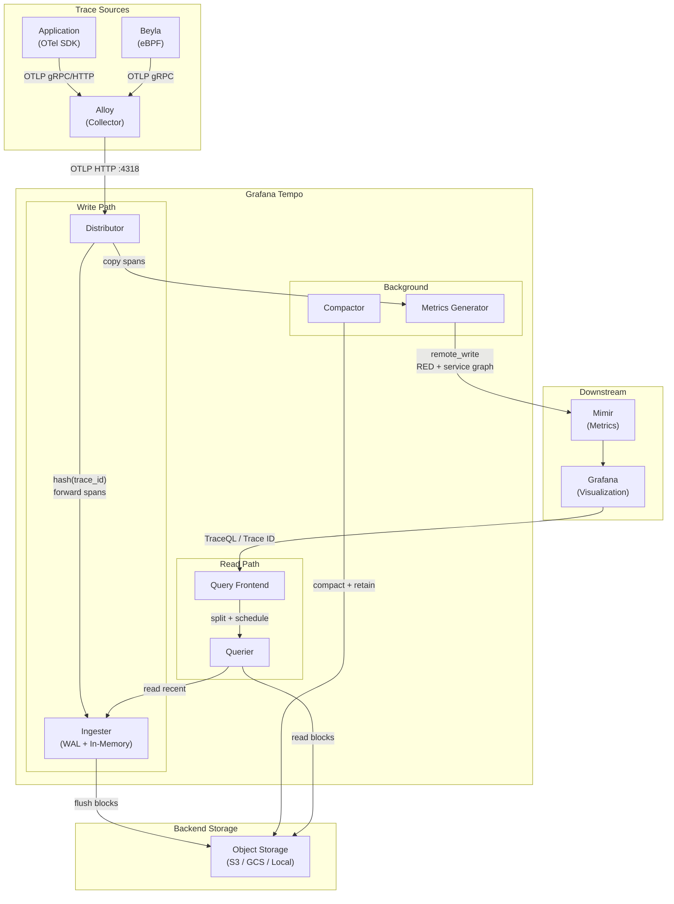

### Write Path vs Read Path Summary

```
+------------------------------------------------------------------+
|                        WRITE PATH                                 |
|                                                                   |
|  Span --> Distributor --> Ingester (WAL) --> Object Storage       |
|                |                                                  |
|                +--> Metrics Generator --> Mimir                   |
+------------------------------------------------------------------+

+------------------------------------------------------------------+
|                        READ PATH                                  |
|                                                                   |
|  Query --> Query Frontend --> Querier --> Ingester (recent)       |
|                                    |                              |
|                                    +--> Object Storage (blocks)   |
+------------------------------------------------------------------+
```

---

## 3. Deployment Modes

Tempo supports two deployment modes. The choice depends on scale, operational requirements, and team expertise.

### 3.1 Single Binary (Current Deployment)

In single binary mode, all Tempo components (distributor, ingester, querier, query frontend, compactor, metrics generator) run within a single process. This is the default mode used by the `grafana/tempo` Helm chart.

```
+--------------------------------------------------+
|                  tempo-0 (Pod)                    |
|                                                   |
|  +-------------+  +------------+  +----------+   |
|  | Distributor |  | Ingester   |  | Querier  |   |
|  +-------------+  +------------+  +----------+   |
|                                                   |
|  +----------------+  +-----------+  +----------+ |
|  | Query Frontend |  | Compactor |  | Metrics  | |
|  |                |  |           |  | Generator| |
|  +----------------+  +-----------+  +----------+ |
|                                                   |
|  WAL: /var/tempo/wal                              |
|  Blocks: /var/tempo/traces                        |
+--------------------------------------------------+
```

**When to use single binary:**

- Development and testing environments
- Small to medium workloads (up to ~50,000 spans/second sustained)
- Teams that want simplicity over fine-grained scaling
- Environments where a single PVC for WAL and block storage is acceptable
- When you do not need independent scaling of read vs write paths

**Limitations of single binary:**

| Limitation | Impact |
|-----------|--------|
| No independent scaling | Cannot scale ingesters separately from queriers. A read-heavy workload forces you to scale all components. |
| Single point of failure | One pod handles everything. If it OOMs during compaction, trace ingestion stops too. |
| Shared resource contention | Compaction, query execution, and ingestion compete for the same CPU and memory. |
| Local storage only (typical) | The `grafana/tempo` chart uses a PVC. You can configure S3/GCS, but the chart is designed for local storage. |
| Vertical scaling ceiling | Eventually you hit the limits of a single pod's memory and CPU allocation. |
| No ring-based replication | A single ingester means WAL data is not replicated. Pod restart = potential data loss for in-flight traces. |

**Current configuration reference** (from `values-tempo.yaml`):

```yaml
# Single binary Tempo with metrics-generator
persistence:
  enabled: true
  size: 10Gi
  storageClassName: standard

tempo:
  metricsGenerator:
    enabled: true
    remoteWriteUrl: "http://mimir-gateway.observability.svc:80/api/v1/push"
  overrides:
    defaults:
      metrics_generator:
        processors:
          - service-graphs
          - span-metrics
          - local-blocks

compactor:
  config:
    compaction:
      compaction_window: 1h
      block_retention: 168h
```

### 3.2 Distributed Mode (tempo-distributed Chart)

In distributed mode, each component runs as a separate Kubernetes Deployment or StatefulSet. This uses the `grafana/tempo-distributed` Helm chart.

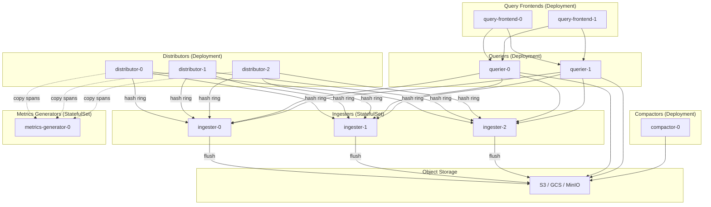

**Component scaling layout (distributed):**

```
+---------------------------------------------------------------+
|  STATELESS (Deployment, scale freely)                         |
|                                                                |
|  +------------------+  +------------------+                   |
|  | distributor (3x) |  | querier (2x)     |                  |
|  | CPU: high        |  | CPU: high        |                  |
|  | Mem: low         |  | Mem: medium-high |                  |
|  +------------------+  +------------------+                   |
|                                                                |
|  +------------------+  +------------------+                   |
|  | query-frontend(2)|  | compactor (1x)   |                  |
|  | CPU: low         |  | CPU: high        |                  |
|  | Mem: low         |  | Mem: high        |                  |
|  +------------------+  +------------------+                   |
+---------------------------------------------------------------+
|  STATEFUL (StatefulSet, scale with care)                      |
|                                                                |
|  +------------------+  +--------------------+                 |
|  | ingester (3x)    |  | metrics-gen (1-2x) |                |
|  | CPU: medium      |  | CPU: medium        |                |
|  | Mem: HIGH        |  | Mem: medium        |                |
|  | Disk: WAL (PVC)  |  | Disk: WAL (PVC)    |                |
|  +------------------+  +--------------------+                 |
+---------------------------------------------------------------+
```

**When to use distributed mode:**

- Production environments with >50,000 spans/second sustained
- When you need independent scaling of write path (distributors, ingesters) vs read path (queriers, query frontends)
- When compaction load should not compete with ingestion
- When using object storage (S3/GCS) as the primary backend
- When you need ingester replication for durability

**Comparison:**

| Aspect | Single Binary | Distributed |
|--------|---------------|-------------|
| Helm chart | `grafana/tempo` | `grafana/tempo-distributed` |
| Operational complexity | Low | Medium-High |
| Independent scaling | No | Yes, per component |
| Object storage | Optional | Required |
| Ingester replication | No | Yes (configurable factor) |
| Best for | Dev, small prod | Medium to large prod |
| Typical span rate | <50K/s | 50K/s to millions/s |

---

## 4. Component Deep Dive

### 4.1 Distributor

**What it does:** The distributor is the entry point for all trace data. It receives spans from collectors (Alloy, OTel Collector) via OTLP, Jaeger, or Zipkin protocols. It hashes the trace ID to determine which ingester(s) should receive the spans, then forwards them accordingly.

**Why it exists:** Decouples protocol handling from storage. Provides consistent hashing to ensure all spans for a given trace end up at the same ingester, which is essential for assembling complete traces before flushing to blocks.

**How it works:**

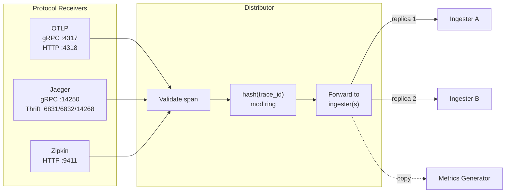

**Key configuration parameters:**

| Parameter | Default | Description |
|-----------|---------|-------------|
| `distributor.receivers.otlp.protocols.grpc.endpoint` | `0.0.0.0:4317` | OTLP gRPC listen address |
| `distributor.receivers.otlp.protocols.http.endpoint` | `0.0.0.0:4318` | OTLP HTTP listen address |
| `distributor.ring.kvstore.store` | `memberlist` | Ring key-value store (memberlist, consul, etcd) |
| `distributor.log_received_spans.enabled` | `false` | Log every received span (debug only, very verbose) |
| `distributor.search_tags_deny_list` | `[]` | Tags to exclude from search metadata |

**Resource characteristics:**

- **CPU**: Medium-high. Deserialization of incoming spans, hashing, and forwarding.
- **Memory**: Low-medium. Stateless -- spans pass through, not buffered long.
- **Disk**: None. Fully stateless.
- **Network**: High ingress (all spans arrive here), high egress (forwards to ingesters).

### 4.2 Ingester

**What it does:** The ingester receives spans from distributors, groups them by trace ID, and assembles them into in-memory blocks. It maintains a Write-Ahead Log (WAL) on local disk for durability. When blocks reach a configured size or age threshold, the ingester flushes them to backend object storage.

**Why it exists:** Object storage is optimized for large sequential writes, not millions of tiny span writes. The ingester batches spans into blocks (typically 50-500 MB each) to create an efficient write pattern for object storage. It also provides a short-term query path for very recent traces that have not yet been flushed.

**Block lifecycle in the ingester:**

```mermaid
statechart
```

```
Span arrives
     |
     v
+------------------+
| In-Memory Buffer |  (collecting spans by trace ID)
| + WAL on disk    |  (for crash recovery)
+------------------+
     |
     | max_block_duration (30m) or max_block_bytes (500MB) reached
     v
+------------------+
| Complete Block   |  (assembled, ready to flush)
+------------------+
     |
     | flush to backend
     v
+------------------+
| Object Storage   |  (S3/GCS/local)
| /blocks/{id}     |
+------------------+
```

**Key configuration parameters:**

| Parameter | Default | Description |
|-----------|---------|-------------|
| `ingester.max_block_duration` | `30m` | Maximum time before a block is cut and flushed |
| `ingester.max_block_bytes` | `524288000` (500MB) | Maximum block size before flush |
| `ingester.lifecycler.ring.replication_factor` | `1` | Number of ingesters that receive each span (distributed mode) |
| `ingester.flush_check_period` | `10s` | How often to check if blocks need flushing |
| `ingester.trace_idle_period` | `10s` | Time after last span before a trace is considered complete |
| `ingester.concurrent_flushes` | `1` | Number of simultaneous block flushes |

**Resource characteristics:**

- **CPU**: Medium. Span assembly and block encoding.
- **Memory**: HIGH. All in-flight traces live in memory. This is typically the highest-memory component. Memory usage scales linearly with span ingestion rate multiplied by `max_block_duration`.
- **Disk**: Medium. WAL storage proportional to in-flight data. PVC required.
- **Network**: High ingress (from distributors), burst egress (block flushes to storage).

### 4.3 Compactor

**What it does:** The compactor runs as a background process that reads small blocks from object storage, merges them into larger blocks, and deletes the originals. It also enforces block retention (deleting blocks older than the configured retention period) and builds bloom filters for each compacted block.

**Why it exists:** Ingesters flush relatively small blocks (every 30 minutes per ingester). Over time, this creates many small files in object storage, which degrades query performance because each query must open and scan more blocks. The compactor merges these into fewer, larger blocks, dramatically improving read performance.

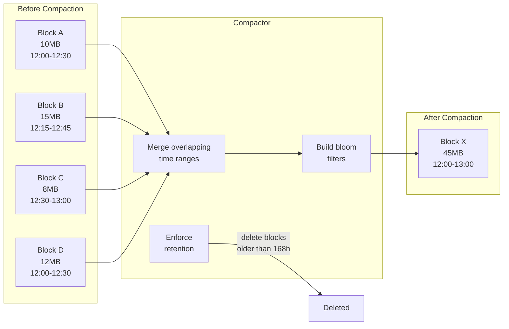

**Key configuration parameters:**

| Parameter | Default | Description |
|-----------|---------|-------------|
| `compactor.compaction.compaction_window` | `1h` | Time window for grouping blocks to compact together |
| `compactor.compaction.max_compaction_objects` | `1000000` | Maximum number of objects in a compacted block |
| `compactor.compaction.block_retention` | `168h` | How long blocks are kept before deletion |
| `compactor.compaction.compacted_block_retention` | `1h` | How long to keep compacted blocks before removing originals |
| `compactor.compaction.max_block_bytes` | `107374182400` (100GB) | Maximum size of a compacted block |
| `compactor.ring.kvstore.store` | `memberlist` | Ring store for compactor coordination |

**Resource characteristics:**

- **CPU**: High during compaction cycles. Reads, merges, and re-encodes blocks.
- **Memory**: High. Must hold block data in memory during merge operations.
- **Disk**: Temporary. Downloads blocks from object storage, writes merged blocks, then uploads.
- **Network**: High burst. Downloads and uploads blocks during compaction windows.

### 4.4 Querier

**What it does:** The querier executes trace lookups and TraceQL search queries. It reads data from two sources: (1) ingesters, for recent traces not yet flushed to storage, and (2) object storage, for completed blocks. It assembles partial results into complete traces.

**Why it exists:** Separates read logic from write logic. The querier understands the block format, can navigate bloom filters for trace ID lookups, and can perform columnar scans for TraceQL search queries.

**Query execution flow:**

```
Querier receives request from Query Frontend
     |
     +---> Query Ingesters (recent data, in-memory)
     |         |
     |         +---> Return partial trace
     |
     +---> Query Object Storage (blocks)
     |         |
     |         +---> Check bloom filter for trace ID
     |         |         |
     |         |         +---> If trace ID present: read block, extract trace
     |         |         +---> If trace ID absent: skip block (fast)
     |         |
     |         +---> For TraceQL: scan columnar data (vParquet)
     |
     +---> Merge results from all sources
     |
     +---> Return complete trace / search results
```

**Key configuration parameters:**

| Parameter | Default | Description |
|-----------|---------|-------------|
| `querier.max_concurrent_queries` | `20` | Maximum parallel queries per querier instance |
| `querier.frontend_worker.frontend_address` | auto-discovered | Query frontend gRPC address |
| `querier.search.prefer_self` | `10` | Number of blocks the querier reads directly before offloading to workers |

**Resource characteristics:**

- **CPU**: High. Block scanning and trace assembly are CPU-intensive, especially for TraceQL queries.
- **Memory**: Medium-high. Must hold block data during query execution. Large trace results consume memory.
- **Disk**: None (or minimal for temporary block downloads). Stateless.
- **Network**: High egress from object storage during queries.

### 4.5 Query Frontend

**What it does:** The query frontend sits in front of queriers and optimizes query execution. It splits large search queries into smaller sub-queries across time ranges and blocks, distributes them to queriers via a queue, caches results, and implements SLO-based queuing to prioritize queries.

**Why it exists:** Without the query frontend, a single TraceQL query over 7 days of data would require one querier to scan all blocks sequentially. The query frontend parallelizes this work by splitting the query into many smaller jobs that run concurrently across multiple queriers.

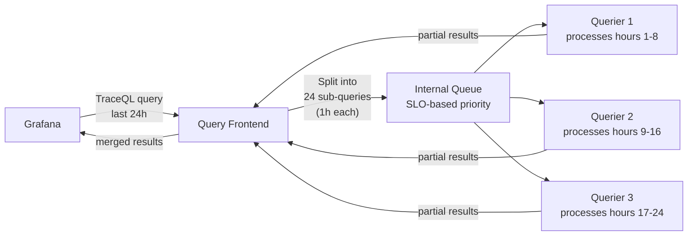

**Key configuration parameters:**

| Parameter | Default | Description |
|-----------|---------|-------------|
| `query_frontend.search.target_bytes_per_job` | `104857600` (100MB) | Target size of each sub-query job |
| `query_frontend.search.default_result_limit` | `20` | Default number of results for search queries |
| `query_frontend.search.max_duration` | `168h` | Maximum time range for search queries |
| `query_frontend.max_retries` | `2` | Number of retries for failed sub-queries |
| `query_frontend.search.concurrent_jobs` | `1000` | Maximum concurrent search jobs |

**Resource characteristics:**

- **CPU**: Low-medium. Primarily splitting queries and merging results.
- **Memory**: Low-medium. Holds sub-query results during merging.
- **Disk**: None. Fully stateless.
- **Network**: Medium. Proxies all query traffic.

### 4.6 Metrics Generator

**What it does:** The metrics generator receives a copy of every span from the distributor and produces derived metrics: RED (Rate, Error, Duration) metrics per service/operation, service-to-service dependency graphs, and local block queries for TraceQL metrics. It remote-writes these metrics to a Prometheus-compatible backend (Mimir).

**Why it exists:** Traces are detailed but expensive to query in aggregate. Metrics are cheap to query in aggregate but lack detail. The metrics generator bridges this gap by extracting aggregate signals from traces -- you get service maps, latency histograms, and error rates without writing separate instrumentation.

See [Section 7 (Metrics Generator)](#7-metrics-generator) for a detailed breakdown of each processor.

**Key configuration parameters:**

| Parameter | Default | Description |
|-----------|---------|-------------|
| `metrics_generator.ring.kvstore.store` | `memberlist` | Ring store for generator coordination |
| `metrics_generator.processor.service_graphs.dimensions` | `[]` | Additional dimensions for service graph metrics |
| `metrics_generator.processor.span_metrics.dimensions` | `[]` | Additional dimensions for span metrics |
| `metrics_generator.storage.remote_write[].url` | (required) | Mimir/Prometheus remote write URL |
| `metrics_generator.storage.remote_write[].send_exemplars` | `true` | Include trace ID exemplars in metrics |
| `metrics_generator.processor.local_blocks.flush_to_storage` | `false` | Whether to flush local blocks to object storage |

**Resource characteristics:**

- **CPU**: Medium. Processes every span to compute aggregations.
- **Memory**: Medium. Maintains in-memory aggregation state (histograms, graph edges).
- **Disk**: Small WAL for buffering before remote write.
- **Network**: Medium ingress (receives span copies), medium egress (remote write to Mimir).

### 4.7 Vulture

**What it does:** Vulture is an optional trace health check tool (similar to Loki Canary for logs). It continuously generates synthetic traces, pushes them into Tempo, then queries Tempo after a delay to verify the traces are readable. It exposes Prometheus metrics about trace completeness, latency, and errors.

**Why it exists:** In production, you need to verify that traces written to Tempo can actually be read back. Vulture provides an end-to-end synthetic test that catches issues like:
- Ingester failures silently dropping spans
- Object storage misconfiguration
- Query path regressions after upgrades
- Compaction corrupting blocks

**Key metrics exposed by Vulture:**

| Metric | Description |
|--------|-------------|
| `tempo_vulture_trace_pushed_total` | Total traces pushed to Tempo |
| `tempo_vulture_trace_found_total` | Total traces successfully read back |
| `tempo_vulture_trace_missing_total` | Traces pushed but not found on read |
| `tempo_vulture_trace_error_total` | Errors during push or read |
| `tempo_vulture_trace_latency_seconds` | Time between push and successful read |

**Resource characteristics:**

- **CPU**: Very low. Generates one trace at a time.
- **Memory**: Very low. Minimal state.
- **Disk**: None.
- **Network**: Minimal. One trace write + one trace read per cycle.

---

## 5. Write Path

The write path describes the journey of a span from application code to durable storage in object storage.

### Step-by-Step Write Path

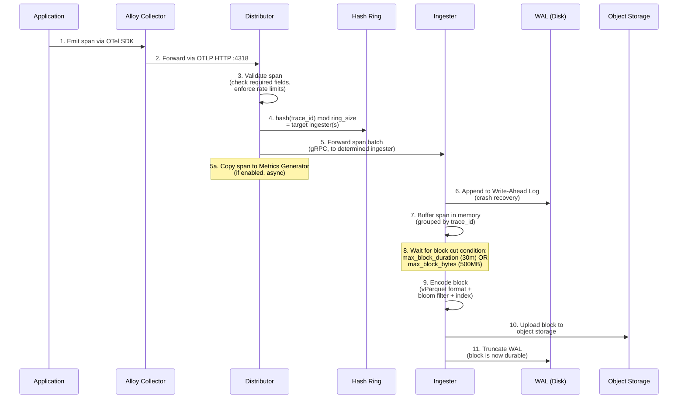

### Detailed Step Descriptions

| Step | Component | Description |
|------|-----------|-------------|
| 1 | Application | The application creates spans using an OTel SDK or Beyla generates spans via eBPF. Spans include trace ID, span ID, parent span ID, service name, operation name, timing, attributes. |
| 2 | Alloy | The collector batches spans and forwards them to Tempo's distributor endpoint. In this stack, Alloy sends via OTLP HTTP to port 4318. |
| 3 | Distributor | Validates spans: checks that trace IDs are present, span data is well-formed, and rate limits are not exceeded. Malformed spans are rejected with an error code. |
| 4 | Distributor | Computes `hash(trace_id) % ring_size` using consistent hashing. The hash ring maps the result to one or more ingesters (depending on replication factor). This ensures all spans for a trace go to the same ingester. |
| 5 | Distributor | Forwards the span batch to the target ingester(s) via gRPC. In single binary mode, this is an in-process call. In distributed mode, it is a network call. |
| 5a | Metrics Generator | If enabled, the distributor sends a copy of each span to the metrics generator asynchronously. This does not block the write path. |
| 6 | Ingester | Appends the span to the Write-Ahead Log on local disk. The WAL ensures that if the ingester crashes, in-flight spans can be recovered on restart. |
| 7 | Ingester | Adds the span to an in-memory buffer, organized by trace ID. Multiple spans for the same trace are grouped together. |
| 8 | Ingester | The ingester periodically checks whether the current block should be "cut" -- either because it has been open for `max_block_duration` (default 30m) or has accumulated `max_block_bytes` (default 500MB) of data. |
| 9 | Ingester | When a block is cut, the ingester encodes it in vParquet format: columnar storage with a bloom filter over trace IDs and a block-level index for efficient lookup. |
| 10 | Ingester | Uploads the completed block to object storage (S3, GCS, or local filesystem). The block is now durable and query-able by queriers reading from storage. |
| 11 | Ingester | Truncates the WAL entries corresponding to the flushed block. The WAL only needs to retain data for spans that have not yet been flushed. |

### Write Path Failure Modes

| Failure | Impact | Mitigation |
|---------|--------|------------|
| Distributor crash | Spans in flight are lost (not yet WAL'd) | Run multiple distributor replicas (distributed mode) |
| Ingester crash | WAL replayed on restart, minimal loss | WAL provides crash recovery; replication factor >1 in distributed mode |
| Object storage unavailable | Flush fails, ingester retries | Ingester buffers and retries; monitor `tempo_ingester_flush_failures_total` |
| Rate limit exceeded | Distributor returns 429 | Tune `ingestion_rate_limit_bytes` and `ingestion_burst_size_bytes` |

---

## 6. Read Path

Tempo supports two primary read patterns: trace-by-ID lookup and TraceQL search. They use different strategies to find data.

### 6.1 Trace by ID Lookup

This is the most common access pattern. A user clicks a trace link in Grafana (typically navigating from a log line or metric exemplar) and Tempo retrieves the full trace by its 128-bit trace ID.

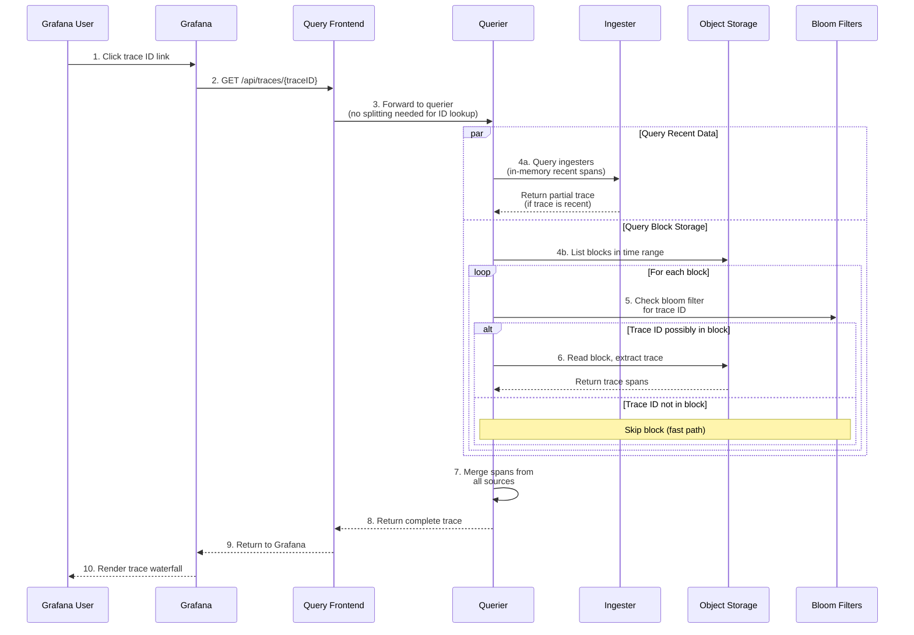

**Why bloom filters matter for trace-by-ID:**

A bloom filter is a probabilistic data structure that can definitively say "this trace ID is NOT in this block" or "this trace ID MIGHT be in this block." For trace-by-ID lookups, this means the querier can skip the vast majority of blocks without reading their contents.

```
Without bloom filters:
  100 blocks x 200MB each = 20GB of data to scan
  Latency: seconds to minutes

With bloom filters:
  100 blocks x check bloom filter (KB each) = skip 99 blocks
  1 block x 200MB = 200MB to scan
  Latency: milliseconds to low seconds
```

### 6.2 TraceQL Search Query

TraceQL is Tempo's query language for searching traces by attributes, duration, service name, and other criteria. This is a more expensive operation than trace-by-ID because it must scan block data.

Example TraceQL queries:

```
{ resource.service.name = "helloworld" && span.http.status_code >= 500 }
{ duration > 2s && resource.service.name = "checkout-service" }
{ span.db.system = "postgresql" && duration > 100ms }
```

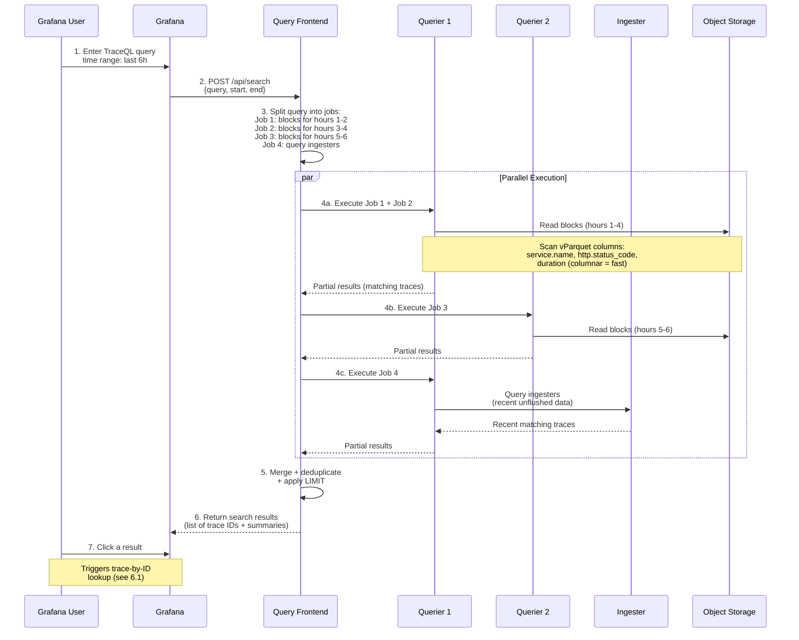

**Why vParquet matters for TraceQL:**

Tempo stores blocks in the vParquet (v3) columnar format. This means each span attribute (service.name, http.status_code, duration) is stored in a separate column. When a TraceQL query filters on `http.status_code >= 500`, Tempo only reads the `http.status_code` column, not the entire span. This is dramatically faster than row-oriented storage.

```
Row-oriented storage (old Tempo format):
  Read entire span to check one attribute
  Data read per block: ~200MB

Columnar storage (vParquet):
  Read only the columns referenced in query
  Data read per block: ~5-20MB (depending on columns)
```

### Read Path Performance Comparison

| Operation | Typical Latency | Data Scanned | CPU Cost |
|-----------|----------------|--------------|----------|
| Trace by ID (recent, in ingester) | <10ms | In-memory only | Very low |
| Trace by ID (in storage, bloom filter hit) | 50-500ms | One block | Low |
| TraceQL search (1h window, 10 blocks) | 1-5s | Columnar subset of 10 blocks | Medium |
| TraceQL search (24h window, 200 blocks) | 5-30s | Columnar subset of 200 blocks | High |
| TraceQL search (7d window, 1000+ blocks) | 30s-2min | Columnar subset of 1000+ blocks | Very high |

---

## 7. Metrics Generator

The metrics generator is one of Tempo's most powerful features. It observes every span flowing through the distributor and produces derived metrics that are remote-written to Mimir (or any Prometheus-compatible backend). This enables aggregate dashboards, service maps, and alerting -- all derived from trace data -- without any additional application instrumentation.

### Current Configuration

From `values-tempo.yaml`, the metrics generator is enabled with three processors:

```yaml
tempo:
  metricsGenerator:
    enabled: true
    remoteWriteUrl: "http://mimir-gateway.observability.svc:80/api/v1/push"
  overrides:
    defaults:
      metrics_generator:
        processors:
          - service-graphs
          - span-metrics
          - local-blocks
```

### Metrics Generator Data Flow

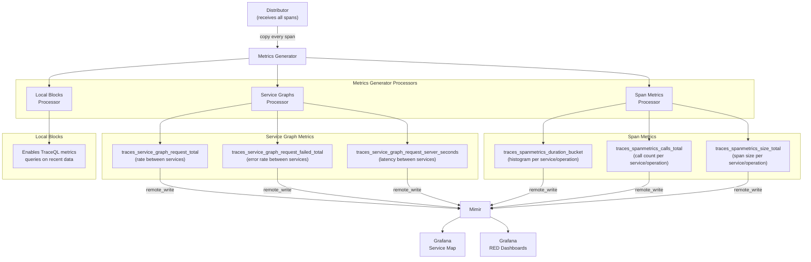

### 7.1 Service Graphs Processor

**What it produces:** Metrics representing the call relationships between services. For every service-A-calls-service-B relationship observed in traces, the processor emits rate, error, and duration metrics.

**How it works:**

1. The processor examines each span's parent-child relationships.
2. When a client span (from service A) has a corresponding server span (from service B), the processor records an "edge" from A to B.
3. It aggregates these edges into counters and histograms.

**Metrics produced:**

| Metric | Type | Description |
|--------|------|-------------|
| `traces_service_graph_request_total` | Counter | Total requests between two services |
| `traces_service_graph_request_failed_total` | Counter | Failed requests between two services |
| `traces_service_graph_request_server_seconds_bucket` | Histogram | Server-side latency between two services |
| `traces_service_graph_request_client_seconds_bucket` | Histogram | Client-side latency between two services |
| `traces_service_graph_request_messaging_system_seconds_bucket` | Histogram | Latency for messaging-system edges |

**Labels on these metrics:**

- `client` -- the calling service name
- `server` -- the called service name
- `connection_type` -- "direct" or via a messaging system

**Grafana Service Map:** These metrics are what power the Grafana Service Map visualization. In the Tempo datasource configuration, `serviceMap.datasourceUid` points to Mimir, and Grafana queries `traces_service_graph_request_total` and related metrics to render the node graph.

From the current Grafana datasource config:

```yaml
serviceMap:
  datasourceUid: mimir
nodeGraph:
  enabled: true
```

**Configuration:**

```yaml
metrics_generator:
  processor:
    service_graphs:
      dimensions:
        - "http.method"           # Add HTTP method as a label
        - "messaging.system"      # Add messaging system as a label
      peer_attributes:
        - "db.name"              # Use db.name to identify database nodes
        - "net.sock.peer.addr"   # Use peer address for unresolved services
      wait: 10s                   # Wait time for matching client/server spans
      max_items: 10000            # Maximum number of edges to track
      enable_client_server_prefix: true
```

### 7.2 Span Metrics Processor

**What it produces:** RED (Rate, Error, Duration) metrics for every service and operation combination observed in spans. This is the equivalent of instrumenting every service with Prometheus `http_request_duration_seconds` histograms -- but derived entirely from trace data.

**How it works:**

1. For each span, the processor extracts the service name and span name (operation).
2. It increments a counter (`traces_spanmetrics_calls_total`) and records the duration in a histogram (`traces_spanmetrics_duration_bucket`).
3. If the span has an error status, it increments the error-specific counter.

**Metrics produced:**

| Metric | Type | Description |
|--------|------|-------------|
| `traces_spanmetrics_calls_total` | Counter | Total number of spans per service/operation |
| `traces_spanmetrics_duration_seconds_bucket` | Histogram | Duration distribution per service/operation |
| `traces_spanmetrics_size_total` | Counter | Total size of spans per service/operation |

**Labels on these metrics:**

- `service` -- the service name (from `resource.service.name`)
- `span_name` -- the operation name
- `span_kind` -- CLIENT, SERVER, PRODUCER, CONSUMER, INTERNAL
- `status_code` -- OK, ERROR, UNSET
- Additional dimensions from configuration

**Example: Using span metrics for RED dashboards:**

```promql
# Request Rate (per service, per operation)
sum(rate(traces_spanmetrics_calls_total{service="helloworld"}[5m])) by (span_name)

# Error Rate
sum(rate(traces_spanmetrics_calls_total{service="helloworld", status_code="STATUS_CODE_ERROR"}[5m]))
/
sum(rate(traces_spanmetrics_calls_total{service="helloworld"}[5m]))

# Duration (p99)
histogram_quantile(0.99,
  sum(rate(traces_spanmetrics_duration_seconds_bucket{service="helloworld"}[5m])) by (le, span_name)
)
```

This is already referenced in the Grafana Tempo datasource configuration:

```yaml
tracesToMetrics:
  datasourceUid: mimir
  tags: [{ key: "service.name", value: "service" }]
  queries:
    - name: "Request rate"
      query: "sum(rate(traces_spanmetrics_duration_count{$$__tags}[5m]))"
```

**Configuration:**

```yaml
metrics_generator:
  processor:
    span_metrics:
      dimensions:
        - "http.method"
        - "http.status_code"
        - "http.route"
      enable_target_info: true      # Emit target_info metric with resource attributes
      histogram_buckets: [0.002, 0.004, 0.008, 0.016, 0.032, 0.064, 0.128, 0.256, 0.512, 1.02, 2.048, 4.096, 8.192, 16.384]
      intrinsic_dimensions:
        service: true
        span_name: true
        span_kind: true
        status_code: true
        status_message: false
```

### 7.3 Local Blocks Processor

**What it produces:** The local blocks processor does not produce metrics in the traditional sense. Instead, it stores a subset of recent trace data in a local block format that enables TraceQL metrics queries (e.g., `{ } | rate()`) on very recent data that has not yet been flushed to object storage.

**How it works:**

1. The processor receives spans from the distributor (same as the other processors).
2. It writes these spans into a local block structure (similar to how the ingester creates blocks).
3. When a TraceQL metrics query arrives, the metrics generator can serve recent data from these local blocks without waiting for ingester flushes.

**Why it matters:** TraceQL metrics queries (`{ resource.service.name = "helloworld" } | rate()`) need to scan trace data. Without local blocks, these queries can only see data that has been flushed to object storage -- introducing a delay equal to the ingester's `max_block_duration` (30 minutes). The local blocks processor eliminates this gap.

**Configuration:**

```yaml
metrics_generator:
  processor:
    local_blocks:
      flush_to_storage: false        # Do not flush to main storage (ingesters do this)
      max_block_duration: 5m         # Block duration in the local blocks processor
      max_block_bytes: 524288000     # 500MB max block size
      complete_block_timeout: 30s    # How long to keep a completed block
```

### Metrics Generator Resource Impact

The metrics generator processes a copy of every span, so its resource usage scales linearly with span ingestion rate.

| Span Rate | CPU Impact | Memory Impact | Remote Write Volume |
|-----------|-----------|---------------|-------------------|
| 1K spans/s | ~50m CPU | ~128Mi | ~500 samples/s to Mimir |
| 10K spans/s | ~200m CPU | ~512Mi | ~5K samples/s to Mimir |
| 100K spans/s | ~1 CPU | ~2Gi | ~50K samples/s to Mimir |

Monitor these metrics to assess generator health:

- `tempo_metrics_generator_spans_received_total` -- total spans processed
- `tempo_metrics_generator_spans_discarded_total` -- spans dropped (capacity issues)
- `tempo_metrics_generator_bytes_received_total` -- bytes processed
- `tempo_metrics_generator_registry_active_series` -- active metric series being tracked

---

## 8. Scaling Guide

Tempo is designed to be cheap. It does not index span content, does not maintain an inverted index, and stores data in commodity object storage. This means scaling Tempo is primarily about managing the ingestion pipeline and query capacity -- not managing an ever-growing index.

### Scaling Matrix

| Component | Scale When | How to Scale | Key Metric to Watch | Notes |
|-----------|-----------|-------------|-------------------|-------|
| **Distributor** | Incoming span rate exceeds capacity; 429 rate limit errors | Add replicas (stateless) | `tempo_distributor_spans_received_total`, `tempo_discarded_spans_total` | Cheapest to scale. Pure CPU/network. |
| **Ingester** | Memory usage >80%; block flush latency increasing; WAL growing | Add replicas (StatefulSet, rebalances via ring) | `tempo_ingester_live_traces`, `tempo_ingester_bytes_received_total`, memory usage | Most impactful scaling target. Each ingester holds data in memory. |
| **Compactor** | Compaction falling behind; many small blocks accumulating | Increase CPU/memory for single compactor or use sharded compaction | `tempo_compactor_blocks_total`, `tempo_compactor_outstanding_blocks` | Usually 1 compactor is enough. Scale vertically first. |
| **Querier** | Query latency increasing; queue depth growing at query frontend | Add replicas (stateless) | `tempo_querier_query_duration_seconds`, query frontend queue depth | Scale with read load. Independent of write path. |
| **Query Frontend** | Queue depth consistently high; queries timing out | Add replicas (stateless), tune splitting parameters | `tempo_query_frontend_queue_length`, `tempo_query_frontend_retries` | Usually 2 replicas is sufficient. |
| **Metrics Generator** | `spans_discarded_total` increasing; remote write falling behind | Add replicas (StatefulSet) or increase resources | `tempo_metrics_generator_spans_discarded_total`, `prometheus_remote_storage_queue_highest_sent_timestamp_seconds` | Scales with span rate, not storage. |

### Scaling by Symptom

**Symptom: Spans being dropped (429 errors from distributors)**

```
Root cause: Ingestion rate exceeds configured limits or distributor capacity.

Diagnosis:
  - Check: tempo_discarded_spans_total (increasing = drops)
  - Check: tempo_distributor_spans_received_total (current rate)
  - Check: distributor CPU utilization

Fix (in order):
  1. Increase ingestion_rate_limit_bytes and ingestion_burst_size_bytes in overrides
  2. Add distributor replicas
  3. If ingesters are slow to accept, scale ingesters too
```

**Symptom: Ingester memory usage is high or OOM kills**

```
Root cause: Too many live traces in memory, or block duration/size too large.

Diagnosis:
  - Check: tempo_ingester_live_traces (number of traces in memory)
  - Check: process_resident_memory_bytes (actual memory usage)
  - Check: max_block_duration and max_block_bytes settings

Fix (in order):
  1. Reduce max_block_duration (e.g., 30m -> 15m) to flush more frequently
  2. Reduce ingester.trace_idle_period to expire traces faster
  3. Increase ingester memory limits
  4. Add ingester replicas (distributed mode) to spread the load
```

**Symptom: Queries are slow or timing out**

```
Root cause: Too many blocks to scan, or querier capacity insufficient.

Diagnosis:
  - Check: tempo_querier_query_duration_seconds (query latency)
  - Check: number of blocks in the time range
  - Check: compactor health (are blocks being compacted?)

Fix (in order):
  1. Verify compactor is running and healthy (fewer, larger blocks = faster queries)
  2. Add querier replicas
  3. Increase query_frontend.search.target_bytes_per_job to adjust parallelism
  4. Reduce search.max_duration to limit maximum query time range
  5. Add caching (memcached) for block metadata and bloom filters
```

**Symptom: Compaction falling behind**

```
Root cause: Too many blocks being produced faster than compactor can merge.

Diagnosis:
  - Check: tempo_compactor_outstanding_blocks (growing = falling behind)
  - Check: compactor CPU and memory utilization
  - Check: object storage latency

Fix (in order):
  1. Increase compactor CPU and memory resources
  2. Tune compaction_window (larger window = fewer compaction cycles but bigger merges)
  3. Enable sharded compaction (distributed mode)
```

### Single Binary Scaling Path

For the current single binary deployment, scaling follows this progression:

```
Stage 1: Vertical Scaling (current)
  tempo-0: 500m CPU / 1Gi memory
       |
       | Approaching limits? Increase resources:
       v
Stage 2: Vertical Scaling (larger)
  tempo-0: 2 CPU / 4Gi memory
       |
       | Still not enough? Single binary ceiling reached.
       v
Stage 3: Migrate to Distributed Mode
  Switch to grafana/tempo-distributed chart.
  Deploy separate distributors, ingesters, queriers, compactor.
  Point storage to S3/GCS/MinIO instead of local PVC.
```

### Distributed Mode Scaling Reference

For production distributed deployments, use these starting points and scale based on observed metrics:

| Component | Starting Replicas | CPU per Replica | Memory per Replica | Scale Trigger |
|-----------|------------------|----------------|-------------------|---------------|
| Distributor | 3 | 500m-1 | 512Mi-1Gi | >70% CPU |
| Ingester | 3 | 1-2 | 2Gi-4Gi | >80% memory or >10K live traces per ingester |
| Querier | 2-3 | 1-2 | 1Gi-2Gi | p99 query latency >5s |
| Query Frontend | 2 | 250m-500m | 256Mi-512Mi | Queue depth >100 |
| Compactor | 1 | 1-2 | 2Gi-4Gi | Outstanding blocks growing |
| Metrics Generator | 1-2 | 500m-1 | 1Gi-2Gi | Spans discarded >0 |

---

## 9. Hot and Cold Data with S3

Tempo's storage architecture naturally creates a temperature gradient for trace data. Understanding this gradient is essential for cost optimization, particularly when using S3.

### Data Temperature Model

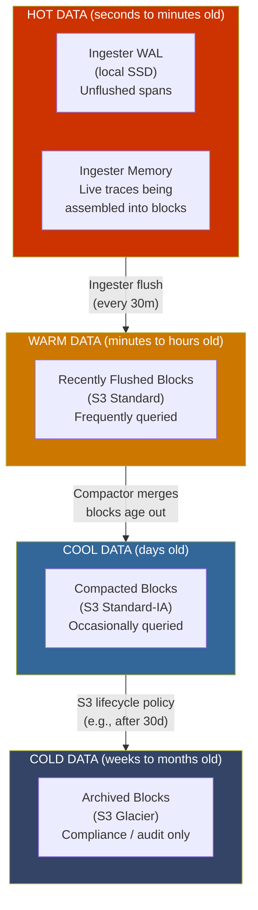

### How Tempo Stores Data

Tempo's storage has two main areas:

**1. Ingester WAL (Write-Ahead Log) -- Hot Data**

The WAL lives on local disk (PVC in Kubernetes). It contains every span that has been received but not yet flushed to a block. The WAL serves two purposes:
- Crash recovery (replay WAL on restart)
- Short-term query source (queriers read from ingesters for very recent data)

WAL data typically covers the last 0-30 minutes (the `max_block_duration`).

**2. Object Storage Blocks -- Warm to Cold Data**

All completed blocks live in object storage. A block is a self-contained unit containing:

```
block/
  +-- meta.json              (block metadata: time range, trace count, size)
  +-- data.parquet           (span data in vParquet columnar format)
  +-- bloom-0.bloom          (bloom filter for trace ID lookup)
  +-- bloom-1.bloom          (bloom filter shard 2, if needed)
  +-- index                  (block-level index)
```

### S3 Storage Architecture

```
s3://tempo-traces/
  |
  +-- single-tenant/                    (tenant ID, or "single-tenant" when multi-tenancy disabled)
       |
       +-- blocks/
       |    +-- 01HQ3K.../              (block UUID)
       |    |    +-- meta.json
       |    |    +-- data.parquet
       |    |    +-- bloom-0.bloom
       |    |    +-- bloom-1.bloom
       |    |    +-- index
       |    |
       |    +-- 01HQ3L.../              (another block)
       |    +-- 01HQ3M.../
       |    ...
       |
       +-- blocklist/                   (compactor state)
            +-- compacted-...
```

### S3 Lifecycle Policies for Cost Optimization

S3 lifecycle policies can automatically transition blocks to cheaper storage classes as they age. This is transparent to Tempo -- S3 handles the transitions and Tempo reads from the same paths.

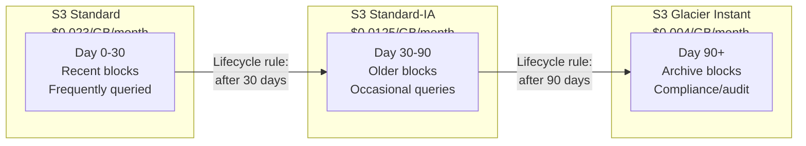

**Example S3 lifecycle policy (Terraform):**

```hcl
resource "aws_s3_bucket_lifecycle_configuration" "tempo_traces" {
  bucket = aws_s3_bucket.tempo_traces.id

  rule {
    id     = "tempo-block-tiering"
    status = "Enabled"

    filter {
      prefix = "single-tenant/blocks/"
    }

    # Move to Standard-IA after 30 days
    transition {
      days          = 30
      storage_class = "STANDARD_IA"
    }

    # Move to Glacier Instant Retrieval after 90 days
    transition {
      days          = 90
      storage_class = "GLACIER_IR"
    }

    # Delete after retention period (e.g., 365 days)
    # Note: Tempo's compactor also enforces block_retention,
    # but this is a safety net at the storage layer.
    expiration {
      days = 365
    }
  }
}
```

**Important considerations for lifecycle policies:**

| Storage Class | Retrieval Latency | Minimum Storage Duration | Best For |
|--------------|-------------------|--------------------------|----------|
| S3 Standard | Milliseconds | None | Active blocks (0-30 days) |
| S3 Standard-IA | Milliseconds | 30 days | Blocks queried occasionally |
| S3 Glacier Instant Retrieval | Milliseconds | 90 days | Compliance data, rare queries |
| S3 Glacier Flexible Retrieval | Minutes to hours | 90 days | NOT recommended (query latency too high) |
| S3 Glacier Deep Archive | Hours | 180 days | NOT recommended for Tempo |

Do NOT use Glacier Flexible Retrieval or Deep Archive for data that Tempo's querier needs to read. These classes have retrieval latencies of minutes to hours, which will cause query timeouts. Use Glacier Instant Retrieval if you need very cheap archive storage that Tempo can still query.

### S3 Backend Configuration for Tempo

To configure Tempo to use S3 instead of local storage:

```yaml
# Tempo configuration for S3 backend
storage:
  trace:
    backend: s3
    s3:
      bucket: tempo-traces
      endpoint: s3.us-east-1.amazonaws.com
      region: us-east-1
      # Authentication options:
      # Option 1: IAM role (recommended for EKS with IRSA)
      # No access_key/secret_key needed -- uses pod's IAM role
      #
      # Option 2: Static credentials (not recommended for production)
      # access_key: ${S3_ACCESS_KEY}
      # secret_key: ${S3_SECRET_KEY}
      #
      # Option 3: MinIO (for on-prem or testing)
      # endpoint: minio.observability.svc:9000
      # insecure: true
      # access_key: minio
      # secret_key: minio123

    # WAL remains on local disk
    wal:
      path: /var/tempo/wal

    # Block storage settings
    block:
      version: vParquet4               # Latest columnar format

    # Cache configuration (recommended for production)
    cache: memcached
    memcached:
      host: memcached.observability.svc
      service: memcached-client
      timeout: 500ms
```

**Helm values example (tempo-distributed with S3):**

```yaml
# values-tempo-distributed.yaml
storage:
  trace:
    backend: s3
    s3:
      bucket: tempo-traces
      endpoint: s3.us-east-1.amazonaws.com
      region: us-east-1

global_overrides:
  defaults:
    metrics_generator:
      processors:
        - service-graphs
        - span-metrics
        - local-blocks

metricsGenerator:
  enabled: true
  remoteWriteUrl: "http://mimir-gateway.observability.svc:80/api/v1/push"

ingester:
  replicas: 3
  persistence:
    enabled: true
    size: 10Gi        # WAL storage only, not block storage

distributor:
  replicas: 3

querier:
  replicas: 2

queryFrontend:
  replicas: 2

compactor:
  replicas: 1
```

### Bloom Filters and Search Performance

Bloom filters are a critical performance optimization in Tempo's read path. Every block contains one or more bloom filter files that encode the set of trace IDs present in that block.

**How bloom filters work in Tempo:**

```
Query: Find trace ID "abc123def456"

For each block in the time range:
  1. Load bloom filter (tiny: ~KB to low MB)
  2. Check: Is "abc123def456" possibly in this block?
     - If NO (definitive): Skip this block entirely
     - If MAYBE (probabilistic): Read the full block and search

False positive rate: ~1% (configurable)
Result: 99% of blocks are skipped without reading their data.
```

**Bloom filter sizing:**

| Block Size | Bloom Filter Size | False Positive Rate |
|-----------|------------------|-------------------|
| 100MB block | ~100KB bloom | ~1% |
| 500MB block | ~500KB bloom | ~1% |
| 1GB block | ~1MB bloom | ~1% |

The compactor builds bloom filters during compaction. Larger blocks have proportionally larger bloom filters, but the ratio remains efficient.

**Configuration for bloom filters:**

```yaml
storage:
  trace:
    blocklist_poll: 5m              # How often to refresh the block list
    bloom_filter_false_positive: 0.01  # 1% false positive rate (default)
    bloom_filter_shard_size_bytes: 100000  # Size of each bloom filter shard
```

**Trade-offs:**

- Lower false positive rate = larger bloom filters = more object storage reads to load filters, but fewer false reads of actual block data.
- Higher false positive rate = smaller bloom filters = faster filter loads, but more unnecessary block reads.
- The default 1% rate is well-tuned for most workloads.

### Data Temperature Summary

| Temperature | Location | Data Age | Access Pattern | Storage Cost | Query Latency |
|------------|----------|----------|---------------|-------------|---------------|
| **Hot** | Ingester memory + WAL | 0-30 min | Every query checks ingesters | PVC ($$$) | <10ms |
| **Warm** | S3 Standard | 30 min - 30 days | Frequent queries | $0.023/GB/mo | 50-500ms |
| **Cool** | S3 Standard-IA | 30-90 days | Occasional queries | $0.0125/GB/mo | 50-500ms |
| **Cold** | S3 Glacier Instant | 90+ days | Rare (compliance, audit) | $0.004/GB/mo | 50-500ms |

---

## 10. Production Checklist

### Storage

- [ ] **Use object storage (S3/GCS/MinIO) as the backend.** Local filesystem is suitable for development only. Object storage provides durability, scalability, and cost-effective tiering.
- [ ] **Configure S3 lifecycle policies** to transition blocks to Standard-IA after 30 days and Glacier Instant Retrieval after 90 days. Do not use Glacier Flexible Retrieval or Deep Archive for blocks Tempo queries.
- [ ] **Use IAM roles (IRSA on EKS, Workload Identity on GKE)** for S3/GCS authentication instead of static credentials.
- [ ] **Size ingester PVCs for WAL storage.** The WAL holds ~30 minutes of data. Size the PVC at 2-3x the expected 30-minute ingestion volume to account for flush delays. Use SSD-backed storage classes.
- [ ] **Set `block_retention`** in the compactor to match your retention requirements. The default is 0 (infinite). Set it explicitly (e.g., `168h` for 7 days, `720h` for 30 days).
- [ ] **Enable vParquet4 block format** (`storage.trace.block.version: vParquet4`) for the best query performance with TraceQL.

### High Availability

- [ ] **Deploy in distributed mode** for production workloads exceeding 50K spans/second or requiring high availability.
- [ ] **Set ingester replication factor to 3** in distributed mode. This ensures no data loss if a single ingester fails.
- [ ] **Run at least 2 replicas of stateless components** (distributors, queriers, query frontends) behind a load balancer.
- [ ] **Configure pod anti-affinity** for ingesters to ensure they are scheduled on different nodes.
- [ ] **Set PodDisruptionBudgets (PDBs)** for ingesters: `maxUnavailable: 1`.

### Performance

- [ ] **Deploy memcached** for caching bloom filters, block metadata, and query results. This dramatically reduces object storage read operations and query latency.
- [ ] **Tune `max_block_duration`** based on span rate. High span rates should use shorter durations (15m) to keep block sizes manageable and flush more frequently.
- [ ] **Monitor compactor health.** If compaction falls behind, queries will be slow because they must scan more blocks. Watch `tempo_compactor_outstanding_blocks`.
- [ ] **Set `query_frontend.search.max_duration`** to prevent unbounded queries. The current setting of `168h` (7 days) is reasonable.
- [ ] **Configure `search.target_bytes_per_job`** at the query frontend. Smaller job sizes (50-100MB) parallelize better across queriers but create more overhead. Larger job sizes (200-500MB) reduce overhead but parallelize less.

### Ingestion

- [ ] **Set rate limits** via `overrides.defaults.ingestion_rate_limit_bytes` and `ingestion_burst_size_bytes`. Without limits, a misbehaving service can overwhelm Tempo.
- [ ] **Configure `max_traces_per_user`** to prevent a single tenant from consuming all ingester memory.
- [ ] **Monitor `tempo_discarded_spans_total`** to detect span drops. Alert if this metric is non-zero.
- [ ] **Monitor `tempo_ingester_live_traces`** to track memory pressure on ingesters.

### Metrics Generator

- [ ] **Enable the metrics generator** with at minimum `service-graphs` and `span-metrics` processors. These power the Grafana service map and RED dashboards.
- [ ] **Verify remote write to Mimir is healthy.** Monitor `prometheus_remote_storage_samples_failed_total` on the metrics generator pods.
- [ ] **Set `dimensions`** on the span metrics processor carefully. Each unique dimension value creates a new metric series. High-cardinality dimensions (e.g., user ID, request ID) will create cardinality explosions in Mimir.
- [ ] **Enable `local-blocks` processor** if you use TraceQL metrics queries and need them to cover the most recent data.

### Monitoring

- [ ] **Scrape Tempo metrics.** Tempo exposes Prometheus metrics at `/metrics` on its HTTP port. Ensure Alloy or Prometheus is scraping these.
- [ ] **Deploy Vulture** (optional) for end-to-end trace write-read validation. Alert on `tempo_vulture_trace_missing_total > 0`.
- [ ] **Install the Tempo operational dashboard** from grafana.com (dashboard ID 15316 or the Tempo mixin dashboards). Monitor ingestion rate, query latency, block count, and compactor status.
- [ ] **Set up alerts for critical conditions:**

| Alert | Condition | Severity |
|-------|-----------|----------|
| Spans being dropped | `rate(tempo_discarded_spans_total[5m]) > 0` | Critical |
| Ingester OOM risk | `container_memory_working_set_bytes / container_spec_memory_limit_bytes > 0.85` | Warning |
| Compaction behind | `tempo_compactor_outstanding_blocks > 100` | Warning |
| Query latency high | `histogram_quantile(0.99, rate(tempo_querier_query_duration_seconds_bucket[5m])) > 10` | Warning |
| Flush failures | `rate(tempo_ingester_flush_failures_total[5m]) > 0` | Critical |
| Remote write failures | `rate(prometheus_remote_storage_samples_failed_total[5m]) > 0` (on metrics-generator pods) | Warning |

### Networking

- [ ] **Use gRPC for internal communication** between Tempo components. Ensure gRPC load balancing is configured (e.g., headless services in Kubernetes or client-side balancing).
- [ ] **Expose only the query frontend** and distributor externally. Internal components (ingesters, compactor) should not be accessible outside the cluster.
- [ ] **Configure TLS for object storage** communication if required by your security policy.

### Backup and Disaster Recovery

- [ ] **Object storage is the backup.** S3/GCS provide built-in durability (11 nines). No additional backup is needed for block data.
- [ ] **Enable S3 versioning** as a safety net against accidental deletion.
- [ ] **Back up the Tempo configuration** (Helm values, overrides) in version control.
- [ ] **Document the WAL recovery process.** If an ingester pod is rescheduled, the WAL on the PVC allows it to recover in-flight data. Ensure PVCs use `Retain` reclaim policy.

---

*This document covers Tempo as deployed in the LGTM stack at `/home/gavinyap/Workspace/song/lgtm-stack/`. Configuration references are drawn from `values-tempo.yaml` and `values.yaml` in the same repository.*
